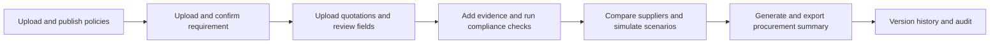

<div align="center">

# QuoteWise

**Supplier Comparison and Procurement Decision Workspace**

English · [简体中文](README.zh-CN.md)

</div>

---

QuoteWise is a supplier quotation review and decision-support system for procurement teams. It brings procurement requirements, supplier quotations, procurement policies, supplier evidence, and historical performance into one traceable workflow, helping users review extracted fields, perform compliance checks, compare suppliers, run what-if scenarios, consult an AI assistant, and produce procurement summaries.

The system provides analysis and recommendations only. It does not approve purchases, sign contracts, place orders, or make payments on behalf of users. All suppliers, materials, quotations, and procurement records in this repository are synthetic demonstration data.

## Core capabilities

- **Procurement requirement management**: Upload PDF, TXT, or Markdown files, review the extracted content, and confirm it. Incomplete requirement drafts can be restored.
- **Quotation extraction and human review**: Parse text-based PDFs and fixed-format CSV files, review 30 normalized quotation fields, and retain source evidence, versions, and manual corrections.
- **Policy RAG and compliance verification**: Upload, review, and publish procurement policies; retrieve applicable clauses for a task and combine them with supplier evidence to run deterministic checks.
- **Supplier decision comparison**: Evaluate hard constraints such as specifications, budget, quantity, fees, and delivery before ranking suppliers using up to two user-selected criteria.
- **Supplier information and history**: Present current quotation facts, historical on-time delivery rate, rejected order-line rate, rating, and sample scope.
- **AI decision assistant**: Explain frozen results, inspect evidence, propose scenario changes, and draft supplier communication. Any authoritative change still requires user confirmation.
- **Procurement summary and audit**: Produce a report covering requirements, quotation trade-offs, policy status, risks, and recommended actions while retaining task, quotation, policy, and result versions.

## End-to-end workflow



Compliance verification sits between quotation review and supplier comparison. RAG retrieves the applicable policy clauses and citations, while deterministic rules combine those clauses with quotation facts and confirmed supplier evidence to produce a verification status. Retrieving a relevant clause alone does not mean that a supplier is compliant.

See the [user workflow](docs/WORKFLOW.en.md) for the detailed operating sequence.

## Quick start

### Prerequisites

- Python 3.11 or later
- Node.js 22 and npm
- Docker Desktop
- Valid LLM, embedding, and reranking service credentials when using live extraction, RAG, or AI features

### macOS

First-time setup:

```bash
cd /path/to/Team-QQFARM
./scripts/dev/setup.sh
```

Edit `.env` and provide the required model-service credentials, then start all services:

```bash
./scripts/dev/start.sh
```

Stop the application processes:

```bash
./scripts/dev/stop.sh
```

To stop PostgreSQL as well while preserving its data volume:

```bash
./scripts/dev/stop.sh --postgres
```

### Windows PowerShell

```powershell
cd C:\path\to\Team-QQFARM
.\scripts\dev\setup.ps1
.\scripts\dev\start.ps1
```

Stop the application:

```powershell
.\scripts\dev\stop.ps1
```

### Default endpoints

| Service | URL |
| --- | --- |
| Frontend | <http://127.0.0.1:5173> |
| API | <http://127.0.0.1:8000> |
| Swagger API documentation | <http://127.0.0.1:8000/docs> |
| API liveness check | <http://127.0.0.1:8000/health/live> |
| API readiness check | <http://127.0.0.1:8000/health/ready> |
| Worker heartbeat | <http://127.0.0.1:8000/health/worker> |

The startup scripts launch PostgreSQL, run Alembic migrations, initialize LangGraph checkpoints, and start the API, worker, and frontend. See [local environment](docs/LOCAL_ENVIRONMENT.en.md) for complete configuration, manual startup, and troubleshooting instructions.

## Run the complete workflow with Demo4

The current end-to-end demonstration package is located at [data/generated/demos/full_flow_demo4](data/generated/demos/full_flow_demo4/README.md). Follow this sequence:

1. Upload and publish the policy files under `policy/electronics_sg/` in the policy library.
2. Create a procurement task and upload `requirement/procurement_requirement.txt`.
3. Upload the four PDF quotations under `quotes/pdf/`, or use the four equivalent CSV files under `quotes/csv/`. Do not mix the two quotation sets in one task.
4. Review the extracted fields, citations, and supplier identities on the quotation review page, then formally submit the quotations.
5. On the compliance page, upload supplier documents from `compliance_evidence/initial/`, confirm their facts against the source text, and run the checks.
6. Review compliance eligibility, decision comparison, supplier information, and the AI decision assistant. When needed, use `compliance_evidence/corrections/` to test evidence replacement and rechecking.
7. Generate the procurement summary and verify its content, citations, versions, and exported output.

`compliance_evidence/entry_guide.json` is only an aid for manual data entry. It does not replace reading and verifying the original evidence. `evaluation/reference/` contains offline acceptance answers and must never be uploaded to the system or exposed to the runtime agent.

See [testing and delivery acceptance](docs/TESTING.en.md) for detailed manual steps, expected states, and failure cases.

## Automated tests

Backend, rules, extraction, and RAG:

```bash
.venv/bin/python -m pytest
```

Frontend:

```bash
cd frontend
npm test
npm run lint
npm run build
```

The default test suite mainly uses fixed model outputs and synthetic fixtures. Passing it demonstrates code-contract and deterministic-logic correctness, not successful connectivity to live external model services. Live model, agent, and PostgreSQL recovery tests require their respective environment switches; see [TESTING.md](docs/TESTING.en.md).

## Repository structure

```text
Team-QQFARM/
├── frontend/                 React + TypeScript frontend
├── src/supplier_comparison/  FastAPI, worker, extraction, RAG, and rule engine
├── migrations/               Alembic database migrations
├── data/                     Contracts, policies, demos, and test fixtures
├── evaluation/reference/     Reference answers isolated from runtime
├── tests/                    Backend, extraction, RAG, rules, and history tests
├── scripts/dev/              One-command macOS and Windows startup scripts
├── compose.yaml              PostgreSQL and backend container orchestration
└── docs/                     Current delivery documentation
```

The runtime uses a modular monolith architecture. The React frontend calls FastAPI; the API writes long-running work to a persistent job queue; the worker performs extraction, model calls, and workflow progression; PostgreSQL stores authoritative business state; and file storage preserves immutable originals and extraction artifacts.

See [system architecture](docs/ARCHITECTURE.en.md) for technical details.

## Key design principles

- PostgreSQL is the authoritative source for tasks, quotations, policies, compliance results, comparison results, and report status.
- Models handle document understanding, intent parsing, and natural-language explanations. Deterministic code controls money, hard constraints, ranking, versioning, and compliance execution.
- An unknown value is not zero and is not automatically a failure. When it may affect the decision, the status remains `PENDING` or `REVIEW_REQUIRED`.
- Changes to requirements, quotations, policy bindings, or supplier evidence advance the task revision. Historical results remain available but cannot overwrite the current revision.
- The AI assistant cannot modify authoritative facts, bypass user confirmation, contact suppliers, or perform procurement actions.
- Instructions contained in uploaded documents are treated only as data to analyze. They cannot alter system permissions or workflow behavior.

## Configuration and security

During first-time setup, the setup script creates `.env` from `.env.example`. Never commit `.env`, credentials, model-response diagnostics, real quotations, or local upload files.

Primary configuration groups include:

| Configuration | Purpose |
| --- | --- |
| `DATABASE_URL` | PostgreSQL connection |
| `QUOTE_STORAGE_PATH` | Quotation and extraction file storage |
| `POLICY_UPLOAD_STORAGE_PATH` | Original policy file storage |
| `SUPPLIER_MODEL_*` | Primary LLM |
| `SUPPLIER_EMBEDDING_*` | Policy vector retrieval |
| `SUPPLIER_RERANK_*` | Policy candidate reranking |
| `SUPPLIER_CONVERSATION_MODEL_*` | Optional dedicated model for the AI decision assistant |
| `SUPPLIER_AGENT_ENABLED` | Optional investigation-agent switch; disabled by default |
| `SUPPLIER_PDF_OCR_ENABLED` | Scanned-PDF OCR switch; disabled by default |

Refer to [.env.example](.env.example) for all defaults and descriptions.

## Documentation

| Document | Description |
| --- | --- |
| [ARCHITECTURE.en.md](docs/ARCHITECTURE.en.md) | Components, authoritative data, AI/RAG boundaries, and security principles |
| [WORKFLOW.en.md](docs/WORKFLOW.en.md) | User workflow from policy preparation to procurement summary |
| [DATA.en.md](docs/DATA.en.md) | Data layout, Demo4, fixtures, reference answers, and evaluation isolation |
| [LOCAL_ENVIRONMENT.en.md](docs/LOCAL_ENVIRONMENT.en.md) | Installation, startup, environment variables, and troubleshooting |
| [DEPLOYMENT_LIGHTSAIL.md](docs/DEPLOYMENT_LIGHTSAIL.md) | Production deployment on the NUS-ISS Amazon Lightsail environment |
| [TESTING.en.md](docs/TESTING.en.md) | Automated tests, manual end-to-end workflow, and delivery acceptance |
| [data/README.md](data/README.md) | Data-directory maintenance entry point |
| [scripts/dev/README.md](scripts/dev/README.md) | One-command startup script reference |
| [docs/i18n/](docs/i18n/) | Chinese-English terminology, UI copy, status, and report language dictionary |

## Troubleshooting

| Symptom | Check first |
| --- | --- |
| Historical tasks fail to load | PostgreSQL data volume, database migrations, and API readiness |
| An upload remains waiting | Worker heartbeat and `logs/dev/worker.err.log` |
| `worker_failed` appears | Worker logs, model credentials, structured-output validation, and the current task revision |
| Policy publishing fails | Embedding configuration, the `vector` extension, and clause-review status |
| Compliance results do not change | Whether evidence is confirmed, whether checks target the current task revision, and whether the worker is running |
| AI assistant generation fails | Conversation-model configuration and worker logs; deterministic comparison results are not rewritten by this failure |
| The frontend still shows an old page | Current Git branch, Vite working directory, and browser cache |

Do not use `docker compose down -v` as a routine stop command because it deletes the PostgreSQL data volume. Use `scripts/dev/stop.sh` or the corresponding PowerShell script instead.
