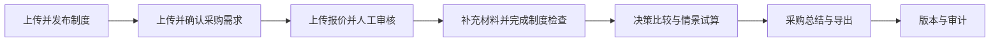

<div align="center">

# QuoteWise

**供应商比选与采购决策工作区**

[English](README.md) · 简体中文

</div>

---

QuoteWise 是一个面向采购人员的供应商报价审核与决策辅助系统。它把采购需求、供应商报价、采购制度、供应商证明材料和历史表现整理为一条可追溯的工作流，帮助用户完成字段核对、制度检查、供应商比较、情景试算、AI 问答和采购总结。

系统只提供分析和建议，不代替采购人员作出批准、签约、下单或付款决定。仓库中的供应商、物料、报价和采购记录均为合成演示数据。

## 核心能力

- **采购需求管理**：上传 PDF、TXT 或 Markdown，解析后由用户核对并确认；未完成的需求草稿可恢复。
- **报价解析与人工审核**：支持文本型 PDF 和固定 CSV 模板，统一审核 30 个报价字段，并保留原文证据、版本和人工修正记录。
- **制度 RAG 与合规核验**：上传、审核并发布采购制度；按任务检索适用条款，再结合供应商证明材料执行确定性检查。
- **供应商决策比较**：先检查规格、预算、数量、费用和交期等硬约束，再按最多两个用户指定指标排序。
- **供应商信息与历史表现**：展示当前报价事实、历史准时率、拒收订单行率、评级和样本范围。
- **AI 决策助手**：解释当前冻结结果、核查证据、提出情景变更并生成沟通建议；所有正式变更都需要用户确认。
- **采购总结与审计**：生成包含需求、报价取舍、制度状态、风险和行动建议的报告，并保留任务、报价、制度和结果版本。

## 完整流程



制度检查位于报价审核与决策比较之间。RAG 负责找到适用制度条款和引用，确定性规则负责结合报价事实与已确认材料给出检查状态；“检索到条款”本身不等于供应商已经合规。

详细操作顺序见 [用户流程](docs/WORKFLOW.md)。

## 快速开始

### 前置条件

- Python 3.11 或更高版本
- Node.js 22 和 npm
- Docker Desktop
- 需要真实解析、RAG 或 AI 功能时，准备可用的 LLM、Embedding 和 Rerank 服务凭据

### macOS

首次安装：

```bash
cd /path/to/Team-QQFARM
./scripts/dev/setup.sh
```

编辑 `.env`，填写模型服务密钥，然后一键启动：

```bash
./scripts/dev/start.sh
```

停止应用进程：

```bash
./scripts/dev/stop.sh
```

如需同时停止 PostgreSQL 容器但保留数据卷：

```bash
./scripts/dev/stop.sh --postgres
```

### Windows PowerShell

```powershell
cd C:\path\to\Team-QQFARM
.\scripts\dev\setup.ps1
.\scripts\dev\start.ps1
```

停止应用：

```powershell
.\scripts\dev\stop.ps1
```

### 默认地址

| 服务 | 地址 |
| --- | --- |
| 前端 | <http://127.0.0.1:5173> |
| API | <http://127.0.0.1:8000> |
| Swagger API 文档 | <http://127.0.0.1:8000/docs> |
| API 存活检查 | <http://127.0.0.1:8000/health/live> |
| API 就绪检查 | <http://127.0.0.1:8000/health/ready> |
| Worker 心跳 | <http://127.0.0.1:8000/health/worker> |

一键脚本会启动 PostgreSQL、执行 Alembic 迁移、初始化 LangGraph 检查点，并启动 API、Worker 和前端。完整配置、手工启动和排障方法见 [本地运行环境](docs/LOCAL_ENVIRONMENT.md)。

## 使用 Demo4 走通全流程

当前完整演示包位于 [data/generated/demos/full_flow_demo4](data/generated/demos/full_flow_demo4/README.md)。建议按照以下顺序测试：

1. 在规则资源库上传并发布 `policy/electronics_sg/` 中的制度文件。
2. 新建采购任务并上传 `requirement/procurement_requirement.txt`。
3. 上传 `quotes/pdf/` 下的四份 PDF 报价，或改用 `quotes/csv/` 下的四份等价 CSV；同一任务不要混用两套报价。
4. 在报价审核页核对解析字段、来源和供应商身份，然后正式提交报价。
5. 在制度检查页上传 `compliance_evidence/initial/` 中的供应商材料，根据原文确认事实并执行检查。
6. 查看制度资格、决策比较、供应商信息和 AI 决策助手；需要时使用 `compliance_evidence/corrections/` 验证材料替换与重新检查。
7. 生成采购总结，检查报告内容、引用、版本和导出结果。

`compliance_evidence/entry_guide.json` 仅用于帮助人工录入，不能代替阅读和核对材料原文。`evaluation/reference/` 是离线验收答案，禁止上传给系统或提供给运行时 Agent。

更完整的人工步骤、预期状态和异常用例见 [测试与交付验收](docs/TESTING.md)。

## 自动化测试

后端、规则、解析和 RAG：

```bash
.venv/bin/python -m pytest
```

前端：

```bash
cd frontend
npm test
npm run lint
npm run build
```

默认测试主要使用固定输出和合成夹具，只能证明代码契约与确定性逻辑通过，不能表述为真实外部模型服务已经通过。真实模型、Agent 和 PostgreSQL 恢复测试需要显式启用相应环境开关，具体见 [TESTING.md](docs/TESTING.md)。

## 系统结构

```text
Team-QQFARM/
├── frontend/                 React + TypeScript 前端
├── src/supplier_comparison/  FastAPI、Worker、解析、RAG 和规则引擎
├── migrations/               Alembic 数据库迁移
├── data/                     契约、制度、演示数据和测试夹具
├── evaluation/reference/     与运行时隔离的参考答案
├── tests/                    后端、解析、RAG、规则和历史数据测试
├── scripts/dev/              macOS/Windows 一键启动脚本
├── compose.yaml              PostgreSQL 与后端容器编排
└── docs/                     当前交付文档
```

运行时采用模块化单体架构：React 前端调用 FastAPI；API 将长任务写入持久化作业队列；Worker 完成解析、模型调用和工作流推进；PostgreSQL 保存权威业务状态，文件存储保存不可覆盖的原件和解析产物。

更多技术细节见 [系统架构](docs/ARCHITECTURE.md)。

## 关键设计原则

- PostgreSQL 是任务、报价、制度、检查结果、比较结果和报告状态的权威来源。
- 模型负责文档理解、意图解析和自然语言解释；金额、硬约束、排序、版本和合规执行由确定性代码负责。
- 未知值不等于零，也不会自动判为不合格；可能影响选择时保持 `PENDING` 或 `REVIEW_REQUIRED`。
- 需求、报价、制度绑定或证明材料变化后推进任务版本，旧结果保留但不得覆盖当前版本。
- AI 助手不能修改权威事实、跳过用户确认、联系供应商或执行采购行为。
- 上传文档中的任何指令都只作为待分析数据，不能改变系统权限或工作流。

## 配置与安全

首次运行由安装脚本从 `.env.example` 创建 `.env`。不要提交 `.env`、密钥、模型响应诊断、真实报价或本地上传文件。

主要配置组包括：

| 配置 | 用途 |
| --- | --- |
| `DATABASE_URL` | PostgreSQL 连接 |
| `QUOTE_STORAGE_PATH` | 报价和解析文件存储 |
| `POLICY_UPLOAD_STORAGE_PATH` | 制度原件存储 |
| `SUPPLIER_MODEL_*` | 主 LLM |
| `SUPPLIER_EMBEDDING_*` | 制度向量检索 |
| `SUPPLIER_RERANK_*` | 制度候选重排 |
| `SUPPLIER_CONVERSATION_MODEL_*` | AI 决策助手的可选独立模型 |
| `SUPPLIER_AGENT_ENABLED` | 可选调查 Agent 开关，默认关闭 |
| `SUPPLIER_PDF_OCR_ENABLED` | 扫描 PDF OCR 开关，默认关闭 |

全部默认值与说明以 [.env.example](.env.example) 为准。

## 文档索引

| 文档 | 内容 |
| --- | --- |
| [ARCHITECTURE.md](docs/ARCHITECTURE.md) | 系统组件、数据权威、AI/RAG 边界和安全原则 |
| [WORKFLOW.md](docs/WORKFLOW.md) | 从制度准备到采购总结的用户流程 |
| [DATA.md](docs/DATA.md) | 数据目录、Demo4、夹具、参考答案和评测隔离 |
| [LOCAL_ENVIRONMENT.md](docs/LOCAL_ENVIRONMENT.md) | 安装、启动、环境变量和常见故障 |
| [TESTING.md](docs/TESTING.md) | 自动化测试、人工全流程和交付验收 |
| [data/README.md](data/README.md) | 数据目录的维护入口 |
| [scripts/dev/README.md](scripts/dev/README.md) | 一键启动脚本说明 |
| [docs/i18n/](docs/i18n/) | 中英术语、界面文案、状态和报告表达字典 |

## 常见问题

| 现象 | 优先检查 |
| --- | --- |
| 历史任务读取失败 | PostgreSQL 数据卷、数据库迁移和 API ready 状态 |
| 上传后一直等待 | Worker 心跳与 `logs/dev/worker.err.log` |
| 出现 `worker_failed` | Worker 日志、模型凭据、结构化输出校验和当前任务版本 |
| 制度发布失败 | Embedding 配置、`vector` 扩展和条款审核状态 |
| 制度检查没有变化 | 材料是否已确认、检查是否绑定当前任务版本、Worker 是否运行 |
| AI 助手生成失败 | Conversation 模型配置和 Worker 日志；确定性比较结果不会因此被改写 |
| 前端还是旧页面 | 当前 Git 分支、Vite 工作目录和浏览器缓存 |

请勿使用 `docker compose down -v` 作为普通停止命令；该命令会删除 PostgreSQL 数据卷。正常停止请使用 `scripts/dev/stop.sh` 或对应的 PowerShell 脚本。
