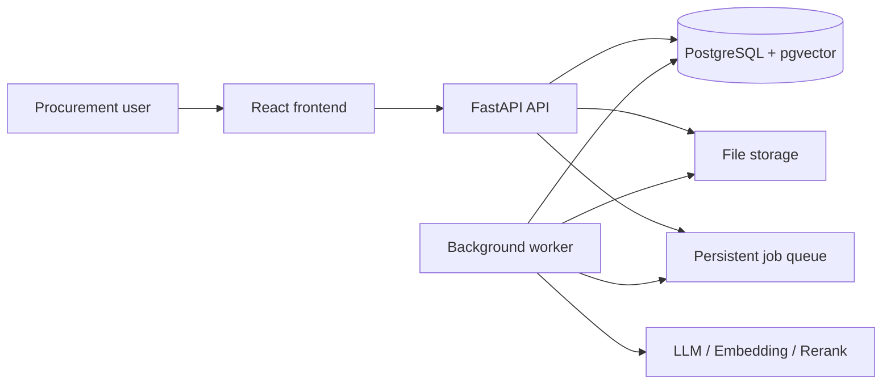
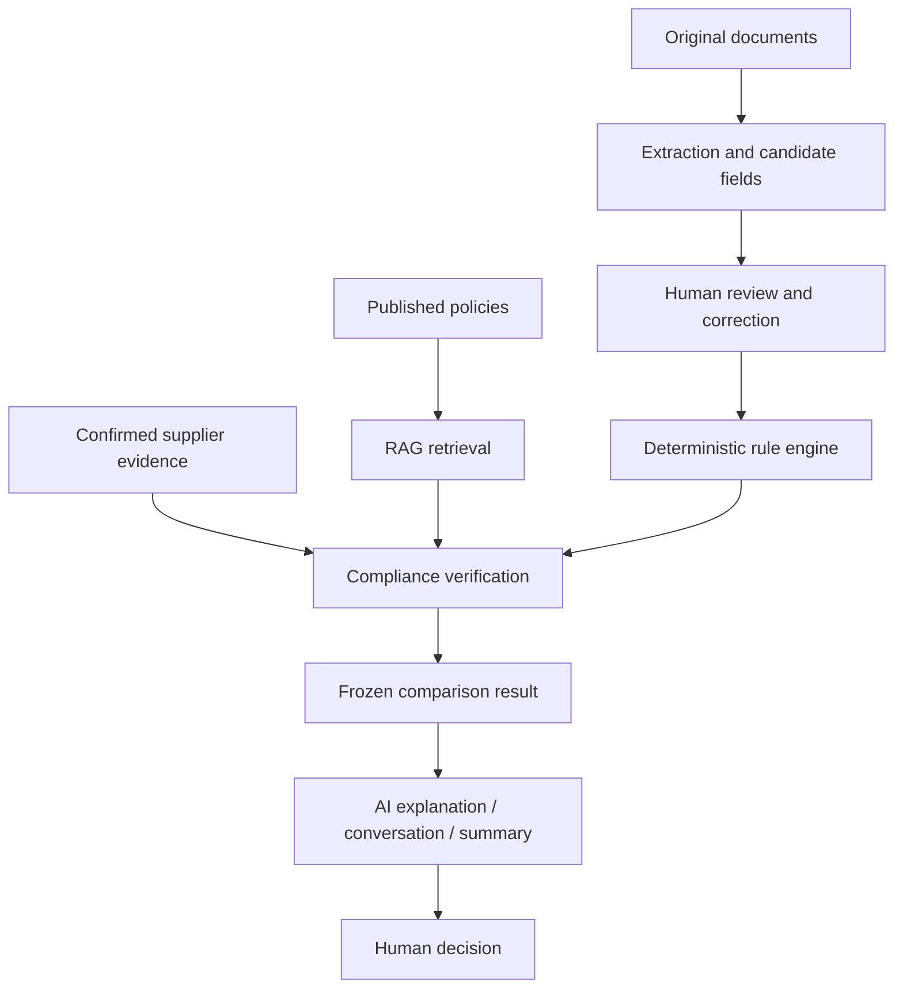
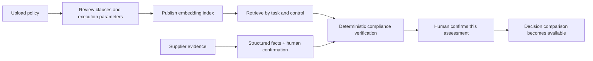

# Supplier Comparison System Architecture

[简体中文](ARCHITECTURE.md) · English

This document describes the runtime architecture and authority boundaries of the current delivery. See [WORKFLOW.en.md](WORKFLOW.en.md) for the user journey, [DATA.en.md](DATA.en.md) for data boundaries, and [LOCAL_ENVIRONMENT.en.md](LOCAL_ENVIRONMENT.en.md) and [TESTING.en.md](TESTING.en.md) for startup and testing.

## 1. System goals

The system turns procurement requirements, supplier quotations, procurement policies, and supplier evidence into traceable comparison results. It helps procurement professionals review, compare, communicate, and retain records. It provides recommendations but does not approve purchases, sign contracts, place orders, or make payments.

## 2. Runtime components

| Component | Responsibilities | Does not |
| --- | --- | --- |
| React frontend | Task, quotation review, compliance, decision, AI assistant, summary, and audit interfaces | Calculate authoritative amounts or compliance conclusions independently |
| FastAPI | Authentication boundary, input validation, version checks, business APIs, and file downloads | Run long model tasks inside request threads |
| Worker | Requirement/quotation extraction, workflow progression, AI conversations, and summary generation | Bypass human confirmation or approve a purchase |
| PostgreSQL | Authoritative state for tasks, revisions, snapshots, jobs, results, policies, vectors, and review records | Store original file bytes |
| File storage | Immutable quotation originals, policy originals, and extraction artifacts | Act as the business-state database |
| Model services | Document understanding, intent parsing, explanations, and narrative generation | Monetary calculations, hard constraints, compliance adjudication, or final approval |

The current implementation is a modular monolith. Backend code lives in `src/supplier_comparison/`, frontend code in `frontend/`, and database migrations in `migrations/`. Local and container deployments share the same domain contracts.

## 3. Authoritative data and versioning

- PostgreSQL is the sole authority for tasks, quotations, policy bindings, compliance results, comparison results, and report status.
- LangGraph checkpoints store workflow position and recovery context only; they do not replace business tables.
- Files are stored by version with hashes. Replacing a file creates a new version instead of overwriting the previous file.
- A valid change to requirements, quotations, policy bindings, or compliance evidence advances `task_revision`, creates a new snapshot, and moves previous results into history.
- API writes use expected versions and idempotency keys to prevent duplicate submissions and late results from overwriting the current revision.
- Monetary values use `Decimal` in Python, `NUMERIC` in PostgreSQL, and decimal strings in APIs.

Core identifiers must not be mixed:

| Identifier | Meaning |
| --- | --- |
| `task_id` | One procurement task |
| `task_revision` | Current task-input revision |
| `quote_id` / `quote_version` | A supplier quotation and its version |
| `job_id` | One asynchronous job |
| `graph_run_id` | One recoverable workflow run |
| `result_id` | One frozen comparison result |
| `policy_set_version` / `policy_index_version` | Policy-content and retrieval-index versions |

## 4. Business-processing layers

### 4.1 Extraction and evidence

PDF, TXT, Markdown, and fixed CSV templates are processed according to the formats accepted by each entry point. Quotation fields must retain source citations; a locatable citation does not by itself mean that a field is verified. Field status uses `EXTRACTED | VERIFIED | MISSING | CONFLICT`, while origin uses `DOCUMENT | USER_INPUT | USER_CORRECTION | DERIVED`.

Quotation review fields are returned by `GET /api/v1/quote-field-schema`; the frontend does not maintain a second set of field rules.

### 4.2 Deterministic decision layer

Code controls specifications, quantity/MOQ, packaging multiples, fees, tax basis, delivery, budget, feasibility, and ranking. Supplier outcomes are:

- `FEASIBLE`: all relevant hard constraints are satisfied.
- `INFEASIBLE`: at least one confirmed requirement is not satisfied.
- `PENDING`: an unknown or review item may still affect the result.

Unknown is not zero and does not automatically mean failure. If a `PENDING` item can affect selection, the system may produce only a draft or pending-confirmation result.

### 4.3 Policy RAG and compliance execution

An uploaded policy first becomes a set of reviewable clauses. Only a published version with a matching scope can be bound to a task. RAG locates clauses relevant to the current control and provides citations. The deterministic compliance layer then combines those clauses, quotation facts, and human-confirmed supplier evidence into `PASS | FAIL | REVIEW_REQUIRED | NOT_EVALUATED`.

A RAG retrieval hit is not a compliance conclusion. When a policy, evidence item, or executable parameter is missing, the UI must explicitly show that the control is not evaluated or requires review.

### 4.4 AI and agent behavior

AI may support requirement/quotation extraction, natural-language preference parsing, constrained investigation, decision Q&A, communication recommendations, and procurement summaries. All tool calls are limited by task, version, allowlist, call count, and time budget. AI cannot alter authoritative facts, bypass compliance gates, or apply hypothetical changes by itself. A scenario can be applied only after explicit user confirmation.

## 5. Security and trust boundaries

- Credentials are read only from backend environment variables and never enter the frontend, logs, test fixtures, or repository.
- Instructions inside uploaded files are content to analyze and cannot change system rules or tool permissions.
- The runtime agent can read only inputs allowed for the current task. Reference answers and holdout sets remain in offline evaluation directories.
- Original files, human corrections, derived values, and model outputs are labeled separately and remain auditable.
- A model cannot silently fall back to an unauthorized provider, and a new job cannot be used to bypass call budgets.

## 6. Current delivery boundary

The system supports comparing multiple supplier quotations for one procurement requirement within a single task. Arbitrary document formats, complex multi-item allocation, automated negotiation, automated ordering, and approval-free operation are outside the current delivery scope. Scanned-PDF support depends on OCR configuration, and live model, embedding, and reranking features depend on available services and valid credentials.
