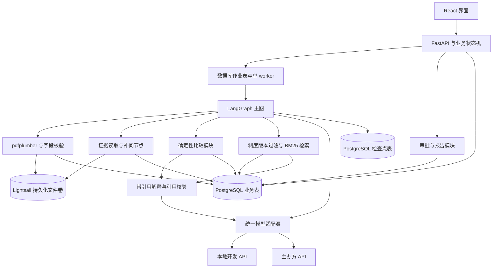

# 供应商比选系统架构

> v0.4 · 2026-09-08 · 采购制度 RAG 纳入正式 MVP。交付与时间线见 [项目计划](../Supplier_Comparison_Project_Plan.md)，数据与共同演示见 [DATA.md](DATA.md)，选型记录见 [方案.md](方案.md)。

## 架构状态与适用范围

本文描述 Supplier Comparison 项目的**目标架构**，用于指导原型开发、测试和演示，不表示功能已经实现。已确定 FastAPI＋Pydantic＋React、LangGraph、PostgreSQL、pdfplumber，以及主办方 Lightsail 实例＋Docker Compose／本地持久化卷。模型先使用团队本地开发 API 跑通，再切换主办方 API 做 AWS 部署测试；具体协议、模型 ID、认证和实例资源参数待核验。

系统面向中小企业采购人员。用户提交一项采购需求，通常上传 3–5 家供应商针对同一类商品的报价。系统提取并核验关键条款，使用确定性工具计算采购成本和检查约束，在信息不足时请求补充，最后形成带来源的比较结果和采购建议，交由人工审核。3–5 家是演示和评测规模，不是最低准入数量；排除后仅一家可行时仍可输出建议并说明备选不足。

首版范围限定为：

- Electronics 类别，首版每次比较同一制造商、料号、封装及必要版本的全新 MCU-9，不允许替代型号；MCU-9 是合成目录标签，演示规格定义见 DATA.md；
- 输入为英文文本型 PDF、CSV 或人工录入数据；
- 金额使用 SGD，并采用已确认的一致税费口径；
- 固定单价、明确计价单位、固定包装、按数量计 MOQ、一次交付和简单明确的费用；
- 比较规格、数量、包装单位、起订量、价格、已知费用、交期、付款条件和有效期；
- 输出比较表、推荐与排除理由、来源、版本记录、审批记录和决策报告；
- 采购制度 RAG 为正式模块，检索版本化制度条款，为缺失信息、推荐及审批变更提供引用解释。

系统不负责联系供应商、自动议价、签约、下单或付款，也不会在缺少数据时生成无依据的供应商信誉评分。

阶梯价格、最低订单金额、复杂折扣和分批交付不在自动计算范围内。发现此类条款时创建问题，要求用户提供可核验的适用条件或明确排除该报价；不得静默简化为固定价格。

## 系统边界

系统接收采购需求、供应商报价、用户对缺失或冲突信息的补充，以及团队维护的版本化采购制度。前三类形成采购事实，制度作为解释依据。系统产生结构化报价、待确认问题、确定性计算结果、供应商可行性判断、带制度引用的推荐建议和最终审批记录。

系统中的判断权分为三层：

1. **模型层**负责理解文档、识别可能的字段与歧义、生成补问和解释结果。
2. **确定性业务层**负责单位换算、采购数量、总成本、硬约束、版本和审批有效性。
3. **人工层**负责确认关键纠正、修改采购要求、处理例外并批准最终建议。

Agent 不拥有采购授权。模型输出属于待验证的判断，不能替代确定性计算、后端状态控制或人工审批。上传文件只被视为待分析数据，其中的文字不能改变系统规则、调用未授权工具或触发外部采购操作。

## 运行架构与模块边界



该图表示运行调用关系，不表示领域模型依赖数据库 SDK。模块通过明确契约调用；领域计算只接受已核验的类型化数据，不依赖 LLM、Web 或存储 SDK。存储和模型实现放在适配器中。Web 不形成权威计算结果，模型不直接修改审批状态。

首版采用模块化单体：一个 Python 后端代码库维护 LangGraph、解析、计算、审批和报告模块，API 与 worker 使用相同后端镜像、不同启动命令。React 通过 API 访问。PostgreSQL 业务表保存权威状态与审计记录，检查点表保存图执行位置与上下文，文件卷保存原件、解析文本和报告。图节点不等于独立 Agent，不增加多 Agent 服务。

模型任务通过持久化作业记录后台执行，前端按任务 ID 轮询进度即可。MVP 可使用数据库作业表和单执行器，无需额外消息中间件。同一任务的写操作需串行化或使用版本条件更新；进程重启后可以识别未完成作业并按幂等规则恢复。

工具优先实现为同进程 Python 函数。当前报价直接解析，历史查询使用 SQL，采购制度通过正式 RAG 模块检索；不引入向量数据库、独立 MCP 服务或额外消息中间件。SQLAlchemy＋psycopg 访问 PostgreSQL，Alembic 管理业务表迁移；检查点初始化与版本单独管理。Pydantic 校验结构，业务代码校验证据、规格和交易条件。

### Agent 闭环与工具边界

主 Agent 的价值集中在“发现影响决策的歧义 → 选择证据和工具 → 提出具体问题 → 根据确认后的回答继续比较 → 解释变化”。固定解析、算术和状态转移由程序保证，不需要模型反复规划。Agent 可以提出下一步动作，后端决定动作是否符合当前状态。

| 工具契约示意 | 作用 | 后端必须执行的限制 |
| --- | --- | --- |
| `read_evidence(task_id, quote_version, source_ids)` | 读取任务内的报价原文 | 校验访问身份、文件归属和版本，不允许任意路径读取 |
| `submit_candidates(task_id, quote_version, fields)` | 提交提取候选字段和引用 | 校验结构与引用；候选值不自动成为已核验业务输入 |
| `list_issues(task_id, task_revision)` | 获取当前缺失和冲突 | 问题类型与阻塞标记由业务校验器确定 |
| `propose_question(issue_id, wording)` | 将结构化问题转成具体补问 | 不能通过改写问题解除阻塞；关联原问题与输入版本 |
| `compare(snapshot_id)` | 计算数量、成本、约束和排序 | 后端读取不可变快照；不接受模型临时传入的权威价格或数量 |
| `retrieve_policy(task_id, task_revision, query)` | 在任务绑定制度集合中检索条款 | 后端核验权限、版本、范围和适用日期；只返回允许读取的条款与检索轨迹 |
| `submit_issue_explanation(issue_id, task_revision, claims, retrieval_id)` | 保存补问原因与制度引用 | 绑定当前开放问题及同修订检索；不要求 result_id，不得更改问题的阻塞标记或答案 |
| `submit_explanation(result_id, claims, retrieval_id)` | 解释结果与取舍 | 推荐对象和排序必须与工具一致；报价与制度引用分开核验，失败则使用明确标识的确定性模板 |

人工回答、修改需求、排除报价、批准和导出通过应用 API 提交，并由用户身份与版本检查保护。Agent 没有审批工具。原始会话日志可按受限策略留存，但不得作为已验证的业务事实。

LangGraph 主图依次处理输入解析、字段理解、校验／补问、确定性比较、retrieve_policy 和 explain_with_sources；阻塞问题可先检索并解释补问原因，再 interrupt，不能先宣布最终推荐。补问回答后回到业务校验并重算。推荐通过发布检查后结束图运行，人工审批通过独立 FastAPI 接口处理。检查点使用 PostgresSaver／AsyncPostgresSaver 等持久化实现；不依赖仅存内存的检查点完成重启恢复。[LangGraph 持久化](https://docs.langchain.com/oss/python/langgraph/persistence)

### 采购制度 RAG 的运行契约

这是第二周必交付模块。首版知识库为 3–5 份团队编写的英文 Markdown 制度，逐章节切分并保留稳定条款 ID；正文和清单从版本化文件导入 PostgreSQL，导入幂等且不覆盖旧版本。制度均标记为虚构演示资料，字段和评测隔离见 DATA.md 第 7 节。

1. 后端根据任务固定的 policy_set_version、访问范围和评估时点筛选条款；不把所有旧版本混入检索。原始问题与规则原因码形成英文检索输入，中文按钮可映射固定英文问题，不承诺任意跨语言语义搜索。
2. 复用 BM25 库对过滤后的条款排序，初始 Top-3；保留否定词、固定分词／别名和检索版本。小知识库可在单 worker 内建立可重建索引，以集合版本和内容哈希为缓存键。无 embedding API、向量扩展或独立检索服务依赖。
3. 模型只收到当前已确认事实、计算结果及实际检索到的条款。解释的每条制度主张绑定 citation，包含文档／版本／条款 ID、原文和哈希；后端检查它属于此次返回集合且原文匹配，语义支持另以模型支持判断及人工评测核验，不能把 ID 存在等同于依据充分。
4. 检索记录状态 OK／NO_EVIDENCE／CONFLICT／ERROR；零命中、零分或不足以支持回答时不硬拼答案。发现版本或内容冲突时明确提示，不由模型选择较宽松规则。检索文本中的指令不能取得工具或审批权限。NO_EVIDENCE 与 ERROR 分别表示无依据和运行故障。
5. 检索故障不改变金额、可行性或审批有效性规则；展示确定性事实与“制度依据未验证”标记，允许人工按既定审批条件审阅，不标记为自动制度合规。正式项目验收必须包含成功检索、正确引用和失败处理，不能以运行降级替代交付。
6. 每次检索绑定 task_revision、snapshot_id（若已生成）、policy_set_version 和 retrieval_id；结果发布前复核版本。推荐与 HTML 报告冻结引用和状态，不在导出时重新检索最新文本。正式解释重生成须新推荐版本并重审。
7. 任务创建时绑定一个明确制度集合；InputSnapshot 保存该版本。新集合发布只供新任务使用，不追溯改变旧任务。现有任务显式切换集合时增加 task_revision，废止旧运行／推荐／审批，按正常更新流程重算；发现制度与计算规则矛盾时由团队修正后重新验证，不自动把文本变成执行规则。

BM25 不增加模型调用；引用解释复用原推荐解释节点的调用，支持判断若单独调用也累计进每次逻辑运行最多 8 次的总预算。超限或 API 故障明确记录；本地和主办方 API 分别执行相同引用测试。首版由结果／补问面板触发解释，不新增独立聊天系统或无限问答循环。

补问解释绑定 issue_id＋task_revision＋policy_set_version＋retrieval_id，保存独立的 IssueExplanation，经问题查询接口供 React 补问面板读取；此时没有 result_id／snapshot_id 也有效，不创建虚假比较结果。以问题、修订、制度集合及解释版本建立幂等约束；interrupt 恢复不能重复生成或重置模型调用计数。问题失效时其解释一并标记历史；回答后生成的新结果重新检索。任务面板触发只提交有界作业或读取当前已保存解释，不能绕过运行预算循环生成。

### 模型接入与单机部署

- 本地开发调用团队自行配置的 API；本地服务商和协议未定，不要求运行模型权重。Lightsail 阶段使用主办方 API，目标为 Claude Sonnet 4.6 或账号内获准 Sonnet，实际以开放范围为准，不预设 Bedrock、Anthropic 或 OpenAI 兼容协议及认证方式。
- 模型适配层统一消息、结构化输出、工具调用和错误映射，按环境配置 provider、model_id、地址、区域及认证。密钥仅在后端运行环境提供，不进入代码、前端、日志或检查点。AWS 失败不静默回退个人 API。
- 用相同开发样例检查接口兼容性，再分别记录完整评测；最终 AWS 报告只反映主办方接口的实测结果。切换模型／环境创建新测试运行，不跨环境恢复旧模型会话。
- Compose 管理 Web 入口（React 构建产物及反向代理）、API、单 worker、PostgreSQL。配置 HTTPS、健康检查、连接重试和有界连接池；数据库仅在内部网络可达。
- 数据库与文件使用不同命名卷，API／worker 按需共享文件卷；文件下载经后端鉴权，新报价使用不可覆盖的版本路径。容器重建继续挂载原卷，常规发布不删除数据卷。
- Git 管理源码、依赖锁定和部署配置；镜像以提交号／发布号标记并记录摘要。发布统一执行一次迁移；回退旧镜像前检查表结构和检查点兼容性，镜像回退不回退业务数据或审批。
- 使用 pg_dump 与配套文件备份，导出到实例之外并验证恢复，资源到期前导出。实例 CPU、内存、磁盘和架构待确认后配置资源与日志上限。[Docker Compose 部署](https://docs.docker.com/compose/how-tos/production/)、[持久化卷](https://docs.docker.com/engine/storage/volumes/)

## 组件与权力边界

| 组件 | 拥有的职责 | 不应拥有的职责 |
| --- | --- | --- |
| Web 交互界面 | 上传报价、填写采购需求、展示来源、人工纠正、补问信息和提交审批 | 绕过后端校验、直接修改权威计算结果或复用失效审批 |
| 工作流控制器 | 推进流程、保存状态、暂停与恢复、生成快照、检查版本、控制幂等及审批有效性 | 猜测缺失条款、修改用户约束或代替人工审批 |
| 文档理解模块 | 从支持的文档中识别字段、来源位置、缺失项和歧义 | 将低置信或冲突字段自动标记为已确认 |
| LLM／Agent | 理解文本、生成补问、解释比较结果和取舍 | 执行权威金额计算、擅自放宽预算或交期、批准采购建议 |
| 标准化工具 | 规范数量、币种、包装和商品描述，检查是否具备可比性 | 在规格无法确认时强行认定商品等价 |
| 比较与约束工具 | 计算实际采购量、总成本并检查预算、交期、MOQ 等硬约束 | 把未知费用默认为零，或自行决定未声明的评分权重 |
| 持久化层 | 保存采购需求、报价、字段、来源、问题、比较结果、版本和审批记录 | 生成推荐或解释业务结果 |
| 报告生成模块 | 导出标记明确的草稿；按已批准且当前有效的记录生成最终报告 | 用过期结果、阻塞问题或失效审批生成当前有效的最终报告 |
| 人工审核人 | 确认纠正和假设、处理异常、批准或退回当前版本的建议 | 将本次审批视为下单、付款或未来版本的永久授权 |

关键权限由应用逻辑而不是提示词保证。模型响应在进入类型化候选记录前须通过结构、类型、取值范围和身份关联检查；进入权威比较快照前还需完成来源和业务核验。仅 JSON 合法、数值合理或模型自报高置信度，不足以证明条款正确。

## 核心领域模型与来源追踪

目标架构围绕以下核心对象组织：

| 对象 | 主要内容 |
| --- | --- |
| 采购需求 | 商品规格、需求数量、预算、到货要求、币种、偏好及版本 |
| 供应商报价 | 供应商、报价文件、报价版本、有效期和处理状态 |
| 报价字段 | 商品规格、包装单位、包装数量、MOQ、单价、运费、交期、付款条件等 |
| 来源引用 | 原始文件、页码或行号、原文片段定位及文件版本 |
| 待处理问题 | 缺失字段、规格冲突、单位歧义、过期报价或需要人工确认的事项 |
| 比较结果 | 标准化输入、计算明细、约束检查、可行性和排除理由 |
| 推荐结果 | 推荐供应商、备选项、主要取舍、证据引用及输入版本集合 |
| 审批记录 | 审核人、审批状态、时间、意见及被批准的推荐版本 |
| 比较范围 | 纳入的报价版本、用户排除及原因、范围版本 |
| 输入快照 | 需求、报价、字段核验、范围、偏好和计算规则的不可变版本集合 |
| 作业与事件 | 作业状态、幂等键、输入版本、尝试次数、错误、关键动作和时间 |

### 字段状态与来源核验

将字段核验状态与数据来源分开，避免把“人工纠正”误解为天然可信：

- `validation_status`：`EXTRACTED`（待核验）、`VERIFIED`（已核验）、`MISSING`（缺失）、`CONFLICT`（冲突）。
- `origin`：`DOCUMENT`（原文）、`USER_INPUT`（人工补充）、`USER_CORRECTION`（人工纠正）、`DERIVED`（由已核验字段计算）。
- 任何纠正先形成新候选版本，重新校验后才可进入 `VERIFIED`；历史值与原始证据不被覆盖。

解析器先为文件、页面／文本块和 CSV 行列生成稳定标识，并保存原文件哈希及解析器版本。模型只能引用本次解析提供的来源 ID；后端验证引用确实存在、属于正确文件版本，且显示给用户的片段与解析文本一致。CSV 使用行号和列名，PDF 使用页码、文本块及可用的位置坐标。派生值关联输入字段 ID 和计算规则版本，不能伪装成原文直接记载。

候选字段只有在结构、单位、范围、来源及跨字段校验通过，且不存在语义歧义或冲突时，才能按明确规则自动核验。未建立可靠校验规则的关键字段必须人工确认。人工补充记录用户、时间和依据；自然语言回答先展示结构化修改供确认。引用存在只能证明可定位，不能证明语义支持，评测需分别检查两者。

每个关键字段必须能够追溯到原始报价中的页码、行号或其他稳定位置，或者明确标记为人工输入。人工纠正不能覆盖原始证据；系统应同时保留原始提取值、纠正值、操作者和时间。

### 最小数据契约

以下是开发前共同固定的逻辑契约，不限定数据库表拆分方式。业务 ID、身份、时间和版本由后端生成或核实，不信任模型提供的身份。

| 契约 | 必要字段与不变量 |
| --- | --- |
| `ProcurementRequirement` | `task_id`、`requirement_version`、商品规格、需求数量及单位、币种、预算口径、到货截止、时间基准、已确认排序规则 |
| `QuoteField` | `field_id`、`quote_version`、`field_version`、字段名、原始值、标准化值、单位、`validation_status`、`origin`、`source_refs`、核验方式／人员／时间 |
| `Issue` | `issue_id`、任务或供应商范围、字段、问题类型、`blocking`、创建时 `task_revision`、`OPEN/RESOLVED/SUPERSEDED`、回答、确认记录及解决依据 |
| `IssueExplanation` | `issue_explanation_id`、`issue_id`、`task_revision`、`policy_set_version`、`retrieval_id`、解释／引用／支持状态和解释版本；不依赖比较结果，问题失效后不可作为当前依据 |
| `InputSnapshot` | `snapshot_id`、`task_revision`、需求／报价／字段版本、比较范围及用户排除、偏好、`schema_version`、`calculation_rule_version`、`policy_set_version`、时间基准、内容哈希；创建后不可修改 |
| `ComparisonResult` | `result_id`、`snapshot_id`、逐供应商数量与费用明细、约束 `PASS/FAIL/UNKNOWN`、可行性、事实与来源 ID、排序及并列、阻塞项、计算时间与时间有效边界 |
| `Recommendation` | `recommendation_id`、`result_id`、推荐／并列候选、解释与事实引用、`retrieval_id`、制度引用及检索状态、`CURRENT/STALE`；推荐对象须属于工具给出的最优集合 |
| `PolicySet / PolicyClause` | 不可变集合版本、文档／版本／条款 ID、范围、生效区间、标题、章节、正文、哈希和虚构标识；成员版本显式列入清单 |
| `RetrievalTrace` | `retrieval_id`、任务／修订／快照引用、集合版本、查询、过滤条件、检索器版本、条款 ID／分数／哈希、引用支持状态、耗时及错误；轨迹不能改写业务事实 |
| `Approval` | `approval_id`、`recommendation_id`、`snapshot_id`、审核人、时间、意见、批准决定及后续失效事件；历史批准事实不被删除 |
| `GraphRun` | `graph_run_id`、独立 `thread_id`、`task_id`、当前输入修订号、模型环境／provider／model_id／提示词版本、累计调用次数、运行状态与失效原因；运行和任务 ID 不混用 |
| `Job` | `job_id`、`graph_run_id`、`task_id`、`task_revision`、`snapshot_id`（有则记录）、阶段、`QUEUED/RUNNING/SUCCEEDED/FAILED`、幂等键、尝试次数、心跳或租约、错误类型；补问暂停表示本段作业完成，图运行仍待回答 |
| `ResumeIntent` | 回答／问题 ID、目标运行及中断标识、回答前后 task_revision、恢复作业 ID、幂等键及处理状态；作为业务回答与检查点恢复的关联记录，可合并入作业表 |

金额在 API 中使用十进制字符串，PostgreSQL 使用 NUMERIC，Python 使用 Decimal；保留原始单价精度，数量和包装单位显式表示。MCU 规格字段包含 manufacturer、manufacturer_part_number、package、revision、condition；packaging_type、units_per_pack 和 order_multiple_units 分开保存。必填与可空规则由 schema 定义；费用 UNKNOWN 与金额 0 不等价。合成来源元数据与运行时 DOCUMENT／USER_INPUT 来源分开，参考答案不进入模型输入，详见 DATA.md。关键日志只记录必要的 ID、状态、耗时和错误。

## 比较任务准入与数据核验

任务须先具备最低必要的采购需求和至少一份纳入范围的报价，再逐供应商核验。可以增量展示已知结果，不要求所有报价先完整才能开始检查。准入检查至少包括：

- 采购商品、规格和数量是否明确；
- 报价文件是否属于支持格式且可以解析；
- 各报价商品是否有足够证据证明可以比较；
- 包装单位、包装数量和单价口径是否明确；
- 预算、交期等用户声明的硬约束是否可以执行；
- 影响总成本或可行性的关键字段是否缺失或冲突；
- 报价是否仍在有效期内。

准入失败不会自动结束任务。系统创建结构化问题并暂停受影响的步骤；用户补充或纠正后重新核验。无法确认等价的商品不能因为名称相似而被直接比较，未知运费、税费或其他必要费用不能默认按零计算。

| 供应商可行性 | 判定规则 | 对任务的影响 |
| --- | --- | --- |
| `FEASIBLE`（可行） | 必要字段已核验，硬约束全部 `PASS`，参与排序的值齐备 | 参与确定性排序 |
| `INFEASIBLE`（不可行） | 至少一项基于可靠证据的硬约束为 `FAIL` | 排除；其他未知字段不再阻塞本次选择，但如实保留未知状态 |
| `PENDING`（待确认） | 尚无足以确定排除的失败项，必要约束或排序值为 `UNKNOWN` | 当前已知结果仅作草稿，创建补问 |

`USER_EXCLUDED` 是比较范围中的人工排除记录，不是计算得出的不可行性。用户须明确确认排除及原因；重新纳入或排除均产生新范围版本并使旧结果、审批失效。新版报价不能自动继承旧报价的排除记录。

MVP 采用保守且简单的规则：仍在范围内的 `PENDING` 报价均视为可能影响选择，阻止最终推荐和审批。用户可以解决问题或明确排除；不实现成本上下界等支配性证明。已确定不可行报价的其他未知字段不阻塞，例如交期明确超限的 A 缺运费，不需要继续追问 A。

只有范围内至少存在一份报价、没有 `PENDING`、且全部不可行时，才返回“无可行方案”。全部被用户排除时返回“比较范围为空”并请求重新选择；存在 `PENDING` 时返回“暂时无法确定”。报告列明纳入、业务排除和人工排除，不能将缩小范围后的最优结论表述为全部供应商中的最优。

## 运行生命周期

### 任务状态与转移条件

任务状态保存在业务数据库。以下状态属于当前任务运行；`STALE` 属于历史推荐和比较结果，不作为当前任务的替代状态。

| 状态 | 进入条件 | 后续动作 |
| --- | --- | --- |
| `DRAFT` | 新任务，需求和文件仍在准备 | 满足最小启动条件后提交到 `PROCESSING` |
| `PROCESSING` | 提取、核验、比较或重算作业已排队／执行 | 按结果进入待补问、待审核、无可行或可重试失败 |
| `NEEDS_INPUT` | 有阻塞问题、范围为空、审核退回要求修订，或需人工后备 | 保存问题；确认回答或修订后创建新版本并回到 `PROCESSING` |
| `READY_FOR_REVIEW` | 有可行方案，无阻塞问题，推荐与当前快照一致且时间有效 | 审核通过进入 `APPROVED`；退回则创建修订问题进入 `NEEDS_INPUT` |
| `APPROVED` | 当前推荐通过后端事务校验并获人工批准 | 可申请最终导出；决策输入或时间有效性变化后重新处理 |
| `NO_FEASIBLE_OPTION` | 非空范围内所有报价均已确定不可行 | 展示原因；修改需求或输入后进入 `PROCESSING` |
| `FAILED_RETRYABLE` | 暂时性模型、网络或作业错误，当前版本仍被保存 | 有界重试回到 `PROCESSING`；用尽重试则创建人工处理问题进入 `NEEDS_INPUT` |

任何已提交任务的外部决策输入变化（需求、文件、用户确认或纠正、范围、规则）均增加 `task_revision`，撤销当前结果的有效指针并创建新作业。同一轮作业内部的提取、核验产物绑定该修订号，各自产生不可变记录，不能因保存自己的产物而无限触发新任务。核验完成后冻结快照；已冻结输入的再次修改须产生新修订号。不要求旧作业立刻停止，但其结果不能发布为当前结果。时间有效性变化也触发新一轮评估，不能因没有编辑数据而沿用有效状态。

### 前后端操作契约

API 路径可随实现确定，以下输入与行为必须一致。用户身份由服务端认证上下文取得，所有操作校验任务访问范围。

| 操作 | 请求必须包含 | 成功与冲突处理 |
| --- | --- | --- |
| 提交需求／报价／纠正／范围变更 | `task_id`、`expected_task_revision`、修改内容、幂等键 | 条件更新版本并排队；版本不符返回冲突，不覆盖当前值 |
| 回答问题 | `issue_id`、问题版本、`expected_task_revision`、已确认的结构化答案、幂等键 | 只解决仍适用于当前输入的问题；旧问题返回过期提示并展示当前问题 |
| 获取进度 | `task_id` | 返回当前版本、任务状态、问题、比较草稿和最新有效结果 ID |
| 批准 | `recommendation_id`、`snapshot_id`、`expected_task_revision`、幂等键 | 事务内校验身份、范围、阻塞、版本和时间，成功才创建审批 |
| 导出 | `result_id`／`recommendation_id`、草稿或最终模式；最终模式含 `approval_id` | 后端检查当前有效性；过期不能作为当前最终报告导出 |

任务修订号、输入快照和图运行／thread_id 用途不同，不得互相代替。补问后的自然语言回答若解析成候选值，必须经结构化确认后才提交正式修改。API 根据业务记录定位运行与中断，不信任客户端任意指定检查点。

### 正常比较流程

```text
提交采购需求并上传报价
→ 提取字段并关联原始来源
→ 标准化规格、数量和包装单位
→ 核验缺失、冲突和报价有效期
→ 保存不可变输入快照，计算实际采购量及已确认总成本
→ 检查硬约束并形成可行方案集合
→ 根据用户明确偏好比较可行方案
→ 在任务绑定的制度集合内检索相关条款，生成带引用的解释
→ 检查当前版本后发布推荐、取舍和排除理由
→ 人工审核并批准当前版本
→ 生成带来源和审批记录的决策报告
```

### 补问与恢复流程

```text
发现关键字段缺失或冲突
→ 创建待处理问题并暂停相关步骤
→ 用户补充、确认或纠正
→ 保存变更及操作来源
→ 重新核验受影响字段
→ 生成新输入快照，从确定性检查阶段恢复比较
```

补问状态必须持久化，不能依赖模型对历史对话的非结构化记忆。按前述范围规则计算的未解决阻塞问题会阻止最终推荐和审批；用户仍可查看草稿和已有证据。输入变更后不再适用的问题标记为 `SUPERSEDED`；不能通过回答旧问题改写新报价。

LangGraph 中断与版本变化采用以下固定协议：

1. 幂等保存 Issue 和 NEEDS_INPUT 后触发 interrupt，检查点持久化后结束本段作业并释放 worker；不保持 HTTP 请求或数据库锁等待回答。
2. 回答在短事务内校验问题、关联运行和预期版本，保存结构化答案，推进 task_revision，并创建含回答前后版本映射的恢复作业。
3. 恢复作业核验待补中断与当前版本仍匹配，通过已保存答案引用恢复同一 thread_id；重新读取业务数据，更新图的输入版本，生成新快照并完整校验／重算。此类回答是允许同一图运行推进版本的受控入口。
4. 若回答后发生其他修改，拒绝该过期恢复。上传报价、需求修改、主动字段修正、范围变更或时间失效产生新图运行；旧运行失效，迟到写入被拒绝。
5. interrupt 恢复会重跑所在节点开头，节点副作用需幂等。业务事务与检查点提交不假定原子性；按运行／问题／作业标识核对并恢复崩溃窗口，未发现匹配持久化中断时不得盲目 resume。[LangGraph 中断规则](https://docs.langchain.com/oss/python/langgraph/interrupts/)

### 报价或需求更新流程

```text
收到新版报价或修改采购需求
→ 创建新的输入版本
→ 增加任务修订号并保存新输入，创建新的 graph_run_id／thread_id
→ 将旧比较结果和推荐标记为过期
→ 使关联的旧审批失效
→ 重新核验，创建新快照并全量计算、检查和推荐
→ 展示变化原因并请求重新审批
```

更新不得静默覆盖历史数据。旧结果可以保留用于审计和对比，但不能继续作为当前有效建议或最终报告的依据。

MVP 对决策输入变化执行整个任务重算，不构建字段级依赖图。新版报价独立提取和核验，旧人工补充不自动迁移；若用户确认沿用某条补充，须创建关联新版报价的人工记录。

### 作业恢复、重试与幂等

作业以任务、图运行、输入版本和阶段识别。PostgreSQL 作业表＋单 worker 调度，每任务最多一个活跃执行。短事务领取任务并提交后才调用模型；修改输入、发布结果和审批采用统一任务行锁及版本条件，API 与 worker 不共享活跃数据库会话。

瞬时错误有限退避重试，缺失／冲突直接补问。初值为每阶段最多 3 次尝试（含首次）、每次逻辑图运行最多 8 次模型调用，并配置超时。恢复与重试沿用累计计数，不能换 job_id 重置预算；这些是可调整阈值。超限保存失败原因，结束当前执行并转人工处理，不自动无限重开图运行。

执行器重启后检查过期租约或未完成作业，允许重做读取和计算；问题、候选提交、结果发布及审批按幂等键去重。同一幂等键携带不同请求内容应拒绝。重复审批返回已有记录及其当前有效性，不能重复批准或恢复已失效审批。

比较结果发布前再次检查输入快照是否仍对应当前 `task_revision`；旧作业晚到可保留为历史结果，但不能覆盖新结果。模型服务不可用时，已核验输入仍可用确定性比较和模板解释继续处理，界面明确标注后备模式。

## 决策与推荐规则

系统遵循“先检查硬约束，再比较用户偏好”的原则：

1. 确认各供应商提供的商品规格具有可比性；
2. 根据需求数量、包装数量和 MOQ 计算必须购买的实际数量；
3. 使用已确认的单价、运费和适用费用计算总成本；
4. 检查预算、交期、规格、数量、有效期及用户明确声明的其他硬约束；
5. 排除不满足硬约束的供应商，并记录逐项原因；
6. 对可行方案按照用户明确选择的成本优先、交期优先或其他规则排序；
7. 输出推荐、备选方案、主要取舍、计算依据和来源。

模型可以把用户语言转换成候选约束，但约束必须由用户确认或来自明确的结构化输入。模型不能自行改变预算、交期、采购数量或评分权重。

当非空比较范围内所有供应商均已确定不满足全部硬约束时，正确结果是“无可行方案”，并展示已知排除原因。仍有待确认报价时只能报告暂时无法确定。系统可以提示用户检查需求或补充信息，但不能自动放宽约束以制造推荐。

### 数量、计价和费用口径

以下字段必须分开保存：基本计数单位（MCU 为颗）、每包装包含的基本单位数、允许的采购步长、MOQ 数量及单位、价格金额、价格所覆盖的单位和数量。按盘与按颗计价不能仅靠一个 unit_price 数值区分。

首版只支持数量型 MOQ，换算为同一基本单位后计算。设需求量为 `D`、MOQ 为 `M`、采购步长为 `S`，三者均以基本单位计数且 `S > 0`：

```text
实际采购量 Q = ceil(max(D, M) / S) × S
```

按整盘采购时 S 为每盘颗数；允许按颗采购时 S＝1。例如需求 1,050 颗、MOQ 1,000 颗、每盘 100 颗且须整盘购买，则采购 1,100 颗（11 盘）。MOQ 原文为 20 盘时先按每盘数量换算，不能把 20 当作 20 颗。

设固定价格 P 覆盖 B 颗，则货款为 Q／B×P。必须有证据说明该价格适用于实际采购量：按盘销售须满足整盘限制；“每百颗”的价格能否用于非整百采购无法确认时先补问，保留原始表达和换算明细。

- 费用状态区分 `KNOWN_AMOUNT`、`FREE`、`INCLUDED`、`NOT_APPLICABLE`、`UNKNOWN`，各状态都有来源或人工确认；不出现运费条款不等于免费。
- `INCLUDED` 不重复累加，明确免费／不适用才允许数值贡献为零；`UNKNOWN` 阻止该报价的确定总成本。已知部分只能标为小计，不得冒充总额。
- 预算与总额使用已确认的一致税费口径。真实数据的适用税费必须确认；演示“不计税”仅是标记明确的简化场景，不默认套用于真实报价。
- 使用十进制定点运算，保留原始单价精度；MVP 默认先以 `ROUND_HALF_UP` 将货款行金额舍入至 SGD 0.01，再累加按同口径确认的费用／税额。原报价声明不同舍入规则或总额不一致时，创建冲突问题，不能静默改原报价。
- 总额相同或排序字段相同，按用户确认的第二排序项处理；未指定则输出并列最优集合。UI 可稳定排列并列行，但不能把行顺序当作业务优胜顺序。

### 交期和有效期口径

需求保存到货截止日期或时间；报价保存发货／到货语义、交期长度、自然日／工作日、起算事件及已确认的起算日期。不能把“发货后三天”或“付款后三个工作日”直接与“五天内到货”比较。

MVP 优先支持明确到货日期，或从明确基准日期开始的自然日到货周期；基准日记为第 0 日。工作日、节假日、付款时间或运输时长不能确定时，请求用户确认预计到货日期及依据，不自行推测。示例中的相对交期必须在运行前绑定一个场景日期。

用户按日期表达时按 `Asia/Singapore` 日历日比较：报价到货日期不晚于需求截止日期视为满足；按时间表达时使用带时区的时间戳。只有日期的报价有效期默认解释为新加坡该日结束，界面展示该口径；原文有不同约定时须确认。数据库时间戳统一存 UTC，同时保留原始日期和时区语义。

每次计算保存 `evaluated_at` 和已知最早时间有效边界，例如报价到期或为满足截止日期所需的最晚起算时间。若确认的计划起算日已经错过，不能继续沿用旧到货结论，须重新核实。展示当前结果、批准和最终导出时检查时间条件；边界到达后即使没有输入编辑，也须撤销当前有效状态并重新评估。

### 示例行为

共同场景 MCU-DEMO-001 的规格、报价、日期与独立答案以 [DATA.md 第 5 节](DATA.md#5-共同主演示与参考答案)为准：虚构制造商 QQ Demo Components、料号 QW-MCU9-DEMO、QFN-32／R1、全新且不允许替代，采购 1,000 颗、预算 S$8,000，从 2026-09-14 起算，2026-09-19 前到货，SGD 且明确不计税。

- A：S$640／100 颗盘，MOQ 20 盘、整盘采购、免费运费，实际 2,000 颗／S$12,800，7 天到货，超预算且超期。
- B：S$6.80／颗、MOQ 1,000 颗、可按颗购买、运费 S$200，实际 1,000 颗／S$7,000，3 天到货。
- C：S$660／100 颗盘、MOQ 10 盘、整盘采购、运费 S$500，实际 1,000 颗／S$7,100，3 天到货。

B 初始 PDF 省略运费，保持 PENDING；用户回答 S$200 后恢复关联图运行、重算并推荐 B。上传 B v2 时明确运费仍为 S$200、到货改为 6 天，创建新图运行，使旧结果和审批失效，改荐 C 并解释增加 S$100。受控演示时钟与真实运行时钟分开，不能用旧场景日期掩盖真实过期。

## 版本、审批与最终定稿

每个推荐结果必须绑定一组不可混用的输入和计算版本：

```text
推荐结果
├── 不可变输入快照
│   ├── 采购需求版本与时间基准
│   ├── 各供应商报价及字段核验版本
│   ├── 来源、人工补充和纠正记录
│   ├── 比较范围、用户排除及排序规则
│   └── schema 与计算规则版本
├── 比较结果版本及时间有效边界
└── 审批记录
```

能够影响可行性、排序或推荐理由的输入变化，都会使关联推荐和审批失效。MVP 对需求、报价、核验值、人工修正、比较范围、偏好、计算规则和已批准解释内容的变更均重新审核，不实现自动判断“实质性变更”的模型逻辑。仅界面主题、列宽、展开／折叠等纯视图设置不触发重新审批；不改变事实的界面设置应与业务输入分开保存。

### 快照、事务与时间保护

输入快照以规范化内容生成哈希，引用不可变版本并保存在数据库。哈希用于识别内容一致性，不代替身份校验或事务锁。权威比较工具按 `snapshot_id` 读取已保存记录，不允许 Agent 在调用时替换价格、数量或约束。

结果发布、批准、最终导出都须读取当前任务修订号与有效结果指针。批准在同一事务中执行当前版本条件检查、阻塞检查、审核人授权检查、以当前时间为基准的有效性检查和审批写入；不接受前端的 `approved=true` 作为批准事实。若期间发生更新，应返回版本冲突并提示重新查看。

最终报告从冻结的已批准内容生成；生成完成后、发布为当前有效最终报告前，再检查版本、审批和时间边界，防止生成期间发生更新。报告生成失败可以幂等重试，不重新创造审批。审批状态由原批准事件和后续失效事件共同确定，失效不能删除历史批准事实。

模型／提示词版本作为运行元数据保留；单纯升级部署配置不改写历史报告。若重新生成了推荐或解释，就产生新的推荐版本并重新审核，不能把新内容附到旧批准记录上。

最终定稿必须满足：

- 采购需求、报价、字段核验、比较范围和规则版本与当前输入快照一致；
- 按比较范围和可行性判定后不存在未解决的阻塞问题；已不可行或人工排除报价的未知字段如实显示；
- 比较结果来自已核验输入和确定性工具；
- 推荐引用的比较结果与当前输入版本一致；
- 人工审核人明确批准该推荐版本；
- 批准与最终导出当时，推荐候选的报价有效期及交付条件仍成立，且当前范围的可行性与排序已经按当前时间复核。已确定不可行或人工排除报价的过期状态不能反过来阻止其他完整方案。

最终报告记录的是采购建议及其审批过程，不是采购订单，也不授权系统执行对外操作。

首版优先导出 HTML，包含需求、范围与排除、数量和费用明细、约束结果、推荐／并列、事实来源、人工修改标记、输入快照、计算时间、生成时间、已知有效边界及审批记录。无可行方案、待确认或未批准结果允许导出明确标记的草稿，不能带有效审批标识。

已下载文件无法远程撤回。系统保留历史报告并在应用中标记失效；报告写明“截至何时、基于哪些输入”的结论，不能宣称无限期有效。历史归档的访问与当前最终报告导出应明确区分，归档不意味着旧审批重新生效。

## 异常处理与人工介入

| 情况 | 系统行为 | 是否允许形成最终推荐 |
| --- | --- | --- |
| 文件格式不支持或解析失败 | 该报价待确认，请求替换、人工录入或明确排除 | 范围内仍有阻塞问题时否 |
| 规格、包装或关键费用存在歧义／缺失 | 该报价待确认；不强行换算或默认费用为零 | 仍可能影响选择时否 |
| 已有可靠硬约束失败的报价缺其他字段 | 标为不可行，保留已知排除原因和未知字段 | 不阻塞其他报价 |
| 报价已经过期 | 标记该报价不可行；若曾支撑当前推荐则使结果和审批失效并重算 | 其他报价完整且无阻塞时可以 |
| 全部已确定不可行 | 展示已知排除理由和“无可行方案” | 不推荐具体供应商 |
| 无已知可行供应商但仍有待确认报价 | 展示“暂时无法确定”并补问 | 否，不能误报无可行 |
| 用户排除了全部报价 | 要求重新选择比较范围 | 否，不能误报无可行 |
| 旧计算晚到或旧页面审批 | 拒绝覆盖或批准，返回当前版本提示 | 仅当前有效结果可进入审批 |
| 报告生成期间发生更新或到期 | 不发布为当前有效最终报告，返回失效原因 | 重算并重新审核后再导出 |
| 模型服务不可用 | 保存当前状态；已核验数据仍可由确定性工具处理 | 视必要数据是否已确认而定 |
| 应用暂时不可用 | 使用人工比较模板继续业务，并保留后续录入记录 | 由人工流程决定 |

人工录入、纠正和后备处理必须清楚标记，不能把人工补全结果展示为模型首次自动提取的结果。

## 数据、安全与信任边界

供应商报价可能包含价格、联系人和商业条款等敏感信息。原型优先使用明确标注的虚构或匿名化样例；真实报价只有在取得使用和展示许可后才能进入系统。

安全边界包括：

- 上传文件是不可信输入，只能通过受限的解析和读取能力处理；
- 校验文件类型、大小和页数上限，按应用生成的文件 ID 存储；不把用户文件名直接当作服务端路径；
- 文档内容不得覆盖系统指令、修改权限或触发外部操作；
- 模型只接收完成当前任务所需的最小数据；
- 应限制报价、来源文件、日志和报告的访问及保留范围；
- 密钥和基础设施凭据不得进入模型输入、业务记录或导出报告；
- 对外通信、签约、下单和付款能力不属于首版系统权限；
- 人工审批只批准当前版本的建议，不产生无限期或跨版本授权。

首版采用预建具名账户、成熟认证组件和服务端会话，保留采购用户与审核人权限，省去注册和找回密码；角色由后端保存，审批记录绑定认证账户，不相信客户端传入的用户名。文件归属、下载和审批均经后端授权；若主办方提供可复用 Cognito 模板，可替换登录实现。PDF 上限初值为每份 5 页／5 MB、单任务 5 份，扫描件更换或人工录入。文件卷不包含评测答案；模型 API 密钥与数据库凭据由部署环境提供。具体组件、保留期限及资源参数在实现时记录，不把规划描述为已上线。

## 验证边界

架构验证不仅检查正常演示流程，还必须覆盖错误和变化场景。最低验证范围包括：

| 验证目标 | 核心检查 |
| --- | --- |
| 字段提取 | 关键字段与人工参考结果一致，并能定位原始来源 |
| 字段核验 | JSON 合法不等于语义已确认；人工纠正形成新版本并重新核验；新版报价不静默继承旧补充 |
| 来源引用 | 拒绝不存在或错误版本的来源 ID；逐项核对引用是否支持事实；派生值有计算输入与规则 |
| 单位与数量 | 正确处理 MCU 按盘／按颗、每盘数量、订购倍数和 MOQ；规格不匹配不得自动替代 |
| 成本计算 | 正确计算实际采购数量和已确认费用，不把未知值当作零 |
| 约束遵循 | 推荐供应商满足所有已声明硬约束 |
| 缺失与冲突 | 影响选择的问题阻止最终推荐；未知不算零、不等同不可行；已不可行报价缺其他字段不阻塞 |
| 范围与无可行方案 | 区分全不可行、仍待确认和范围为空；人工排除有确认及留痕；并列不擅自选优 |
| 版本更新 | 输入变化后重新计算，并使受影响的旧结果和审批失效 |
| 并发与幂等 | 旧计算晚到不能覆盖；旧页面不能批准；重复提交不产生重复问题、结果或审批 |
| 恢复与故障 | 检查点与业务写入之间崩溃可恢复；补问后刷新／重启可回答；重复恢复幂等，过期恢复被拒绝；累计预算不重置 |
| 环境与部署 | 本地与主办方 API 分开评测，AWS 不静默回退个人 API；容器重建保留数据，备份能恢复 |
| 时间边界 | 无输入编辑时自然过期仍使当前结果失效；到货起算日错过后不能复用旧结论 |
| 最终定稿 | 只有版本一致、无阻塞问题且经过人工批准的建议才能作为当前最终报告导出；其他输出明确标为草稿 |
| 生成期间更新 | 报告生成完成后再次校验；生成期间报价变化或到期不能发布有效最终报告 |
| 工具与身份边界 | 文档中的指令不能更改约束、审批或工具权限；来源读取和审批检查任务归属 |

计划中的提取准确率、完成时间和测试通过率属于评测目标，只有在明确测试集、样本量和测量口径后才能报告为实际结果。自建样例上的表现不能被表述为对任意真实报价的保证，也不能替代真实业务用户验证。

评测分三层：确定性单元测试验证数量／金额／约束；状态集成测试验证持久化、并发、恢复和审批；约 20 个业务场景验证提取、补问和端到端效果。建议按模板划分 12 个开发场景与 8 个保留场景，不能只换数字或把多个代码断言当作独立业务样本。

关键字段准确率使用人工修正前输出，并分项报告金额、计价单位、包装、MOQ、费用和交期。缺失／冲突识别分别统计漏检和误报；同时记录无需修正任务比例、正常补问轮数、错误修正次数、来源语义支持、包含人工核验的完成时间和模型调用成本。不能用“全部转人工后正确”代替自动化效果，也不能只报告成功任务。测量口径与目标以项目方案第 8 节为准。

采购制度 RAG 使用独立的 12 个问题（8 开发／4 留出），评测相关条款 Recall@3、引用存在与语义支持、无答案处理、冲突及旧版过滤，并测试检索故障不会更改计算／审批。全部实际分母和失败项单列；制度引用不能计为报价字段提取准确率。具体验收门槛见 DATA.md 第 7 节。

开发顺序与项目方案保持一致：第一周建立契约、版本骨架和最小部署，并冻结 RAG 接口／版本字段；第二周完成补问、更新、审批、采购制度 RAG 及简单报告，并运行状态边界测试；最终周执行业务和 RAG 留出评测、修复和提交。自由文本偏好、开放式多轮补问和额外版式不列为必交付。

## 当前限制与待确认事项

当前仓库尚未包含可运行实现，因此本文中的组件、数据契约和流程均为开发目标。以下事项仍需在编码或部署前确认：

| 待确认项 | 负责人角色 | 决定时间或条件 |
| --- | --- | --- |
| 首个商品规格、支持条款、日期基准和人工参考答案 | 文档与计算工具负责人，团队共同确认 | 第一周前两个工作日 |
| 本地与主办方 API 协议、模型 ID、认证、额度及 LangGraph 比赛适用要求 | Agent 与业务流程负责人 | 本地先跑通；主办方接入可用后尽早验证 |
| MCU 源供应商映射、CSV 模板、字段精度与核验规则、PDF 版式 | 文档与计算工具负责人 | 第一周冻结数据契约，支持范围见 DATA.md |
| 检查点／业务表初始化、恢复作业和事务实现 | Agent 与业务流程负责人、测试与部署负责人 | 第一周跑通持久化骨架，第二周验证完整恢复 |
| Lightsail CPU／内存／磁盘／架构、访问方式、认证组件与保留期限 | 测试与部署负责人 | 第一周最小部署时核验资源并记录配置 |
| 真实报价使用与展示权限 | 数据责任人／团队 | 引入真实数据前；未获许可继续用标记明确的样例 |

已确定选型不再列为开放项：MCU-9、FastAPI／Pydantic／React、LangGraph 单一主图、PostgreSQL、pdfplumber、Lightsail／Docker Compose 和持久化卷、本地 API→主办方 API 两阶段测试。业务表为权威状态、不可变快照、输入变更全量重算、纯视图设置免重审、HTML 优先导出等原则继续保留。

随着代码落地，本文件应补充真实模块路径、具体适配器、部署拓扑和已经通过的验证项。未实现能力应继续保留为目标状态，不得改写为已经存在的运行事实。
