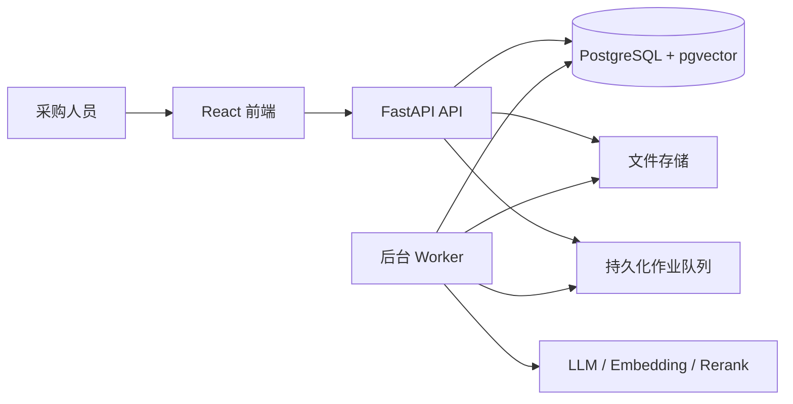
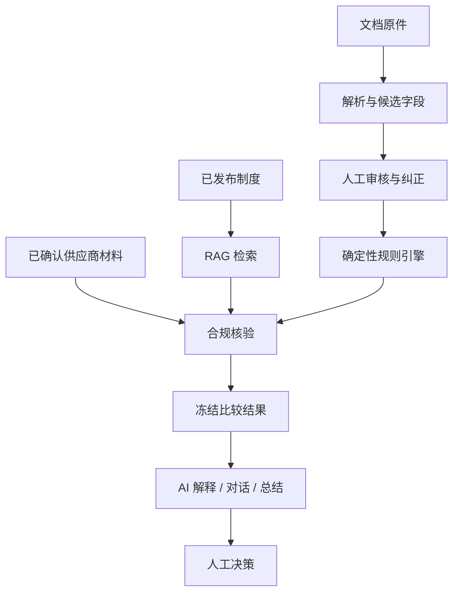
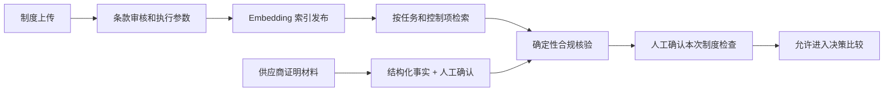

# Supplier Comparison 系统架构

本文描述当前交付版本的运行架构与权力边界。用户操作顺序见 [WORKFLOW.md](WORKFLOW.md)，数据边界见 [DATA.md](DATA.md)，启动与测试见 [LOCAL_ENVIRONMENT.md](LOCAL_ENVIRONMENT.md) 和 [TESTING.md](TESTING.md)。

## 1. 系统目标

系统把采购需求、供应商报价、采购制度和供应商证明材料整理为可追溯的比较结果，帮助采购人员审核、比较、沟通和留档。系统提供建议，不代替采购人员批准、签约、下单或付款。

## 2. 运行组件

| 组件 | 职责 | 不负责 |
| --- | --- | --- |
| React 前端 | 任务、报价审核、制度检查、决策、AI 助手、总结和审计界面 | 自行计算权威金额或合规结论 |
| FastAPI | 鉴权边界、输入校验、版本校验、业务接口和文件下载 | 在请求线程中完成长时间模型任务 |
| Worker | 需求/报价解析、工作流推进、AI 对话和总结生成 | 绕过人工确认或直接批准采购 |
| PostgreSQL | 任务、版本、快照、作业、结果、制度、向量和审核记录的权威状态 | 保存原始文件字节 |
| 文件存储 | 不可覆盖的报价原件、制度原件和解析产物 | 充当业务状态数据库 |
| 模型服务 | 文档理解、意图解析、解释和叙述生成 | 金额运算、硬约束、合规裁决和最终审批 |

当前采用模块化单体：后端代码位于 `src/supplier_comparison/`，前端位于 `frontend/`，数据库迁移位于 `migrations/`。本地和容器部署共用相同领域契约。

## 3. 权威数据与版本

- PostgreSQL 是任务、报价、制度绑定、合规结果、比较结果和报告状态的唯一权威来源。
- LangGraph 检查点只保存工作流位置和恢复上下文，不替代业务表。
- 文件按版本保存并记录哈希；替换文件会生成新版本，不覆盖旧文件。
- 需求、报价、制度绑定或合规材料发生有效变更时，系统推进 `task_revision`，创建新快照并使旧结果进入历史状态。
- API 写操作使用期望版本和幂等键，避免重复提交或迟到结果覆盖当前版本。
- 金额在 Python 中使用 `Decimal`、数据库使用 `NUMERIC`、API 使用十进制字符串。

核心标识不可混用：

| 标识 | 含义 |
| --- | --- |
| `task_id` | 一项采购任务 |
| `task_revision` | 当前任务输入版本 |
| `quote_id` / `quote_version` | 某供应商报价及其版本 |
| `job_id` | 一次异步作业 |
| `graph_run_id` | 一次可恢复的工作流运行 |
| `result_id` | 某次冻结比较结果 |
| `policy_set_version` / `policy_index_version` | 制度内容与检索索引版本 |

## 4. 业务处理分层

### 4.1 解析与证据

PDF、TXT、Markdown 和固定 CSV 模板按各入口允许的格式处理。报价字段必须保留来源引用；来源可定位不等于字段已核验。字段状态使用 `EXTRACTED | VERIFIED | MISSING | CONFLICT`，来源类型使用 `DOCUMENT | USER_INPUT | USER_CORRECTION | DERIVED`。

报价审核字段由 `GET /api/v1/quote-field-schema` 返回，前端不维护第二套字段规则。

### 4.2 确定性决策层

代码负责规格、数量/MOQ、包装倍数、费用、税务口径、交期、预算、可行性和排序。供应商结果为：

- `FEASIBLE`：所有相关硬约束已满足。
- `INFEASIBLE`：存在已确认的不满足项。
- `PENDING`：仍有可能影响判断的未知项或待复核项。

未知值不是零，也不会自动判为不合格。存在会影响选择的 `PENDING` 时，系统只能给出草稿或待确认结果。

### 4.3 制度 RAG 与合规执行

制度上传后先形成可审核条款；只有已发布且范围匹配的版本才能绑定任务。RAG 负责找到与当前控制项相关的条款并提供引用，确定性合规层再把条款、报价事实和人工确认的供应商材料组合为 `PASS | FAIL | REVIEW_REQUIRED | NOT_EVALUATED`。

RAG 的检索命中本身不是合规结论；缺少制度、材料或可执行参数时必须明确显示未核验或待复核。

### 4.4 AI 与 Agent

AI 可用于需求/报价抽取、自然语言偏好解析、受约束调查、决策问答、沟通建议和采购总结。所有工具调用受任务、版本、白名单、次数和时间预算限制；AI 不能修改权威事实、跳过制度门禁或自行应用假设变更。假设场景必须由用户明确确认后才能应用。

## 5. 安全与信任边界

- 密钥只从后端环境变量读取，不进入前端、日志、测试夹具或仓库。
- 上传文件中的指令只是待分析内容，不能改变系统规则或工具权限。
- 运行时 Agent 只能读取当前任务允许的输入；参考答案和留出集位于离线评测目录。
- 原始文件、人工纠正、派生值和模型输出分别标记并保留审计链。
- 不允许模型静默回退到未授权 provider，也不允许通过新建作业绕过调用预算。

## 6. 当前交付边界

系统面向单任务、单采购需求下的多供应商报价比较。当前不把任意格式文档、复杂多商品拆单、自动议价、自动下单或无人审批作为交付能力。扫描 PDF 是否可用取决于 OCR 配置；真实模型、Embedding 和 Rerank 功能取决于对应服务和凭据是否可用。
