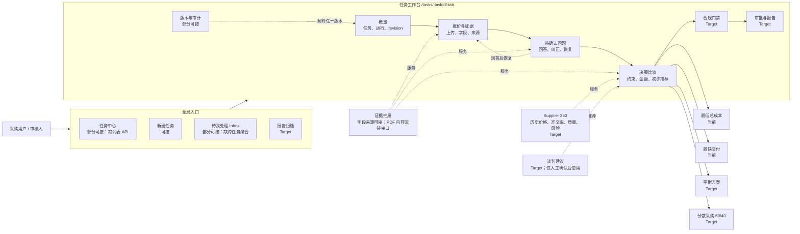

# QuoteWise 前端产品架构与交互说明

> 版本：v2.0  
> 面向：前端开发、后端开发、测试、产品  
> 依据：当前 FastAPI 接口、项目 `WORKFLOW.md` / `ARCHITECTURE.md`、根目录 `竞品分析.md` 与现有低保真原型  
> 目标：让前端清楚知道“现在能做什么、页面如何组织、接口如何对接、哪些只是 Target”，避免界面能力超前于后端事实。

## 1. 产品定位

QuoteWise 是一个面向电子元器件采购的供应商决策工作台。它不是通用聊天机器人，也不是单纯的报价单识别工具，而是把以下能力组织成一条可追溯、可暂停、可恢复、有人负责最终决策的采购流程：

1. 创建采购需求；
2. 上传多家供应商报价；
3. 解析 PDF、识别字段并保留来源证据；
4. 在字段缺失、冲突或需人工确认时暂停；
5. 用户补充或纠正后恢复原工作流；
6. 用确定性规则计算金额、交期和可行性；
7. 生成带依据的初步推荐；
8. 后续扩展合规门禁、审批、报告、Supplier 360 和优化场景。

产品中的 Agent 应嵌入确定性流程，负责解释、编排和辅助，不负责在浏览器端或无证据时修改权威金额、硬约束与合规结论。

## 2. 前端设计原则

### 2.1 以任务工作台为中心

一次 RFQ 是一个任务。报价、问题、证据、结果、版本和审计都属于任务上下文。前端应优先保证单个任务闭环，再建设跨任务首页、统一 Inbox 和报告归档。

### 2.2 事实、证据、解释三层分开

- 事实：后端结果快照、报价字段、金额、交期、revision；
- 证据：PDF 来源、页码、`source_id`、用户纠正事件；
- 解释：为什么淘汰、为什么推荐、仍有哪些风险。

解释不能覆盖事实，界面也不能在浏览器内重新计算权威金额。

### 2.3 人机协作而非自动拍板

当前输出统一称“初步推荐”。只有后续完成合规门禁和人工审批后，才能形成最终决策。谈判建议只能生成草稿，不得自动联系供应商或承诺采购。

### 2.4 当前能力与 Target 能力必须显式区分

本文使用三类标记：

- **可接**：已有后端接口或结果，可进入开发；
- **部分可接**：部分链路可用，但缺聚合接口、通用问题类型或内容流；
- **Target**：竞品启发或规划能力，当前不能做成真实可执行功能。

原型中允许展示 Target 的位置和未来交互，但必须标注 `Target`，不得调用不存在的接口，不得填入虚构数据。

## 3. 总体功能模块图



## 4. 核心业务流程与页面跳转

```mermaid
flowchart TD
    A[/tasks/new 新建需求] --> B[创建任务]
    B --> C[上传 Supplier A / B / C 报价]
    C --> D[启动分析]
    D --> E{任务状态}

    E -->|DRAFT| C
    E -->|QUEUED / RUNNING| F[/overview 查看阶段状态]
    E -->|NEEDS_INPUT| G[/review 处理待确认问题]
    E -->|FAILED| H[/overview 查看错误和受控重试]
    E -->|COMPLETED| I[/decision 查看初步推荐]

    G --> J[提交结构化回答或字段纠正]
    J --> K[revision 递增并创建 RESUME job]
    K --> E

    I --> L[/compliance 合规门禁 · Target]
    L --> M[/approval 审批与报告 · Target]

    C --> N{上传新版报价或修改事实}
    N -->|是| O[旧结果、旧问题和旧审批失效]
    O --> D
```

### 4.1 默认落页规则

前端取得任务详情后，按以下顺序决定落页：

1. `NEEDS_INPUT`：进入“待确认问题”；
2. `COMPLETED` 且有当前有效结果：进入“决策比较”；
3. `QUEUED` / `RUNNING` / `FAILED`：进入“概览”；
4. `DRAFT`：进入“报价与证据”；
5. URL 指定了合法子页时，可保留用户所在页，但仍需显示全局阻塞提示。

### 4.2 不应自动跳转的情况

- 用户正在填写问题答案或字段纠正表单；
- 写操作返回 409；
- 当前结果因 revision 变化而失效；
- 某个供应商解析失败、其他供应商仍可继续处理。

这些情况应显示明确提示，让用户确认下一步，而不是静默刷新或重放旧请求。

## 5. 页面架构与职责

| 页面 / 路由 | 核心目标 | 主要模块 | 后端状态 |
| --- | --- | --- | --- |
| `/tasks` | 浏览和筛选全部采购任务 | 搜索、状态筛选、任务列表、分页 | **部分可接**：缺 `GET /tasks` |
| `/tasks/new` | 创建 RFQ 并进入任务 | 需求表单、创建成功页、上传引导 | **可接** |
| `/tasks/:taskId/overview` | 理解任务当前处于哪一步 | 状态带、运行阶段、阻塞提示、结果有效性 | **可接** |
| `/tasks/:taskId/quotes` | 管理报价和查看提取事实 | 报价卡片、上传、字段表、来源入口 | **部分可接**：缺报价聚合和文档内容流 |
| `/tasks/:taskId/review` | 解决阻塞问题并恢复工作流 | 问题列表、结构化答案、字段纠正、证据抽屉 | **部分可接**：当前完整走通运费两步补问 |
| `/tasks/:taskId/decision` | 比较可行候选并解释初步推荐 | 场景选择、硬约束、比较表、推荐摘要 | **可接**：当前是确定性单次结果 |
| `/tasks/:taskId/compliance` | 验证制度、供应商注册和证书 | 条款证据、注册表、RoHS、人工补证 | **Target** |
| `/tasks/:taskId/approval` | 批准当前有效结果并生成报告 | 审批意见、有效版本、报告预览 | **Target** |
| `/tasks/:taskId/history` | 追溯 revision、回答、纠正和结果 | 时间线、操作者、失效关系、请求 ID | **部分可接**：缺统一审计聚合 API |
| `/inbox` | 跨任务处理阻塞项 | 待办分组、优先级、批量进入任务 | **部分可接**：缺跨任务 issues API |
| `/reports` | 查找已审批报告 | 有效性、版本、下载、归档 | **Target** |

建议统一采用 `/tasks/:taskId/:tab` 子路由，而不是只用本地 Tab 状态。这样刷新、分享链接、浏览器前进后退和权限拦截都更稳定。

## 6. 任务工作台详细说明

### 6.1 概览

概览页不做通用 KPI 仪表盘，只回答四个问题：

1. 当前任务是什么；
2. 工作流走到哪一步；
3. 谁需要处理什么；
4. 当前结果是否仍然有效。

至少分开展示以下五组状态：

| 状态维度 | 示例 | 页面用途 |
| --- | --- | --- |
| 任务生命周期 | `DRAFT / QUEUED / RUNNING / NEEDS_INPUT / COMPLETED / FAILED` | 决定默认落页和主提示 |
| 字段审核 | 未解析、待确认、已纠正、已通过 | 决定报价能否进入计算 |
| 供应商可行性 | `FEASIBLE / INFEASIBLE / PENDING` | 解释硬约束与候选范围 |
| 合规状态 | 未运行、需补证、合规、不合规 | Target；决定能否审批 |
| 结果 / 审批有效性 | 当前有效、已过期、待审批、已批准 | 防止使用旧版本决策 |

“任务 `COMPLETED`”只表示本轮工作流已结束，不代表供应商已合规或结果已审批。

### 6.2 报价与证据

每份报价卡片至少显示：

- 供应商名称；
- 文件名和文件版本；
- 解析 / 审核状态；
- 关键金额和交期摘要；
- 阻塞问题数量；
- “查看字段”和“查看来源”入口。

字段表至少包含：字段名、当前权威值、单位、来源类型、审核状态和操作。用户纠正后，应同时保留原始提取值与纠正事件，不直接覆盖历史。

证据抽屉用于保持上下文，不建议跳转到独立证据页面。当前可以展示字段来源元数据；完整 PDF 在线预览应等后端提供授权内容流或短期签名 URL 后再开放。

### 6.3 待确认问题

当前完整实现的演示链路是 Supplier B 运费缺失：

1. `CONFIRM_MISSING`：用户确认原 PDF 确实未提供运费；
2. `SHIPPING_AMOUNT`：用户提交金额字符串和 `SGD`；
3. 后端保存回答和操作者，推进 revision，创建 `RESUME` job；
4. 工作流重新审核和计算。

问题卡片应显示：

- 问题类型和业务说明；
- 关联供应商、报价和字段；
- 当前任务 revision；
- 证据入口；
- 与 `answer_type` 对应的结构化表单；
- 提交后的结果和新 revision。

未来 OCR 确认、供应商匹配、合规补证也进入这一页，但不能在通用后端问题类型落地前伪装为已可用。

### 6.4 决策比较

这是 MVP 的默认主屏，建议按以下顺序组织：

1. 结果版本与有效性；
2. 五类状态摘要；
3. 决策场景；
4. 采购硬约束；
5. 供应商比较表；
6. 初步推荐及解释；
7. 证据、Supplier 360 和后续动作。

#### 场景命名

| 场景 | 状态 | 产品说明 |
| --- | --- | --- |
| 最低总成本 | 当前 | 先过硬约束，再比较后端确定性总成本 |
| 最快交付 | 当前 | 只使用当前报价交期；可以并列 |
| 平衡方案 | Target | 需要权重、历史指标、场景快照和可复现算法 |
| 分散采购 60/40 | Target | 需要 SKU、数量、MOQ、步长、供应能力和优化约束 |

当前不能把“最快交付”命名成“最低交付风险”，因为尚未接入历史准交率、质量和风险数据。

#### 比较表建议字段

- 供应商；
- 当前可行性；
- 确定性总成本与币种；
- 报价交期；
- 失败的硬约束；
- 字段 / 证据完整性；
- 当前结论；
- 查看证据与 Supplier 360 入口。

推荐区统一写“初步推荐 Supplier X”，同时显示：

- 结果 ID、结果版本和生成时间；
- 基于哪个 task revision；
- 推荐的确定性原因；
- 尚未完成的合规或审批步骤；
- 新报价或事实变更后会失效的提示。

### 6.5 Supplier 360

Supplier 360 适合作为比较表右侧抽屉，而不是一级页面。内容分为两层：

- 当前可接：本任务报价金额、报价交期、字段审核、可行性；
- Target：历史价格、准时交付率、质量 / 退货、风险、证书、合同和往期合作。

当前没有历史供应商数据接口，Target 区域统一显示“待接数据”，不得写演示百分比冒充真实指标。

### 6.6 合规、审批与报告

这三个模块在导航中可以预留，但当前保持 Target 状态：

- 合规：制度 RAG 只负责返回可核验条款，批准供应商与 RoHS 使用结构化数据，最终由确定性门禁裁决；
- 审批：只允许审核当前有效、无阻塞且合规通过的结果；
- 报告：记录结果版本、证据引用、审批人和生成时间。

任何报价、需求、范围或规则更新后，旧结果与旧审批都必须显示“已过期”。

## 7. 现有接口与页面映射

以下接口已经存在，可直接从 OpenAPI 生成类型或由前端 API 层封装：

| 方法与路径 | 页面调用点 | 前端注意事项 |
| --- | --- | --- |
| `POST /api/v1/tasks` | 新建任务 | Header 必须包含 `Idempotency-Key` |
| `GET /api/v1/tasks/{task_id}` | 工作台初始化、刷新状态 | 当前最主要的任务上下文入口 |
| `POST /api/v1/tasks/{task_id}/quotes` | 报价上传 | `multipart/form-data`；包含 `expected_task_revision`、`supplier_id`、文件；Header 带幂等键 |
| `POST /api/v1/tasks/{task_id}/runs` | 启动 / 恢复前的显式运行 | Body 带 `expected_task_revision`；Header 带幂等键；返回 202 |
| `GET /api/v1/tasks/{task_id}/issues` | 待确认问题 | 当前为单任务列表 |
| `POST /api/v1/tasks/{task_id}/issues/{issue_id}/answers` | 提交问题答案 | Body 带 revision 和判别式 `answer_type`；Header 带幂等键；返回 202 |
| `GET /api/v1/tasks/{task_id}/quotes/{quote_id}/fields` | 字段表、证据抽屉 | 不等于完整 PDF 内容流 |
| `POST /api/v1/tasks/{task_id}/quotes/{quote_id}/fields/{field_name}/corrections` | 字段纠正 | 提交原始值、标准值、单位、理由、revision 和幂等键 |
| `GET /api/v1/tasks/{task_id}/results` | 决策结果列表 | 用来确定当前有效结果，不能默认取第一条 |
| `GET /api/v1/tasks/{task_id}/results/{result_id}` | 决策比较详情 | 页面金额和推荐以该快照为准 |
| `GET /health/live` | 部署探活 | 不作为业务状态 |
| `GET /health/ready` | 服务就绪 | 503 时显示服务暂不可用，而不是任务失败 |

### 7.1 所有写操作的统一规则

1. 每次用户动作生成一个新的 `Idempotency-Key`；
2. 同一动作因网络结果未知而重试时复用原键；
3. 相同键不得携带不同请求；
4. 按后端合同提交 `expected_task_revision`；
5. 返回 409 时不自动重放：重新获取任务，展示变化，让用户再次确认；
6. 422 将后端 `error.details` 映射到字段或问题级错误；
7. 保留 `error.request_id`，便于排查。

### 7.2 当前缺少、建议后端补充的接口

| 优先级 | 建议接口能力 | 支持的前端模块 |
| --- | --- | --- |
| P0 | `GET /api/v1/tasks`，含分页与状态筛选 | 任务中心 |
| P0 | 任务工作台聚合响应，或在 `GET task` 中返回 quote / run / current result 摘要 | 减少首次进入的串行请求 |
| P0 | 授权文档内容流或短期签名 URL | PDF / 页级证据查看 |
| P0 | 通用 issues 类型与 schema | OCR、供应商匹配、更多缺失字段 |
| P1 | 报价版本替换、需求版本与比较范围接口 | 正确失效旧结果并重新运行 |
| P1 | 统一审计时间线接口 | 版本与审计页 |
| P1 | worker 自动领取、作业阶段和可轮询进度 | 稳定的运行中体验 |
| P2 | 合规结果、条款引用、注册表和补证接口 | 合规页 |
| P2 | 审批、报告生成、下载和归档接口 | 审批 / 报告页 |
| P2 | Supplier profile / performance / risk 接口 | Supplier 360、平衡和风险场景 |
| P2 | 身份、角色和权限接口 | 登录、路由和按钮权限 |

## 8. 前端状态与数据组织

### 8.1 服务端事实优先

任务、报价、问题、字段、结果和 revision 都属于服务端状态。前端应使用统一请求缓存层管理，不把业务事实仅保存在组件本地状态中。

组件本地状态只保存：

- 当前 Tab；
- 展开的证据 / Supplier 360 抽屉；
- 尚未提交的表单草稿；
- 表格展示偏好。

### 8.2 推荐的前端领域划分

```text
src/
  app/                 路由、应用壳、错误边界
  features/
    tasks/             新建、任务详情、任务中心
    quotes/            上传、字段、证据
    issues/            问题列表、答案表单、恢复
    decision/          场景、约束、比较表、推荐
    compliance/        Target
    approvals/         Target
    audit/             revision 与事件时间线
    suppliers/         Supplier 360 · Target
  shared/
    api/               客户端、错误解析、幂等键、请求 ID
    components/        通用可访问组件
    domain/            共享类型、状态映射、金额与日期格式
```

不要把“供应商卡片”做成包含请求、计算、弹窗和状态判断的超大组件。页面负责组合领域模块，API 层负责合同，展示组件只接收已经整理好的 view model。

### 8.3 前端不得承担的逻辑

- 重新计算最终金额；
- 猜测缺失币种、运费或交期；
- 在证据不足时把字段标记为通过；
- 根据前端分数覆盖后端推荐；
- 静默修复 revision 冲突；
- 在合规未完成时开放最终审批。

## 9. 加载、空态和错误设计

### 9.1 运行中

当前 worker 尚未成为常驻自动 worker，因此前端不能展示虚假的实时百分比。建议展示离散阶段：

`已创建 → 已上传 → 已排队 → 解析 / 审核 → 等待输入 → 比较完成`

只有后端提供可信阶段或进度后，才显示对应值。

### 9.2 部分成功

某个供应商解析失败时，不应让整个页面只显示通用错误。应分别展示每份报价的状态，并允许用户处理失败报价或查看其余可用结果。

### 9.3 必须覆盖的异常

- 文件类型不支持、文件损坏、上传中断；
- 解析 / OCR 失败、字段缺失、币种无法识别；
- 网络超时、离线与重复提交；
- 404：任务、报价、问题或结果不存在；
- 409：revision 冲突、问题已解决、幂等键复用冲突；
- 422：请求或业务校验失败；
- 503：数据库或服务未就绪；
- 500：未知服务错误；
- 长时间停留在 `QUEUED` / `RUNNING`；
- 当前结果因新 revision 失效。

每条错误必须给出下一步，例如“刷新并复核”“重新上传”“补充运费”“查看失败报价”，不能只显示“操作失败”。

## 10. 前端实施顺序

### 阶段 A：可运行骨架

- 应用壳和 `/tasks/:taskId/:tab` 路由；
- API 客户端、统一错误模型、幂等键与 revision 处理；
- 任务概览和直接通过 task ID 打开工作台；
- Target 标签与禁用态规范。

### 阶段 B：当前后端闭环

- 新建任务；
- 上传 A / B / C 报价；
- 启动分析；
- 展示任务状态；
- 运费缺失两步补问；
- 报价字段、纠正和证据摘要；
- 结果列表、结果详情和决策比较。

### 阶段 C：可靠性与版本体验

- 409 冲突恢复；
- 结果过期和 revision 提示；
- 部分失败、空态、重试和刷新恢复；
- 审计历史聚合适配；
- 响应式与无障碍完善。

### 阶段 D：等待后端能力后解锁

- 任务中心与统一 Inbox；
- 文档在线预览；
- 合规门禁；
- 审批与报告；
- Supplier 360；
- 平衡方案、分散采购和谈判建议。

## 11. MVP 验收标准

1. 用户能完成“创建任务 → 上传三份报价 → 启动分析 → 回答运费缺失问题 → 查看结果”的完整闭环；
2. 页面刷新或重新进入后，任务、答案和结果状态不丢失；
3. `NEEDS_INPUT` 时能明确看到问题、关联报价、证据和处理入口；
4. 用户提交相同动作时不会产生重复业务效果；
5. 409 不会覆盖其他修改，也不会自动重放旧请求；
6. 字段纠正、新报价或需求变化后，旧结果不会继续显示为当前有效；
7. 不满足硬约束的供应商不会因价格低而成为推荐；
8. 比较表能解释推荐原因并追溯到证据或用户纠正事件；
9. 界面使用“初步推荐”，合规未完成时不存在可执行的最终审批动作；
10. “最快交付”不会被描述成“最低交付风险”；
11. Target 功能有清晰标签，禁用按钮不发送请求，也不展示虚构历史数据；
12. 320px、360px、736px 和 1024px 下核心流程可操作；
13. 键盘可完成主要操作，焦点态可见，动态结果使用适当的可访问提示；
14. 加载、空态、失败、部分成功和结果过期都有对应界面与下一步操作。

## 12. 前后端联调时需要共同冻结的内容

在正式开发比较页和问题页前，建议前后端共同确认：

1. `GET task`、issues、fields 和 results 的完整响应示例；
2. task、job、graph run、issue、result 的状态枚举及终态；
3. 哪个字段标识“当前有效结果”；
4. 金额的字符串格式、精度、币种和含税口径；
5. 日期时间格式与时区；
6. `null`、字段缺失、空数组分别表示什么；
7. 证据对象中的文件版本、页码、文本定位和用户纠正来源；
8. 上传、回答、纠正和启动运行的 409 / 422 错误样例；
9. 任务更新后，旧问题、旧运行和旧结果如何标记失效；
10. 前端轮询停止条件，以及 worker 未运行时的用户提示。

上述合同冻结后，前端可以先完成当前闭环，同时保证未来合规、审批和 Supplier 360 能以新模块接入，而不需要推翻任务工作台的整体结构。
## V2 任务内供应商信息页补充

任务工作台新增 `/tasks/:taskId/suppliers`，位置在“报价与证据”和“决策结果”之间。
页面只消费 `GET /api/v1/tasks/{task_id}/suppliers` 的只读聚合响应，严格区分
`QUOTE_ONLY`、`CURRENT_RESULT`、`HISTORICAL_RESULT`。图表不得读取原始 CSV、重算评级、
成本、可行性或赢家；主次指标高亮和次指标是否触发只读取后端 `RankingTrace`。

Requirement 普通模式、折叠模式和 Scenario 管理复用同一个 `RankingCriterionSelect`。
六个指标均可展示，但每次只有一个主指标和至多一个次指标参与排序；历史 scope 不适用时，
前端给出禁用原因，后端继续执行同一验证。
