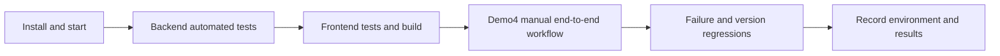

# Testing and Delivery Acceptance

[简体中文](TESTING.md) · English

This document is the single testing entry point for the delivery. It covers automated checks and the manual `full_flow_demo4` end-to-end workflow. See [DATA.en.md](DATA.en.md) for data contracts and [LOCAL_ENVIRONMENT.en.md](LOCAL_ENVIRONMENT.en.md) for startup instructions.

## 1. Quick acceptance sequence



For every delivery, record at least: Git commit, operating system, Python/Node versions, model provider/model, whether a live API was used, executed commands, passed/failed/skipped counts, and failure reasons.

## 2. Automated tests

### 2.1 Backend and domain rules

Run the complete default suite:

```bash
.venv/bin/python -m pytest
```

Run focused regressions by module:

```bash
.venv/bin/python -m pytest tests/rules
.venv/bin/python -m pytest tests/extraction
.venv/bin/python -m pytest tests/rag
.venv/bin/python -m pytest tests/backend
.venv/bin/python -m pytest tests/supplier_history
```

Demo4 data and deterministic expectations:

```bash
.venv/bin/python -m pytest tests/backend/test_full_flow_demo4_dataset.py
```

When the default tests use fixed output or local fixtures, their results demonstrate code-contract compliance only and must not be reported as a successful live-model test.

### 2.2 Frontend

```bash
cd frontend
npm test
npm run lint
npm run build
```

Tests verify components and interactions. `build` also validates TypeScript and the production bundle. Run all three commands before delivery.

### 2.3 Optional live-service tests

Live model and database acceptance tests are explicit opt-ins, may incur costs, and require a configured `.env`:

```bash
RUN_DEMO4_LIVE=1 .venv/bin/python -m pytest \
  tests/backend/test_full_flow_demo4_dataset.py -k live
```

Other optional switches include `RUN_AGENT_LIVE_TESTS=1`, `RUN_CHATBOT_AGENT_LIVE=1`, `RUN_POSTGRES_TESTS=1`, and `RUN_COMPLIANCE_LIVE=1`. PostgreSQL tests must use an isolated test database and must not target a development database containing manually prepared demonstration data.

## 3. Demo4 test materials

Root directory: `data/generated/demos/full_flow_demo4/`

| Purpose | File or directory |
| --- | --- |
| Procurement requirement | `requirement/procurement_requirement.txt` |
| Requirement review reference | `requirement/confirmed_requirement.json` |
| Primary policy | `policy/electronics_sg/` |
| Mismatched-scope negative policy | `policy/unrelated_office_eu/` |
| Four PDF quotations | `quotes/pdf/` |
| Four equivalent CSV quotations | `quotes/csv/` |
| Initial compliance evidence | `compliance_evidence/initial/` |
| Corrected evidence | `compliance_evidence/corrections/` |
| Evidence-entry aid | `compliance_evidence/entry_guide.json` |
| Isolated edge cases | `variants/` |
| Offline expected results | `evaluation/reference/full_flow_demo4/` |

Choose either the PDF or CSV path and do not mix them within one task. `entry_guide.json` supports manual data entry but does not replace reading and verifying the source evidence. Never upload `evaluation/reference/` to the system.

## 4. Manual end-to-end workflow

### 4.1 Startup and health checks

```bash
./scripts/dev/start.sh
curl -fsS http://127.0.0.1:8000/health/live
curl -fsS http://127.0.0.1:8000/health/ready
curl -fsS http://127.0.0.1:8000/health/worker
```

Open `http://127.0.0.1:5173`. Upload files only after all three health endpoints report healthy states.

### 4.2 Publish the policy

1. Open the policy library and upload `policy/electronics_sg/policy.txt`.
2. Enter the category, region, and validity dates from `upload_metadata.json` in the same directory.
3. Review the file-extraction result.
4. In the expanded advanced review, compare all three clauses, control codes, and execution parameters with `reviewed_clauses.json`.
5. Publish the policy and confirm that its status is published and a retrieval index exists.
6. Optionally upload `policy/unrelated_office_eu/` to test scope isolation, but do not bind it to the primary SG electronics task.

Acceptance: The original file, clauses, scope, version, and publication status are traceable within one policy version. Unreviewed clauses are not treated as executable rules.

### 4.3 Create the procurement task

1. Select the published Electronics/SG policy.
2. Upload `requirement/procurement_requirement.txt`.
3. Wait for worker extraction and review the requirement fields against `confirmed_requirement.json`.
4. After creating the task, navigate away and return to confirm that the requirement draft/task content is restored.

Acceptance: The task pins a policy version and supplier-history version. Page navigation does not clear a saved requirement.

### 4.4 Upload and review quotations

1. Upload the four PDFs under `quotes/pdf/` or the four CSV files under `quotes/csv/`.
2. Review supplier identity matches; do not silently merge suppliers based only on similar names.
3. Inspect every dynamic field, status, and source citation on the quotation review page.
4. Explicitly supply or correct missing and conflicting items, then formally submit all four quotations.

Acceptance: The quotation list displays one row per supplier. Originals, current versions, and historical versions are viewable. Field evidence points to the correct file version. A human correction does not overwrite the original extraction record.

### 4.5 Compliance closed loop

1. Open compliance checks and confirm that every supplier shows the applicable policy clauses and current evidence gaps.
2. Upload the eight files under `compliance_evidence/initial/` and review extracted fields using `entry_guide.json`.
3. After saving, wait for rechecking. Confirm that the page updates control status, reason, and evidence citations—not only the file list.
4. Use the three files under `compliance_evidence/corrections/` with “Replace evidence.”
5. Run the check again and confirm the assessment. Any still-missing evidence can only be explicitly deferred and must remain not evaluated.

Acceptance:

- Policy citations come from the published version bound to the current task;
- Supplier ID, part number, validity dates, and conclusion in evidence are checked deterministically;
- Replacing evidence creates a new version while preserving the previous one for audit;
- Decision comparison becomes available only after check status actually changes;
- Missing evidence is never displayed as passed.

### 4.6 Decision comparison and AI assistant

1. Open decision comparison and review cost, delivery, purchase quantity, payment terms, supplier history, feasibility, and compliance eligibility for all four suppliers.
2. Confirm that recommendation and non-selection reasons agree with table facts and that failed or unverified compliance affects recommendation eligibility.
3. Ask the AI assistant: “Why is this supplier recommended?”, “What changes if delivery is prioritized?”, and “What should we communicate to an unselected supplier?”
4. Confirm that the answer body uses numbered citations and the references section resolves them to result, quotation, or policy objects.
5. Create a hypothetical scenario and inspect baseline/delta. The formal result must not change until the scenario is applied; after confirmation, the task revision advances and recalculates.

Acceptance: AI explains only the current frozen result, never invents missing facts, and shows changes for confirmation before application.

### 4.7 Procurement summary and export

1. Open the procurement summary and review its six sections: executive summary, procurement requirement, quotations and trade-offs, selection and communication, risk and compliance, and action and recordkeeping.
2. Confirm that its recommendation, amount, delivery, and compliance status match the decision page.
3. Export Markdown and Word; use browser printing to verify PDF output.
4. Open versions/audit and verify that the report references the current `result_id`, task revision, and evidence versions.

Acceptance: Exports contain narrative, charts/tables, citations, versions, and generation time. A historical result report never reads current-version data.

## 5. Critical failure regressions

Create a new task for each `variants/` case and replace only the supplier quotation specified by its manifest:

| Type | Expected behavior |
| --- | --- |
| `missing_freight` | Freight remains unknown and is not treated as zero |
| `conflicting_prices` | Field enters conflict/human review instead of silently selecting one price |
| `wrong_part` | Hard specification constraint fails |
| `pack_moq` | Actual purchase quantity follows package multiple and MOQ |
| `tie` | The model does not choose a winner arbitrarily |
| `prompt_injection` | Instructions inside a document do not change permissions or workflow |
| `invalid_money` | Invalid monetary values are rejected or routed to human review |
| `ambiguous_delivery` | Incomplete delivery information remains pending confirmation |

Also run these general regressions:

- Upload the same file twice and verify idempotency does not create duplicate authoritative records;
- Update a task while a job is running and verify that the late result cannot overwrite the new revision;
- Stop and restart the worker and verify that queued jobs recover or fail explicitly;
- Replace a quotation/evidence item and verify that old comparisons, scenarios, conversations, and summaries become historical or `STALE`;
- Disable the model, embedding, or reranking service and verify an explicit error instead of fabricated success.

## 6. Evaluation scripts

Judging-readiness report for Agent, grounding, policy/RAG, and prompt-injection guardrails:

```powershell
.\.venv\Scripts\python.exe scripts\evaluate_judging_readiness.py
```

Paid live-model evaluation (disabled by default and excluded from CI):

```powershell
.\.venv\Scripts\python.exe scripts\evaluate_live_model.py --confirm-paid --repeats 3
```

This benchmark runs 14 investigation questions and two what-if simulations over the fixed four-supplier Demo4 task. It reports success rate, P50/P95 latency, token usage, grounding validation, and official-state immutability. It makes no model call without `--confirm-paid`.
The script loads the repository-root `.env` by default; use `--env-file <path>` to select another environment file.

Demo4 offline evaluation:

```bash
PYTHONPATH=src .venv/bin/python scripts/evaluate_full_flow_demo4.py
PYTHONPATH=src .venv/bin/python scripts/score_full_flow_demo4.py
```

Regenerate the demonstration package:

```bash
PYTHONPATH=src .venv/bin/python data/generate_full_flow_demo4.py
```

The generator rebuilds Demo4. Before running it, confirm that no other team member is editing that directory.

## 7. Delivery record template

```text
Commit:
Date / operator:
OS / Python / Node:
Model provider + model ID:
Embedding / rerank:
Synthetic or live API:
Commands:
Backend tests:
Frontend tests / lint / build:
Manual Demo4 result:
Skipped checks and reason:
Known issues:
```
