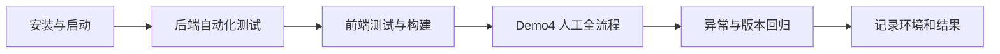

# 测试与交付验收

本文是交付版本唯一的测试入口，覆盖自动化检查和 `full_flow_demo4` 人工全流程。数据契约见 [DATA.md](DATA.md)，启动方法见 [LOCAL_ENVIRONMENT.md](LOCAL_ENVIRONMENT.md)。

## 1. 快速验收顺序



每次交付至少记录：Git commit、操作系统、Python/Node 版本、模型 provider/model、是否真实 API、执行命令、通过/失败/跳过数量及失败原因。

## 2. 自动化测试

### 2.1 后端与领域规则

运行全部默认测试：

```bash
.venv/bin/python -m pytest
```

按模块快速回归：

```bash
.venv/bin/python -m pytest tests/rules
.venv/bin/python -m pytest tests/extraction
.venv/bin/python -m pytest tests/rag
.venv/bin/python -m pytest tests/backend
.venv/bin/python -m pytest tests/supplier_history
```

Demo4 数据与确定性预期：

```bash
.venv/bin/python -m pytest tests/backend/test_full_flow_demo4_dataset.py
```

默认测试使用固定输出或本地夹具时，结果只能证明代码契约通过，不能写成真实模型已经通过。

### 2.2 前端

```bash
cd frontend
npm test
npm run lint
npm run build
```

测试验证组件和交互；`build` 同时验证 TypeScript 与生产构建。三条命令都应在交付前执行。

### 2.3 可选真实服务测试

真实模型或数据库验收是显式 opt-in，可能产生费用，并要求 `.env` 已配置：

```bash
RUN_DEMO4_LIVE=1 .venv/bin/python -m pytest \
  tests/backend/test_full_flow_demo4_dataset.py -k live
```

其他可选开关包括 `RUN_AGENT_LIVE_TESTS=1`、`RUN_CHATBOT_AGENT_LIVE=1`、`RUN_POSTGRES_TESTS=1` 和 `RUN_COMPLIANCE_LIVE=1`。PostgreSQL 测试必须使用隔离测试数据库，不能指向有人工演示数据的开发库。

## 3. Demo4 测试材料

主目录：`data/generated/demos/full_flow_demo4/`

| 用途 | 文件 |
| --- | --- |
| 采购需求 | `requirement/procurement_requirement.txt` |
| 需求核对参考 | `requirement/confirmed_requirement.json` |
| 主制度 | `policy/electronics_sg/` |
| 范围不匹配反例 | `policy/unrelated_office_eu/` |
| 四份 PDF 报价 | `quotes/pdf/` |
| 四份等价 CSV 报价 | `quotes/csv/` |
| 首轮制度材料 | `compliance_evidence/initial/` |
| 修正材料 | `compliance_evidence/corrections/` |
| 材料录入辅助 | `compliance_evidence/entry_guide.json` |
| 隔离异常用例 | `variants/` |
| 离线预期结果 | `evaluation/reference/full_flow_demo4/` |

PDF 与 CSV 选择一种路径，不要在同一任务混传。`entry_guide.json` 只帮助人工录入，不替代阅读和核对材料原文；`evaluation/reference/` 禁止上传给系统。

## 4. 人工全流程

### 4.1 启动与健康检查

```bash
./scripts/dev/start.sh
curl -fsS http://127.0.0.1:8000/health/live
curl -fsS http://127.0.0.1:8000/health/ready
curl -fsS http://127.0.0.1:8000/health/worker
```

打开 `http://127.0.0.1:5173`。三个健康接口都正常后再上传文件。

### 4.2 发布制度

1. 进入“规则资源库”，上传 `policy/electronics_sg/policy.txt`。
2. 按同目录 `upload_metadata.json` 填写适用类别、地区和有效期。
3. 核对文件解析结果。
4. 在默认展开的高级审核中，按 `reviewed_clauses.json` 核对三个条款、控制码和执行参数。
5. 发布制度，确认状态为已发布且生成检索索引。
6. 可另行上传 `policy/unrelated_office_eu/` 验证范围隔离，但不要把它绑定到 SG 电子采购主任务。

验收点：原文件、条款、范围、版本和发布状态能在同一制度版本中追溯；未审核条款不能被当作可执行规则。

### 4.3 创建采购任务

1. 选择刚发布的 Electronics/SG 制度。
2. 上传 `requirement/procurement_requirement.txt`。
3. 等待 Worker 解析，按 `confirmed_requirement.json` 核对需求字段。
4. 创建任务后切换到其他页面再返回，确认需求草稿/任务内容仍可恢复。

验收点：任务绑定固定制度版本与供应商历史版本；页面跳转不会清空已保存需求。

### 4.4 上传并审核报价

1. 上传 `quotes/pdf/` 下四份 PDF，或上传 `quotes/csv/` 下四份 CSV。
2. 核对供应商身份匹配；不接受仅凭相似名称静默合并供应商。
3. 在报价审核页检查全部动态字段、状态和原文证据。
4. 对缺失或冲突项明确补充/纠正，正式提交四份报价。

验收点：报价列表按供应商一行展示；原件、当前版本和历史版本可查看；字段证据定位到正确文件版本；人工纠正不会覆盖原提取记录。

### 4.5 制度检查闭环

1. 进入“制度检查”，确认每家供应商显示制度条款和当前材料缺口。
2. 上传 `compliance_evidence/initial/` 的八份材料，并按 `entry_guide.json` 核对解析字段。
3. 保存后等待重新检查，确认页面不仅增加文件记录，也更新对应控制项状态、原因和材料引用。
4. 使用 `compliance_evidence/corrections/` 中三份文件执行“替换材料”。
5. 再次检查并确认本次 assessment；对仍缺失的项目只能显式暂不补充并保留未核验状态。

验收点：

- 制度引用来自当前任务绑定的已发布版本；
- 材料中的供应商编号、料号、有效期和结论被确定性核对；
- 替换材料生成新版本，旧版仍可审计；
- 检查状态实际变化后，才能进入决策比较；
- 缺材料不会被显示为“已通过”。

### 4.6 决策比较与 AI 助手

1. 打开决策比较，核对四家供应商的成本、交期、采购量、付款条件、历史表现、可行性和制度资格。
2. 确认推荐/未选原因与表格事实一致，且制度未通过或未核验会影响推荐资格。
3. 在 AI 助手中询问“为什么推荐”“如果优先交期会怎样”“给未选供应商什么沟通建议”。
4. 检查正文引用为编号，引用区能定位到结果、报价或制度对象。
5. 创建一个假设情景，检查 baseline/delta；不应用时正式结果不变，确认应用后 task revision 推进并重算。

验收点：AI 只解释当前冻结结果；不存在的事实不会被补写；涉及偏好变化时先展示并要求确认。

### 4.7 采购总结与导出

1. 打开采购总结，检查执行摘要、采购需求、报价与取舍、选择与沟通、风险与制度、行动与留档六部分。
2. 核对总结中的推荐、金额、交期、制度状态与决策页一致。
3. 导出 Markdown 和 Word；使用浏览器打印验证 PDF。
4. 打开版本/审计页，确认报告关联当前 `result_id`、task revision 和证据版本。

验收点：导出内容包含正文、图表/表格、引用、版本和生成时间；旧结果的报告不会读取新版本数据。

## 5. 关键异常回归

每个 `variants/` 用例使用新任务，只替换 manifest 指定供应商的一份报价：

| 类型 | 预期行为 |
| --- | --- |
| `missing_freight` | 运费保持未知，不能当作 0 |
| `conflicting_prices` | 字段进入冲突/人工审核，不静默选一个价格 |
| `wrong_part` | 规格硬约束失败 |
| `pack_moq` | 按包装倍数和 MOQ 计算实际采购量 |
| `tie` | 并列时不由模型擅自选赢家 |
| `prompt_injection` | 文档内指令不改变系统权限或流程 |
| `invalid_money` | 非法金额被拒绝或转人工处理 |
| `ambiguous_delivery` | 不完整交期保持待确认 |

还应执行以下通用回归：

- 上传同一文件两次，幂等处理不产生重复权威记录；
- 作业运行时更新任务，迟到结果不能覆盖新 revision；
- 停止并重启 Worker，待处理作业可恢复或明确失败；
- 替换报价/材料后，旧比较、Scenario、对话和总结显示为历史或 `STALE`；
- 模型、Embedding 或 Rerank 不可用时明确报错，不伪造成功。

## 6. 评测脚本

Demo4 离线评测入口：

```bash
PYTHONPATH=src .venv/bin/python scripts/evaluate_full_flow_demo4.py
PYTHONPATH=src .venv/bin/python scripts/score_full_flow_demo4.py
```

重新生成演示包：

```bash
PYTHONPATH=src .venv/bin/python data/generate_full_flow_demo4.py
```

生成器会重建 Demo4；执行前先确认工作区没有其他成员正在修改该目录。

## 7. 交付记录模板

```text
Commit:
Date / operator:
OS / Python / Node:
Model provider + model ID:
Embedding / rerank:
Synthetic or live API:
Commands:
Backend tests:
Frontend tests / lint / build:
Manual Demo4 result:
Skipped checks and reason:
Known issues:
```
