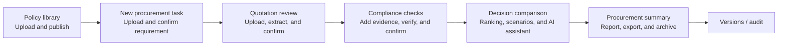
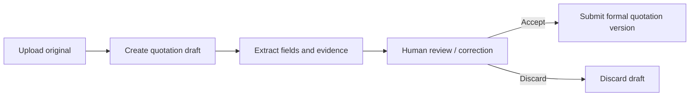
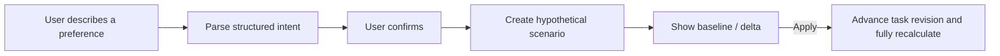

# Supplier Comparison User Workflow

[简体中文](WORKFLOW.md) · English

This document describes the complete workflow in the current delivery, from policy preparation to procurement summary. See [ARCHITECTURE.en.md](ARCHITECTURE.en.md) for API and storage boundaries.

## 1. Primary workflow

Policies may be prepared in advance. When creating a task, the user chooses whether to bind a published policy. For new tasks using `compliance/2.0`, compliance checks sit between quotation review and decision comparison.

## 2. Inputs and completion criteria by stage

| Stage | User actions | System output | Requirement to continue |
| --- | --- | --- | --- |
| Policy preparation | Upload policy files, review clauses, configure executable checks, and publish | Versioned and scoped policy set with a searchable index | Version is published, or the user explicitly confirms that no policy is bound |
| Procurement requirement | Upload PDF/TXT/MD or enter and review the requirement | Confirmed requirement, ranking preferences, and task revision | Requirement fields pass validation |
| Quotation review | Upload PDF/CSV, verify supplier identity and dynamic fields, and submit | Immutable quotation version with field evidence | At least one formal quotation; critical fields handled as required |
| Compliance checks | Review matched clauses, upload/replace evidence, and confirm pending items | Control statuses and citations for each supplier | Current assessment is confirmed by the user |
| Decision comparison | Review deterministic comparison, supplier information, scenarios, and AI explanations | Frozen comparison result for the current revision | Result is not stale; the user makes the business decision |
| Procurement summary | Generate narrative and review risks and communication recommendations | Exportable Markdown/Word/PDF print report | Summary matches the current `result_id` |

## 3. Requirements and task revisions

A requirement file is first saved as a recoverable draft. After extraction, the user reviews and confirms it to create the task. When the user leaves and returns to the page, the backend restores the draft instead of relying only on browser memory.

Updating the requirement, replacing a quotation, changing the policy binding, adding compliance evidence, or applying a decision scenario may advance `task_revision`. Earlier results remain viewable but are marked historical or stale and cannot overwrite the new revision.

## 4. Quotation upload and human review

- PDFs use text extraction and model-assisted field extraction; fixed CSV files use deterministic template parsing.
- The frontend renders review items dynamically from the field schema.
- A new quotation version is reviewed independently and does not inherit manual additions from an older version.
- One supplier may have several versions, but only the current active version participates in comparison.
- When a critical field is `MISSING`, `CONFLICT`, or unconfirmed, the system blocks submission or keeps the quotation pending.

## 5. Compliance checks

A compliance check does more than store uploaded files. A complete check:

1. Retrieves current policy clauses using the task binding, category, region, and control.
2. Creates an assessment plan that pins the policy version, clauses, and execution parameters.
3. Extracts structured facts from supplier evidence for the user to review and confirm.
4. Deterministically checks supplier ID, product scope, validity period, status, and amount thresholds.
5. Returns `PASS`, `FAIL`, `REVIEW_REQUIRED`, or `NOT_EVALUATED` with policy and evidence citations.
6. Makes that assessment version available to decision comparison only after user confirmation.

Adding or replacing evidence triggers rechecking; earlier evidence remains in version history. Missing evidence is not an automatic failure. It remains not evaluated or requires review and appears consistently in recommendation eligibility, AI answers, and the summary.

## 6. Decision comparison and scenarios

Decision comparison applies hard constraints first and then ranks suppliers using the primary and secondary criteria selected by the user. All six criteria are available, but at most two can be used for ranking at one time; the others remain visible as decision information.

The page reuses one frozen result for cost, delivery, purchase quantity, payment terms, supplier history, feasibility, compliance eligibility, and recommendation/non-selection reasons. No page should independently recalculate a separate conclusion.

Natural-language adjustments follow a controlled workflow:

Supplier exclusions, ranking changes, and tolerances take effect only after confirmation. An unapplied scenario does not modify formal procurement data. When base input changes, the old scenario becomes `STALE`.

## 7. AI decision assistant

The assistant answers questions using the current frozen requirement, quotations, comparison, compliance assessment, and supplier history. It can explain recommendations, compare alternatives, draft communication, and propose adjustments that require confirmation. The answer body uses numbered citations, with full objects and versions in a references section.

The assistant cannot:

- Write chat text directly into authoritative facts;
- Claim that a supplier without evidence is compliant;
- Apply preference changes without confirmation;
- Contact suppliers, negotiate, approve, sign, or order.

The worker runs conversations and asynchronous generation and streams status events. A model output that fails validation is shown as a failure and cannot be presented as a successful answer.

## 8. Results, summaries, and audit

The decision page, supplier information page, AI assistant, and procurement summary share the same `result_id` and frozen snapshot. The procurement summary combines requirements, quotation trade-offs, compliance status, risks, communication recommendations, and next actions into a formal report. It exports to Markdown and Word; PDF is produced through browser printing.

The audit page retains relationships among task revisions, quotation versions, policy versions, evidence versions, jobs, human corrections, results, and reports. Historical pages read only their corresponding snapshot and cannot fill an old result with current data.

## 9. Failures and recovery

| Condition | System behavior |
| --- | --- |
| Worker is not running | Job remains queued or fails with a diagnosable frontend state; retry after starting the worker |
| Model output fails its schema | Job fails and records the error; incomplete authoritative fields are not saved |
| Input revision changed | Late write is rejected and the client must refresh the current revision |
| Quotation fact is missing | Keep `PENDING` or require human confirmation; do not guess |
| Policy/evidence is missing | Keep not evaluated or review required and require explicit confirmation |
| RAG or model service fails | Show retrieval/generation failure; do not silently switch provider |
| All suppliers are infeasible | Explicitly show that no feasible quotation exists; do not force a recommendation |

See [TESTING.en.md](TESTING.en.md) for the complete local walkthrough.
