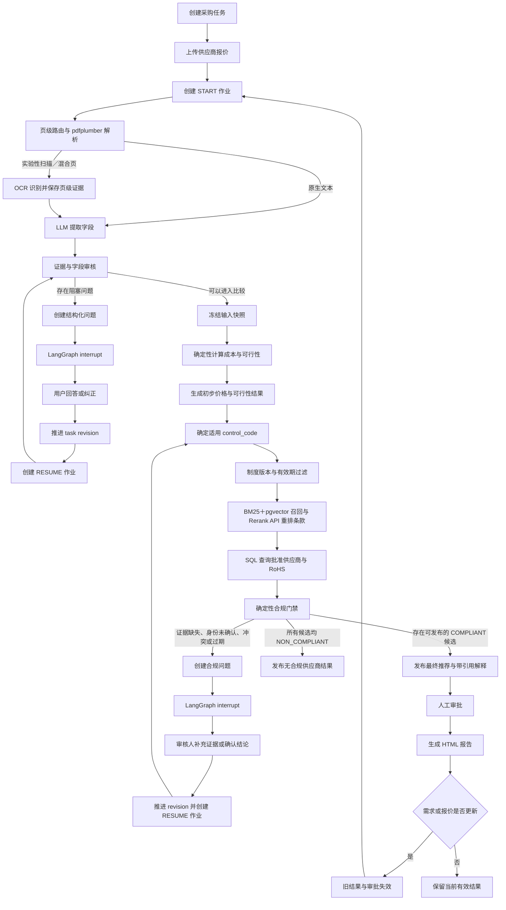

# Supplier Comparison 项目 Workflow

2026-09-17 本地流程更新：全量审核后新增 `analyze_decision_impact`，先判断合法未知费用是否影响推荐，再决定是否进入现有运费补问。无影响的报价保留未知和原审核状态，比较快照与结果接口提供影响报告；冲突、证据与身份错误以及必查制度门禁仍然阻塞。新增 `GET /api/v1/tasks/{task_id}/review` 集中读取问题及 `POST /api/v1/tasks/{task_id}/fields/corrections` 跨报价批量修改，事务提交后统一重审和重算，不绕过审核。参见 [批量审核指引](guide/guide_BATCH_REVIEW.md) 与 [决策影响交付指引](guide/guide_DECISION_IMPACT.md)。前端批量页面与自主调查 Agent 执行器仍待实现。下文固定流程说明需结合这些更新阅读。

> 文档状态：Final（2026-09-15，pgvector 选型已冻结）。后续实施以无版本后缀的 [WORKFLOW.md](WORKFLOW.md) 为正式入口。

2026-09-18 本地更新：新增可选 `investigate_quotes` 和 `await_batch_review` 分支，真实模型在审核/影响分析后选择受控工具，并记录计划、观察及停止。未解决字段集中交给原批量纠正接口，不能自动写回或绕过发布门禁。默认 `SUPPLIER_AGENT_ENABLED=false`，开启说明及剩余边界见 [自主调查指引](guide/guide_INVESTIGATION_AGENT.md)。前一段的“执行器待实现”为历史状态；前端页面、结果提问与制度异常自主重试仍未完成。
>
> 本文说明项目从创建采购任务到推荐、审批和重新比较的完整工作流，并明确当前已实现功能与 Week2 待实现功能。业务边界以 [ARCHITECTURE.md](ARCHITECTURE.md) 为准，实施安排见 [WEEK2_PLAN.md](WEEK2_PLAN.md)。

## 1. Workflow 概览

本项目采用一个有状态的采购比选工作流。系统不是由多个 Agent 自由对话组成，而是由一个 LangGraph 主图编排 PDF 解析、LLM 字段理解、证据审核、人工补问、确定性计算和结果发布。

遇到缺失或冲突字段时，工作流将问题写入 PostgreSQL，通过 LangGraph `interrupt` 暂停。用户提交结构化回答后，后端检查任务版本、保存操作者和回答，再从 PostgreSQL checkpoint 恢复原图运行。



图中的任务创建、PDF 上传、提取、审核、两次补问、快照、确定性比较和结果发布已经完成 Week1 集成。React、通用多字段补问、制度 RAG 与供应商合规门禁、审批、报告、报价 v2 替换和常驻 worker 属于 Week2 目标。

## 2. 角色和模块边界

| 角色／模块 | 负责内容 | 不拥有的权限 |
| --- | --- | --- |
| 采购用户 | 创建需求、上传报价、回答补问、纠正字段、调整比较范围 | 直接修改计算结果或批准采购建议 |
| 审核人 | 查看来源、推荐和制度依据，批准当前有效版本 | 批准存在阻塞问题或已经失效的版本 |
| React | 收集输入、显示状态、问题、来源、比较结果和审批操作 | 在浏览器内计算权威金额或绕过后端版本检查 |
| FastAPI application service | 校验身份、幂等键和 revision，推进业务状态 | 重新实现解析、审核和成本规则 |
| LangGraph | 编排节点、暂停、恢复和发布流程 | 将 checkpoint 当作权威业务数据库 |
| B 的解析／审核模块 | 解析 PDF／注册 CSV、调用模型、校验证据、生成 ReviewEnvelope | 计算最终采购金额或批准建议 |
| C 的规则模块 | 计算数量、MOQ、成本、交期和可行性 | 猜测未知字段或使用制度文本修改硬规则 |
| RAG 模块 | 用 BM25、pgvector 及 Embedding／Rerank API 检索适用制度，返回可核验引用 | 通过语义搜索猜测批准状态、证书有效期或独立裁决合规 |
| 供应商注册表 | 用结构化记录保存批准供应商和 RoHS 证书，并精确查询当前版本 | 接受客户端声明的 supplier_id 作为可信身份 |
| 合规门禁 | 用确定性规则和具名人工事件把制度要求及结构化证据映射为合规状态 | 让 LLM 在无证据时默认通过或修改价格排序 |
| PostgreSQL | 保存业务状态、版本、artifact、问题、结果、审批和 checkpoint | 生成业务判断或推荐 |

## 3. 创建采购任务

用户先提交一份 `ProcurementRequirement`，内容包括：

- 指定制造商和 MCU 料号；
- 封装及 revision；
- 商品必须为全新，不允许替代型号；
- 需求数量、预算和币种；
- 最晚到货日期；
- 成本或交期优先级。

后端创建：

- `task`；
- `requirement version 1`；
- `task revision 1`；
- 后续用于绑定的 `policy_set_version` 和 `supplier_registry_version`。

任务修订号是整个工作流的并发边界。所有会改变业务事实的操作必须携带 `expected_task_revision`。请求使用旧 revision 时返回 409，不能覆盖当前版本。

## 4. 上传与版本化供应商报价

用户通常上传 Supplier A、B、C 三份报价 PDF。每次上传执行：

1. 以数据流读取文件并检查文件类型和大小；
2. 计算 SHA-256；
3. 按系统 ID 写入不可覆盖的文件版本路径；
4. 创建 `quote` 和 `document` 记录；
5. 推进任务 revision；
6. 使不再适用的旧 graph run、问题及当前结果失效。

Week1 主演示的修订变化如下：

| 操作 | Task revision |
| --- | ---: |
| 创建任务 | 1 |
| 上传 Supplier A | 2 |
| 上传 Supplier B | 3 |
| 上传 Supplier C | 4 |

上传完成后，客户端调用运行接口创建 `START` job。当前 Week1 实现使用一次性 worker：

```powershell
.\.venv\Scripts\python.exe -m supplier_comparison.worker run-job --job-id <job_id>
```

Week2 将增加数据库轮询和租约，让单 worker 自动领取 START／RESUME job；上述命令继续保留为诊断入口。

## 5. PDF 解析与 LLM 字段提取

LangGraph 首先运行 `load_context`，锁定当前任务版本、需求、有效文档、本次运行时间及 graph run ID。随后对每份文档运行：

```text
原生文本 PDF
  → pdfplumber 提取文本和位置
  → LLM 理解报价字段
  → Pydantic 结构校验
  → EvidenceSource 原文定位
  → ExtractionBatch
```

主要提取字段包括：

- 供应商名称；
- 制造商、料号、封装及 revision；
- 新旧状态及是否允许替代；
- 单价、币种和计价基础；
- 包装数量、MOQ 和订购步长；
- 运费及其他费用；
- 交期、起算点和报价有效期。

每份文档建立独立的模型调用预算。完成后的 `ParsedInput`、`ExtractionBatch`、模型版本和证据数据作为不可变 artifact 写入 PostgreSQL；恢复运行时复用已完成的 artifact，不重复提取。

OCR 正式自动放行仍默认关闭。Week2 允许通过显式实验开关处理扫描页和混合页：OCR 结果进入同一字段提取与审核链路，但 OCR 来源的关键字段必须由用户在现有人工审核环节确认或纠正。关闭实验开关时，扫描 PDF 继续返回 `pdf_page_requires_ocr`，不能被解释成所有字段均未提供。

实验性 OCR 保存文件版本、文件哈希、页码、来源 ID、OCR 原文、置信度、引擎和预处理版本。审核页面不嵌入截图或裁剪图片，只向有权限的用户提供原始 PDF 链接和准确页码；浏览器不得看到服务器磁盘路径。

## 6. 证据与字段审核

字段提取完成后，工作流调用 B 的审核模块生成 `ReviewEnvelope`，检查：

- 字段格式是否合法；
- 引用是否真实存在于对应文件版本；
- 引用文本是否支持该字段含义；
- 字段之间是否冲突；
- 关键字段是否完整；
- 报价是否可以进入确定性计算。

只有 `downstream_ready=true` 的报价可以进入 C 的计算模块。模型成功返回 JSON 不代表报价已经审核通过。

以下状态必须分开处理：

| 状态 | 处理方式 |
| --- | --- |
| 字段完整且证据支持 | 进入确定性比较 |
| 缺失或冲突且可由用户解决 | 创建结构化问题并中断 |
| 关键字段来自实验性 OCR | 创建 `OCR_FIELD_CONFIRMATION`，确认或纠正后自动重新审核 |
| 已知硬约束失败 | 标记报价不可行，不猜测其他未知字段 |
| OCR 关闭时遇到扫描页 | 返回明确的 `pdf_page_requires_ocr` |
| 模型调用失败或超预算 | 记录 MODEL_FAILED／ERROR，允许受控重试或人工处理 |

## 7. 人工补问、暂停与恢复

当前已经实现 Supplier B 运费缺失的两步补问。

### 7.1 确认报价确实缺少运费

系统发现 Supplier B 的 PDF 没有运费信息后：

```text
创建 CONFIRM_MISSING issue
  → 保存问题、回答 schema 和操作者
  → LangGraph interrupt
  → worker 退出
  → task 进入 NEEDS_INPUT
```

用户确认“PDF 确实未提供运费”后，后端：

1. 检查 issue 是否仍属于当前 graph run；
2. 检查 `expected_task_revision`；
3. 保存结构化回答和服务端操作者；
4. 创建 `ReviewEvent`；
5. 将 revision 从 4 推进到 5；
6. 创建 `RESUME` job；
7. 从 PostgreSQL checkpoint 恢复原 graph run。

恢复后系统重新审核并形成比较草稿：

| Supplier | 状态 | 金额 |
| --- | --- | ---: |
| A | INFEASIBLE | S$12,800 |
| B | PENDING | 已知小计 S$6,800 |
| C | FEASIBLE | S$7,100 |

因为 B 仍可能成为最优报价，所以此时不能发布最终推荐。

### 7.2 提交运费金额

系统创建第二个 `SHIPPING_AMOUNT` issue。用户提交：

```json
{
  "amount": "200.00",
  "currency": "SGD"
}
```

后端创建 `shipping_fee_status=KNOWN_AMOUNT` 和 `shipping_fee_amount=200.00` 两个纠正事件，保存 `USER_INPUT` 来源，将 revision 推进到 6，并创建新的 RESUME job。工作流随后重新审核、冻结输入并重新计算。

重复提交相同幂等键和相同请求时返回原响应；相同幂等键携带不同请求、回答已解决问题或提交旧 revision 时返回 409。

### 7.3 确认 OCR 来源的关键字段

实验性 OCR 不增加第二轮独立人工审查，而是在现有问题列表中增加 `OCR_FIELD_CONFIRMATION`。系统把同一报价中需要确认的 OCR 关键字段集中展示，避免用户重复打开文件。

后端为每个关键字段建立一个 issue，绑定当前字段候选 artifact、内容哈希和 task revision；React 只负责按报价把这些 issue 集中展示。每个回答独立保存审计事件，只有当前文件版本的全部阻塞项解决后才创建 RESUME 作业。文件版本变化后，旧 issue 和确认事件失效；恢复执行时复用已持久化的 OCR artifact，不重复运行 OCR。

每个审核项显示：

- 字段名和当前提取值；
- 原始文件名、`document_id`、文件版本和哈希；
- 页码、`source_id`、OCR 原文和置信度；
- 经过后端授权的“打开原 PDF”链接。

页面不嵌入图片或裁剪区域。PDF 通过 `GET /api/v1/tasks/{task_id}/documents/{document_id}/content` 鉴权并流式返回；接口只接收系统 ID，不接收磁盘路径，也不在响应中暴露服务器文件位置。用户根据文件和页码在原 PDF 中核对后，只能选择：

| 操作 | 后端记录 | 后续状态 |
| --- | --- | --- |
| 确认正确 | `ReviewEvent` | 自动重新审核该批字段 |
| 修改字段 | `CorrectionEvent` | 保存新字段版本后自动重新审核 |
| 原文无法辨认 | unresolved review finding | 保持 `REVIEW_REQUIRED` |

对应的判别联合类型携带 `field_name`、`candidate_artifact_id`、`action=CONFIRM|CORRECT|UNREADABLE`，纠正时必须包含 `corrected_value`；写操作继续要求 `expected_task_revision` 和 `Idempotency-Key`。人工提交后执行系统自动复核，不要求用户再次审查同一字段。OCR 置信度无论多高都不能替代实验阶段的关键字段确认；非关键字段继续按现有 criticality 策略处理。只有所有适用关键字段已确认且 `ReviewEnvelope.downstream_ready=true`，报价才能进入 C。

## 8. 确定性比较与推荐

审核通过后，C 的规则模块负责计算；LLM 不计算权威金额，也不决定供应商排序。

实际采购数量为：

```text
Q = ceil(max(需求数量, MOQ) / 订购步长) × 订购步长
```

总成本为：

```text
按计价基础换算后的货款
  + 已确认运费
  + 已确认其他费用
```

金额使用 `Decimal`，货款按项目约定舍入到 SGD 0.01 后再加入已确认费用。未知费用保持未知，不能按零处理。

主演示的最终结果为：

| Supplier | 可行性 | 总成本／原因 |
| --- | --- | --- |
| A | INFEASIBLE | S$12,800，超过预算或不满足硬约束 |
| B | FEASIBLE | S$7,000 |
| C | FEASIBLE | S$7,100 |

因此 Supplier B 是初步价格与可行性排名第一的供应商。Week1 可以直接发布该推荐；Week2 接入合规门禁后，只有适用制度、B 的批准供应商状态和有效 RoHS 记录均获得有效证据，才能发布为最终推荐。

系统冻结并保存：

- 采购需求和报价版本；
- 文件哈希；
- 提取及审核 artifact ID；
- 人工回答和纠正；
- 规则与模型版本；
- `policy_set_version`；
- 评估时间和 task revision；
- 比较结果和推荐。

结果发布前，后端再次确认 graph run 仍属于当前任务版本。旧 worker 的迟到结果可以保留为历史 artifact，但不能写入 `tasks.current_result_id`。

## 9. 采购合规与供应商资质核验

2026-09-17：真实 LLM 制度解释已作为独立 CLI 实现，输入已确认事实与完整检索 bundle；逐条说明附当前引用及原文摘录。使用与验证边界见 [guide_RAG_EXPLANATION.md](guide/guide_RAG_EXPLANATION.md)，主流程仍未调用该模块。

实现进展（2026-09-16）：新制度 `2026.09.2` 与要求级检索编排已完成本地真实验证，24／24 要求被有效引用覆盖。现有主图尚未调用该编排，READY 不等于供应商合规。实现入口及限制见 [guide_RAG_ORCHESTRATION.md](guide/guide_RAG_ORCHESTRATION.md)。下方旧版本制度描述保留为历史设计背景，新集成应显式绑定复核后的新版本。

2026-09-16 设计基线见 [RAG_FULL_FLOW_DESIGN.md](RAG_FULL_FLOW_DESIGN.md)：每个 control_code 单独调用现有 Top-3 检索接口，聚合后进行要求级覆盖检查；不把六类控制码压入单次 Top-3。制度一致性审查为 CHANGES_REQUESTED，修订前禁止最终合规放行。本文后续链路仍是实现目标，不代表已接入主图。

Week2 将 RAG 用于检索适用采购制度，并用结构化供应商注册表核验批准状态和 RoHS。系统判断的是“该供应商是否具备进入当前采购建议和人工审批的合规依据”，不是是否可以自动下单。

首版只覆盖两项供应商条件：

- 供应商必须存在于当前版本的批准供应商注册表且状态有效；
- Electronics／MCU 采购要求供应商具有评估时点有效的 RoHS 记录。

ISO 和框架合同保留为未来扩展，不进入 Week2 主流程、数据制作和验收。

```text
初步价格与可行性结果
  → 按 policy_set_version、商品类别、金额、地区和评估时间确定必需 control_code
  → 在对应版本与范围内构造制度查询
  → BM25 稀疏召回
  → embedding API 生成查询向量，pgvector 精确余弦召回 Top-10
  → 融合两路候选，由 rerank API 重排取 Top-3
  → 核验引用并检查所有必需 control_code 都有条款支持
  → 将报价供应商映射到 supplier_master
  → 按 supplier_registry_version 精确查询批准状态与 RoHS
  → 确定性规则生成每家可行供应商的合规状态
  → 按原价格／交期顺序选择可发布候选
  → LLM 仅根据已核验事实和条款生成引用解释
```

制度条款在导入时绑定冻结的候选机器可执行控制码；A／C 必须完成语义审阅后，合规模块才可把它们用于最终判定。当前 `2026.09.1` manifest 使用：

- `QUOTE_COMPLETENESS`；
- `TOTAL_COST`；
- `APPROVED_SUPPLIER`；
- `ROHS_COMPLIANCE`；
- `AMOUNT_APPROVAL`；
- `QUOTE_CHANGE_REVIEW`。

品类、地区和有效期属于制度适用范围；具体阈值保存在条款的结构化参数中。当前虚构制度只有 `AMOUNT_APPROVAL` 定义金额阈值：total landed cost 达到 SGD 10,000（含）时需要经理审批。当前 `APPROVED_SUPPLIER` 和 `ROHS_COMPLIANCE` 不以 S$5,000 为启用条件。所有最终推荐仍按统一流程接受一次人工审批。审阅状态见 [`guide/POLICY_SEMANTIC_REVIEW.md`](guide/POLICY_SEMANTIC_REVIEW.md)。

适用的 control_code 先由制度清单中的结构化范围确定，不能依赖 Top-k 检索结果决定。BM25、pgvector 向量召回和 Rerank 只负责找到相应原文与解释依据；任何必需控制码没有检索到支持条款时进入 `REVIEW_REQUIRED`，不能少执行一项检查后仍判定合规。平均 Recall 只用于评价检索效果；一次具体采购必须达到全部 required control_code 的逐项证据覆盖，才允许生成 `COMPLIANT`。LLM 和 RAG 不能临时发明控制码、阈值或规则。批准状态、证书编号和有效期由 PostgreSQL 精确查询，不能用相似度分数代替。

报价上传时的 `supplier_id` 只是声明值。系统必须将其映射到 `supplier_master_id`；未匹配、多个候选或名称冲突时创建供应商身份问题。具名用户确认后保存映射事件和操作者，才能读取该供应商的注册记录。

合规状态包括：

| 状态 | 含义 | 对推荐的影响 |
| --- | --- | --- |
| `COMPLIANT` | 适用制度、批准状态和有效 RoHS 均有当前版本证据 | 允许成为最终推荐候选 |
| `REVIEW_REQUIRED` | 制度检索失败、身份未确认、证据缺失／冲突或有效期不明确 | 创建结构化问题并暂停，不发布最终推荐 |
| `NON_COMPLIANT` | 已有明确证据证明批准状态无效或 RoHS 已过期／不适用 | 排除该供应商并保留原因和证据 |

工作流一次评估所有 `FEASIBLE` 供应商并保存合规矩阵，而不是在图中无限循环。最终选择规则为：

1. 保留 C 生成的价格／交期排序，不让 RAG 修改分数；
2. 价格顺序中的 `NON_COMPLIANT` 候选可以被跳过；
3. 只要更高排名候选仍为 `REVIEW_REQUIRED`，就只能发布草稿；
4. 所有更高候选均明确不合规时，选择第一个 `COMPLIANT` 候选；
5. 全部候选明确不合规时返回 `NO_COMPLIANT_SUPPLIER`；
6. 没有有效证据时不得默认合规。

人工补充供应商资料会创建新记录版本并重新评估。人工确认检索或身份使用独立 `ComplianceReviewEvent`；它不等同于最终审批。Week2 不实现无证据的任意合规豁免。

BM25、embedding、pgvector、rerank 和解释调用分别记录检索器／模型版本、次数、延迟、用量和错误。pgvector 向量记录绑定制度集合版本、条款 ID、内容哈希、embedding 模型、维度与预处理版本，并可从 PostgreSQL 权威条款完整重建。pgvector 或模型 API 不可用时可以保存 BM25 候选用于诊断，但检索结果必须为 `ERROR`，不能以稀疏结果继续判定合规。`NO_EVIDENCE`、`CONFLICT` 和 `ERROR` 必须分别保存并映射为 `REVIEW_REQUIRED`。报价参考答案、评测标签和生成器映射不得进入运行索引或提示词。

## 10. 人工审批与报告

审批是独立于 LangGraph 的 FastAPI 事务。审核人提交审批时，后端在同一事务中检查：

- 当前认证账户具有审核人权限；
- recommendation、snapshot 和 task revision 均为当前版本；
- 不存在仍会影响推荐的阻塞问题；
- 报价有效期及交付条件在当前时间仍成立；
- 请求没有因重复提交而创建第二条审批。

审批成功后生成绑定冻结内容的 HTML 报告。报告包括需求、比较范围、金额明细、可行性、来源、人工修改、制度引用、版本、评估时间和审批记录。

待确认、未批准或无可行方案的结果可以导出明确标记的草稿。只有当前版本且已经有效审批的结果可以作为最终报告发布。报告生成结束后必须再次检查 revision 和审批有效性，防止生成期间发生报价更新。

## 11. 报价更新与重新推荐

Week2 主演示将在 Supplier B 已获批后上传 B v2：

- 运费仍为 S$200；
- 到货时间由 3 天变为 6 天。

B v2 必须替换当前比较范围中的 B v1，不能作为第四家供应商加入。系统随后：

1. 创建新的报价和文件版本；
2. 推进 task revision；
3. supersede 旧 graph run 和未完成 job；
4. 使旧推荐和审批失效；
5. 对 B v2 重新提取、审核和比较；
6. 改荐 Supplier C，总成本 S$7,100；
7. 解释相对原 B 推荐增加 S$100，以及为什么需要重新审批；
8. 等待审核人批准新版本。

历史 B v1、旧结果、旧审批和旧报告继续保留用于审计，但不能作为当前有效决策使用。新报价不能自动继承旧报价的人工补充和排除记录。

## 12. 问答与 Chatbot 边界

当前系统已有结构化问答，而不是通用 Chatbot：

- 系统针对缺失或冲突字段提出固定问题；
- 用户提交经过 Pydantic 校验的类型化回答；
- 用户可以主动纠正提取字段；
- RAG 检索适用制度；PostgreSQL 供应商注册表为初步推荐提供批准状态和 RoHS 依据。

当前范围不包含任意自然语言聊天。若未来增加任务内 Chatbot，应让自然语言层调用受控的只读查询工具；任何字段修改、问题回答或审批都必须先生成结构化操作预览，再由用户确认并调用现有 application service。LLM 不能直接修改数据库或绕过 revision、身份和审批检查。

## 13. 持久化、恢复与审计

PostgreSQL 是任务、版本、问题、回答、结果和审批的权威记录；LangGraph checkpoint 只保存图执行位置及业务 ID。原始报价文件保存到独立持久化卷。

| 数据 | 保存位置 |
| --- | --- |
| 任务、需求、报价和文件元数据 | PostgreSQL 业务表 |
| ParsedInput、ExtractionBatch、ReviewEnvelope、事件、快照和结果 | 不可变 JSONB artifact |
| 当前图执行位置 | LangGraph PostgreSQL checkpoint 表 |
| 原始 PDF／CSV 和报告 | 持久化文件卷 |
| 模型调用预算和文档执行状态 | document execution／运行调用账本 |
| 制度条款原文和检索轨迹 | PostgreSQL 业务表／artifact |
| 可重建条款向量和检索版本 | PostgreSQL／pgvector；与权威条款共用事务、备份和版本边界 |
| 供应商主数据、批准记录和 RoHS | PostgreSQL 版本化关系表及来源引用 |

Compose 重启但不删除卷时，任务、文件、问题、checkpoint 和历史结果必须保留。API、日志、interrupt 和报告不得包含磁盘路径、Authorization、API Key、provider 原始响应或私有参考答案。

## 14. 分层验收与完整主演示

### 14.1 测试执行类型

| 类型 | 范围 | 网络依赖 | 判定方式 |
| --- | --- | --- | --- |
| 单元测试 | 计算、合规规则、版本和状态转换 | 无 | 固定输入得到确定结果 |
| 集成测试 | FastAPI、PostgreSQL、LangGraph、文件和检索契约 | 无；使用固定模型／检索适配器 | 验证幂等、revision、恢复和副作用 |
| Live 模型测试 | LLM、embedding、rerank 及启用的真实检索组件 | 有；显式运行 | 单独记录版本、用量、延迟和结果 |
| Lightsail smoke test | Compose、持久化、资源和重启恢复 | 官方环境 | 记录实例、镜像、健康状态和恢复结果 |

普通 `pytest` 不依赖网络或真实模型。Live 与 Lightsail 结果分别记录，不能用固定输出测试替代。

### 14.2 完整主演示顺序

主演示固定使用三份原生文本 PDF；实验性 OCR 是独立验收能力，不影响 MCU-DEMO-001 主路径的成功判定。

| 步骤 | 操作 | 预期行为 |
| --- | --- | --- |
| 1 | 创建 MCU-DEMO-001 需求 | 创建 revision 1，绑定制度集合和供应商注册表版本 |
| 2 | 上传 A、B、C 三份 PDF | revision 推进到 4，保存不可变文件版本 |
| 3 | 启动比较 | 解析、提取、审核，创建 `CONFIRM_MISSING` 问题 |
| 4 | 确认 B 未提供运费 | revision 5，恢复后生成草稿并创建金额问题 |
| 5 | 输入 B 运费 S$200 | revision 6，重新审核和计算 |
| 6 | 查看初步比较 | B 为 S$7,000 的价格与可行性第一名，但尚未通过合规门禁 |
| 7 | 检索制度并查询 B 的结构化注册记录 | 核验批准供应商状态、金额门槛和有效 RoHS，显示可回到原文／原记录的引用 |
| 8 | 发布推荐并由审核人批准 | B 为 `COMPLIANT` 后成为唯一最终推荐，生成当前版本 HTML 报告 |
| 9 | 上传 B v2，交期改为 6 天 | 旧结果和审批失效，启动新运行 |
| 10 | 查看重新推荐及合规依据 | 改荐 C／S$7,100，重新核验 C 的批准状态和资质，并解释增加 S$100 |
| 11 | 审核人重新批准 | 新版本审批及报告生效，历史记录仍可查询 |

### 14.3 由简单到复杂的验收案例

| 层级 | 场景 | 工作流预期 |
| ---: | --- | --- |
| 1 | 独立场景 `TC-COMPARE-001` 的三份完整报价 | 无中断完成提取、审核和初步比较，数量与金额正确 |
| 2 | V1 的 B 缺运费 | 两次 interrupt；确认缺失后保持 `PENDING`，输入 S$200 后才完成比较 |
| 3 | 超预算、超期、错误料号或封装 | 保存全部明确失败原因，不让不可行报价进入推荐 |
| 4 | V2／V3 现实别名、载体差异和证据歧义 | PDF／CSV 业务值一致；错误引用进入审核；关键静默错误为 0 |
| 5 | V5／V6 多供应商和混合输入 | 正确选择登记或模型路径，控制调用预算，未知潜在最优报价阻止提前推荐 |
| 6 | B v1 更新为 v2 | 旧运行、问题、人工补充、结果和审批失效，重新比较后改荐 C |
| 7 | 批准供应商＋有效 RoHS | BM25、pgvector 和 rerank 路径检索到正确制度，全部 required control_code 均有当前版本且支持主张的引用，结构化记录核验通过后发布推荐 |
| 8 | 无证据、资质过期、冲突或检索组件故障 | 进入 `REVIEW_REQUIRED`；BM25 候选只作故障诊断，不得默认合规 |
| 9 | 重复请求、旧 revision、worker／数据库重启 | 幂等和版本保护生效，LangGraph 从 checkpoint 恢复且不重复副作用 |
| 10 | V4 异常文件及 V7 实验性 OCR／对抗输入 | 非法文件在模型调用前失败；OCR 关键字段集中进入现有人工审核，通过文件＋版本＋页码核对且不嵌入图片；确认／纠正后自动复核；隐藏文本冲突不得放行 |

每层使用独立场景 ID 或任务，保存输入哈希、task revision、graph run、模型／检索器版本和验收结果。不得只展示 V1 主路径，也不得用总体准确率掩盖关键静默错误、错误合规放行或恢复重复写入。

合规层必须分别验证：第一名 `REVIEW_REQUIRED` 时不得越过它推荐第二名；第一名 `NON_COMPLIANT` 时可以选择下一名 `COMPLIANT`；全部候选明确不合规时返回 `NO_COMPLIANT_SUPPLIER`。还要覆盖供应商身份无匹配／多匹配、证书在评估时点过期，以及 policy／registry 版本变化对旧结果、审批和报告的失效处理。

OCR 层拆分验证关闭、开启、部分确认、`UNREADABLE`、纠正、重复回答、旧 revision、文件版本替换、worker 恢复、PDF 越权访问和隐藏文本冲突。任一未解决关键字段、失效来源或冲突都必须保持 `downstream_ready=false`。

## 15. 当前完成状态

| 模块 | 状态 |
| --- | --- |
| FastAPI 任务、上传、问题、纠正和结果接口 | Week1 已实现 |
| PostgreSQL 业务表和 Alembic migration | Week1 已实现 |
| PDF 解析、LLM 提取与证据审核 | Week1 已实现 |
| Decimal 成本与可行性计算 | Week1 已实现 |
| LangGraph 两次 interrupt 和跨进程恢复 | Week1 已实现 |
| 幂等、revision 和迟到结果保护 | Week1 已实现 |
| 本地真实模型三份 PDF 端到端 | Week1 已通过一次受控验收 |
| React 操作界面 | Week2 待实现 |
| 通用多字段补问和人工排除 | Week2 待扩展 |
| 实验性 OCR 辅助提取与关键字段确认 | Week2 待实现；正式无人值守放行不在本周范围 |
| BM25＋pgvector＋Embedding／Rerank API 制度检索 | Week2 已实现本地子系统、真实模型 smoke、8 题开发集评测及 LangGraph 发布门禁；待供应商合规矩阵接入及 Lightsail 验收 |
| 批准供应商＋RoHS 结构化合规门禁 | Week2 待实现 |
| 报价 v2 替换和需求更新 | Week2 待实现 |
| 具名身份、审批和 HTML 报告 | Week2 待实现 |
| 常驻 worker 自动调度 | Week2 待实现 |
| Lightsail／官方模型完整验收 | 待执行 |
| 自由聊天 Chatbot | 当前 MVP 范围外 |

当前本地真实模型验收不能代表 Lightsail 或主办方模型已经通过；固定输出测试不能替代真实模型提取与 RAG 引用验收。
