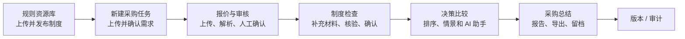
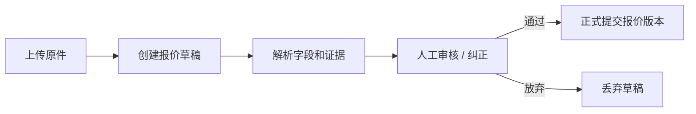
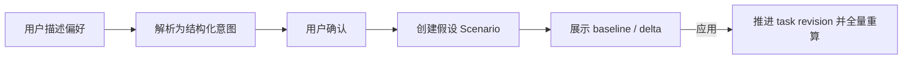

# Supplier Comparison 用户流程

简体中文 · [English](WORKFLOW.en.md)

本文描述当前交付版本从制度准备到采购总结的完整流程。接口和存储边界见 [ARCHITECTURE.md](ARCHITECTURE.md)。

## 1. 主流程

制度资源可以预先准备；创建任务时选择是否绑定已发布制度。对采用 `compliance/2.0` 的新任务，制度检查位于报价审核与决策比较之间。

## 2. 各阶段的输入与完成条件

| 阶段 | 用户操作 | 系统输出 | 进入下一步的条件 |
| --- | --- | --- | --- |
| 制度准备 | 上传制度文件、审核条款、配置可执行检查并发布 | 带版本和范围的制度集合、可检索索引 | 版本已发布；若不绑定制度则需明确确认 |
| 采购需求 | 上传 PDF/TXT/MD 或填写需求并核对 | 已确认的需求、排序偏好和任务版本 | 需求字段通过校验 |
| 报价与审核 | 上传 PDF/CSV、核对供应商身份和动态字段、提交 | 不可变报价版本及字段证据 | 至少一份正式报价；关键字段按要求处理 |
| 制度检查 | 查看命中条款、上传/替换证明材料、确认待处理项 | 每家供应商的控制项状态和引用 | 当前 assessment 已由用户确认 |
| 决策比较 | 查看确定性比较、供应商信息、情景试算和 AI 解释 | 当前 revision 的冻结比较结果 | 结果未过期；用户自行作出业务决定 |
| 采购总结 | 生成叙述、核对风险和沟通建议 | 可导出的 Markdown/Word/PDF 打印稿 | 总结与当前 `result_id` 一致 |

## 3. 需求与任务版本

需求文件先保存为可恢复的草稿，解析完成后由用户确认并创建任务。离开页面再返回时，草稿由后端恢复，而不是只保存在浏览器内存。

更新需求、替换报价、调整制度绑定、补充合规材料或应用决策情景都可能推进 `task_revision`。旧结果仍可查看，但会标记为历史或失效，不能覆盖新版本。

## 4. 报价上传与人工审核

- PDF 走文本提取和模型字段抽取；固定 CSV 走确定性模板解析。
- 前端通过字段 Schema 动态展示审核项。
- 新版报价独立审核，不继承旧版人工补充。
- 同一供应商可以有多个版本，但只有当前有效版本参与比较。
- `MISSING`、`CONFLICT` 或关键字段未确认时，系统会阻止提交或保留为待处理状态。

## 5. 制度检查

制度检查不是“只把文件存起来”。一次完整检查包含：

1. 根据任务绑定、类别、地区和控制项检索当前制度条款。
2. 生成本次检查计划，固定制度版本、条款和执行参数。
3. 将供应商证明材料解析为结构化事实，由用户核对并确认。
4. 确定性核对供应商编号、产品范围、有效期、状态和金额门槛。
5. 输出 `PASS`、`FAIL`、`REVIEW_REQUIRED` 或 `NOT_EVALUATED`，并展示制度引用和材料引用。
6. 用户确认本次 assessment 后，决策比较才读取该版本结果。

补充或替换材料会触发重新检查；旧材料保留为历史版本。没有材料时不是自动失败，而是保持未核验/待复核，并在推荐资格、AI 回答和总结中一致显示。

## 6. 决策比较与情景

决策比较先执行硬约束，再按用户选择的主、次排序指标排序。六个指标均可选择，但每次最多选择两个排序指标；其余指标只作为决策信息展示。

页面复用同一个冻结结果展示成本、到货、采购量、付款条件、供应商历史、可行性、制度资格以及推荐/未选原因。任何页面都不应自行重算另一套结论。

自然语言调整采用受控流程：

排除供应商、排序变化和容差只在用户确认后生效。未应用的 Scenario 不修改正式采购数据；基础输入变化后，旧 Scenario 标记为 `STALE`。

## 7. AI 决策助手

助手基于当前冻结的需求、报价、比较、制度检查和供应商历史回答问题，可解释推荐、比较替代方案、草拟沟通内容并提出需确认的调整。引用在正文中以编号显示，完整对象和版本放在引用区。

助手不能：

- 把聊天文字直接写成权威事实；
- 声称缺少证据的供应商已经合规；
- 绕过确认直接应用偏好；
- 联系供应商、议价、批准、签约或下单。

对话和异步生成由 Worker 执行，并通过事件流更新。模型输出校验失败会明确显示失败，不能伪装成成功答案。

## 8. 结果、总结与审计

决策页、供应商信息页、AI 助手和采购总结共用同一 `result_id` 及其冻结快照。采购总结将需求、报价取舍、制度状态、风险、沟通建议和后续行动组合为正式报告，可导出 Markdown 和 Word；PDF 通过浏览器打印生成。

审计页保留任务 revision、报价版本、制度版本、材料版本、作业、人工纠正、结果和报告的关联。历史页面只能读取对应快照，不能用当前数据补齐过去结果。

## 9. 异常与恢复

| 情况 | 系统行为 |
| --- | --- |
| Worker 未运行 | 作业保持等待或失败，前端显示可诊断状态；启动 Worker 后重试 |
| 模型输出未通过 Schema | 作业失败并记录错误，不保存不完整的权威字段 |
| 输入版本已变化 | 拒绝迟到写入，要求刷新当前 revision |
| 缺少报价事实 | 保持 `PENDING` 或要求人工确认，不猜值 |
| 缺少制度/材料 | 保持未核验或待复核，并要求显式确认 |
| RAG 或模型服务失败 | 显示检索/生成失败；不静默改用其他 provider |
| 全部供应商不可行 | 明确显示无可行报价，不强行推荐 |

本地完整走查步骤见 [TESTING.md](TESTING.md)。
