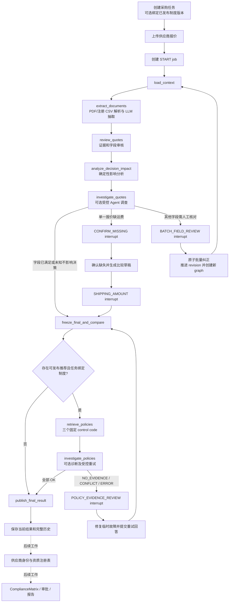

# Supplier Comparison 项目 Workflow

> 文档状态：Final，按 2026-09-18 `main` 分支更新。本文描述当前已实现的后端流程，并把尚未实现的功能明确标为后续工作。业务边界以 [ARCHITECTURE.md](ARCHITECTURE.md) 为准，开发安排见 [WEEK2_PLAN.md](WEEK2_PLAN.md)。

## 1. 系统目标与核心边界

本项目使用 FastAPI、PostgreSQL 和 LangGraph 编排供应商报价比较。主流程负责：

- 创建版本化采购任务并上传报价；
- 从 PDF 或注册 CSV 中抽取字段和证据；
- 审核字段、处理人工确认与纠正；
- 用确定性规则计算数量、成本、交期和推荐；
- 检索任务绑定的采购制度，并校验引用；
- 在任务 revision、快照和 graph run 仍有效时发布结果。

系统包含可选的受控调查 Agent。Agent 可以选择后端提供的只读分析工具、制度重试工具和澄清工具，但不能直接修改业务事实、执行任意 SQL、读取任意文件、裁决供应商合规或发布结果。所有正式写入仍由 application service 执行版本、身份、幂等和审计检查。

LLM 不负责权威金额计算、供应商排序或发布许可。RAG 只提供制度证据，当前也不能证明某家供应商已经获得批准或具有有效 RoHS 证书。

## 2. 当前端到端流程



LangGraph 当前包含 16 个节点。报价批量纠正不会恢复已经过期的旧图，而是推进任务 revision、使旧图失效并创建新的 START job。制度证据问题可以在原图中通过受控回答恢复，但恢复后仍会重新冻结快照、比较并检索制度。

## 3. 任务、revision 与 graph run

用户通过 `POST /api/v1/tasks` 提交 `ProcurementRequirement`。任务可选绑定一个已发布制度组合：

- `policy_set_version`；
- `policy_index_version`；
- `policy_category`；
- `policy_region`。

绑定必须完整。没有绑定制度的任务保留基础报价比较路径；只填写部分绑定会被拒绝。已创建任务不会静默切换到新制度版本，需要使用新绑定重新创建任务。

`task_revision` 是并发和失效边界。上传报价、回答有效问题或主动纠正字段都会推进 revision。所有改变业务事实的请求必须携带 `expected_task_revision`，旧 revision 返回 409。

每次 START 或主动纠正产生独立 `graph_run_id`，LangGraph `thread_id` 使用 graph run ID。上传新报价或主动纠正时，旧 graph、未完成 job、未解决 issue 和旧 current result 会失效。旧 worker 可以保留迟到 artifact，但不能覆盖当前结果。

## 4. 报价上传、解析与抽取

报价上传接口为 `POST /api/v1/tasks/{task_id}/quotes`。后端按数据流读取文件、限制大小、计算 SHA-256，并按系统 ID 写入不可覆盖的持久化位置。原始文件名只作为元数据，API 和日志不返回服务器磁盘路径。

每份有效文档依次执行：

```text
PDF 或注册 CSV
  -> 解析文本与来源位置
  -> LLM 字段理解
  -> Pydantic 契约校验
  -> EvidenceSource 原文定位
  -> ExtractionBatch
```

主要字段包括供应商、制造商、料号、封装、revision、新旧状态、替代限制、价格、币种、计价基础、MOQ、订购步长、运费、其他费用、交期和报价有效期。

每份文档有独立且持久化的模型调用预算，默认最多 8 次。完成的解析、抽取和审核 artifact 会在恢复或新图中复用，未变化的报价不会因为人工纠正其他报价而重新调用抽取模型。

OCR 解析代码已经存在，但正式默认值仍为 `SUPPLIER_PDF_OCR_ENABLED=false`。关闭时扫描 PDF 返回 `pdf_page_requires_ocr`，不能伪装成正常的全字段缺失。OCR 开启后的证据仍必须通过现有审核和人工纠正门禁，不能凭置信度自动发布。

## 5. 字段审核与决策影响分析

`review_quotes` 调用 B 模块生成 `ReviewEnvelope`，检查：

- 字段格式和归一化结果；
- 引用是否属于当前文件版本；
- 原文是否支持字段含义；
- 字段之间是否冲突；
- 关键字段是否完整；
- 是否可以进入确定性计算。

模型成功返回 JSON 不代表报价已经审核通过。`REJECTED`、`REVIEW_REQUIRED` 和 `MODEL_FAILED` 不能直接传入 C 的比较模块。

审核之后执行 `analyze_decision_impact`。规则版本为 `supplier-comparison/1.1.0`。它只在严格条件下证明某个未知费用不会改变当前推荐，例如：

- 排序规则是最低确认总成本；
- 所有相关报价使用同一币种和价格基础；
- 未知项仅为允许分析的非负费用；
- 没有未知折扣、非费用字段冲突或身份／证据问题；
- 该报价的成本下界已经高于最佳可行报价总成本。

满足条件的报价记为 `NON_BLOCKING`，但未知金额仍保持未知，不会被写成零。不能证明无影响的报价记为 `REQUIRES_INVESTIGATION` 或 `UNDETERMINED`，继续阻止发布。影响报告作为不可变 artifact 保存，并随结果 API 返回。

详细规则见 [决策影响交付指引](guide/guide_DECISION_IMPACT.md)。

## 6. 受控调查 Agent

`investigate_quotes` 和 `investigate_policies` 只有在 worker 启用 `SUPPLIER_AGENT_ENABLED=true` 时才使用真实模型。默认关闭时，确定性审核、运费两步确认、批量纠正和制度门禁仍然有效。

报价调查可使用的主要工具包括：

| 工具 | 用途 |
| --- | --- |
| `get_task_context` | 读取当前需求、版本和制度绑定 |
| `analyze_decision_impact` | 读取确定性影响报告 |
| `get_comparison_result` | 读取当前比较草稿 |
| `get_cost_breakdown` | 读取程序计算的成本明细 |
| `locate_quote_source` | 定位当前报价字段证据和受限原文预览 |
| `get_confirmed_quote_records` | 读取当前仍有效的人工纠正记录 |
| `request_clarification` | 生成待人工核对卡片 |
| `analyze_selection_gap` | 分析成本、交期和阻塞差距 |
| `draft_clarification` | 生成尚未发送的供应商沟通草稿 |
| `simulate_requirement_change` | 在用户明确授权的参数范围内进行只读假设试算 |

制度调查只允许读取当前检索状态、任务上下文、请求人工处理，以及在符合条件时重试原来的冻结查询。模型不能修改 query、control code、任务 ID 或制度版本。

默认预算为每个调查阶段最多 8 次模型调用、10 次工具调用和 90 秒。调用预算、开始时间、观察、来源和停止原因都持久化；重放不会将预算归零。模型返回 STOP、达到预算或超时都不会自动释放业务门禁。

调查记录可通过 `GET /api/v1/tasks/{task_id}/investigations` 查询。响应只包含计划摘要、工具调用、公开观察和停止原因，不暴露模型内部思维链。

详细说明见 [调查 Agent 指南](guide/guide_INVESTIGATION_AGENT.md) 和 [Agent 联调指南](guide/guide_AGENT_VALIDATION.md)。

## 7. 人工问题、纠正与恢复

### 7.1 单一报价缺少运费

当唯一阻塞问题是一个报价的 `shipping_fee_status` 缺失时，系统使用两次已有的类型化中断：

1. `CONFIRM_MISSING`：用户确认原报价确实未提供运费，后端创建 `ReviewEvent`；
2. `SHIPPING_AMOUNT`：用户提交 `{amount, currency}`，后端创建运费状态和金额两个 `CorrectionEvent`。

第一次确认后会冻结比较草稿。V1 演示中：A 为 INFEASIBLE／S$12,800，B 为 PENDING／已知小计 S$6,800，C 为 FEASIBLE／S$7,100。由于 B 仍可能成为最优报价，系统继续询问运费。输入 S$200 后，B 总成本为 S$7,000。

### 7.2 通用批量字段审核

当 Agent 调查后仍有多个字段或非运费问题需要人工处理，系统创建 `BATCH_FIELD_REVIEW`，并在 `answer_schema.cards` 中集中返回核对卡片。

该 issue 不能通过通用 issue answer 接口解决。前端必须调用：

```text
POST /api/v1/tasks/{task_id}/fields/corrections
```

请求包含 task revision、每项纠正的 quote、field、可选字段版本、值、单位和理由。后端在一个事务中验证全部纠正；任意一项失败则整批不写入。成功后 revision 只推进一次，旧图失效，创建新图和 START job，并重新审核与计算。

### 7.3 主动单字段纠正

用户也可以通过：

```text
POST /api/v1/tasks/{task_id}/quotes/{quote_id}/fields/{field_name}/corrections
```

主动纠正当前字段。该操作同样创建新 revision 和 graph run。历史 artifact、旧结果和旧调查记录继续保留，但标记为不再属于当前输入。

所有写操作使用 `Idempotency-Key`。相同 key 和相同请求返回原响应；同一 key 携带不同请求、旧 revision、已解决 issue 或失效字段版本返回 409。

## 8. 确定性比较、差距分析与假设试算

C 模块使用 `Decimal` 计算采购数量、成本、交期和硬约束。实际采购数量为：

```text
Q = ceil(max(需求数量, MOQ) / 订购步长) * 订购步长
```

总成本为货款加已确认运费和其他费用。未知费用保持未知，不能按零处理。只有审核通过或经决策影响规则证明不影响当前选择的输入才能进入对应的比较路径。

只读分析接口包括：

- `GET /api/v1/tasks/{task_id}/selection-gaps`：返回阻塞项、已知成本、追平差额、预算超额和交期差距；
- `POST /api/v1/tasks/{task_id}/requirement-simulations`：只有请求显式设置 `confirm_hypothetical=true` 时，才能模拟预算或截止日期变化。

假设试算不会修改正式采购需求，也不会触发制度批准。供应商沟通草稿只返回文本，不会自动发送。

## 9. 制度知识库导入

制度知识库支持 Markdown manifest 导入，以及通过后端上传原生文本 PDF、UTF-8 TXT 或 Markdown。文件上传流程为：

```text
上传并提取
  -> REVIEW_REQUIRED
  -> 人工全量替换／确认条款及 control code
  -> READY_TO_PUBLISH
  -> 生成全部 embedding
  -> 原子发布制度与索引
  -> PUBLISHED
```

相关接口包括：

- `GET /api/v1/policy-sets`：列出可以绑定任务的已发布制度和索引版本；
- `GET /api/v1/policy-imports`：列出当前操作者的导入记录；
- `POST /api/v1/policy-imports`：上传 PDF、UTF-8 TXT 或 Markdown；
- `GET /api/v1/policy-imports/{policy_import_id}`：读取审核详情；
- `PUT /api/v1/policy-imports/{policy_import_id}/clauses`：全量提交审核后的条款；
- `POST /api/v1/policy-imports/{policy_import_id}/publish`：显式发布；
- `POST /api/v1/policy-sets/{policy_set_id}/versions/{policy_set_version}/deactivate`：停用指定版本，禁止新任务绑定。

扫描或空白制度 PDF 返回 `policy_pdf_requires_ocr`。上传不会自动推断可信的 control code；发布前必须人工审核。发布后的正文和索引不可原地覆盖，同版本不同内容哈希会被拒绝。停用不会删除制度或索引，历史任务仍可按冻结版本检索，但新任务无法再绑定该版本；替换内容必须发布新版本。

## 10. 当前 RAG 发布门禁

只有比较结果存在可发布推荐并且任务绑定完整制度版本时，主图才调用 RAG。当前主图对以下三个固定控制码分别检索 Top-3：

- `APPROVED_SUPPLIER`；
- `ROHS_COMPLIANCE`；
- `AMOUNT_APPROVAL`。

每个控制码单独执行：

```text
SQL 版本／品类／地区／有效期过滤
  -> BM25 Top-10
  -> embedding API + pgvector 精确余弦 Top-10
  -> RRF 融合
  -> rerank API
  -> Top-3 引用和哈希核验
```

三个检索结果都必须为 `OK`，并且 citation 的制度版本、control code、retrieval ID、原文和 SHA-256 与当前请求一致，才允许发布当前比较结果。

| 检索状态 | 当前处理 |
| --- | --- |
| `OK` | 通过本次制度证据门禁 |
| `NO_EVIDENCE` | 创建 `POLICY_EVIDENCE_REVIEW`，不自动重试 |
| `CONFLICT` | 创建 `POLICY_EVIDENCE_REVIEW`，不自动重试 |
| `ERROR` | 只有明确的临时 embedding、rerank 或 transport 错误可受控重试 |

自动制度重试默认整个 graph 最多 2 次，硬上限 3 次。重试名额在外部请求前写入 artifact，跨进程恢复不会归零。回答制度问题后，主图会重新冻结当前 revision 的快照和比较结果，再重新执行制度检索。

通过制度证据门禁只表示找到了当前版本的相关制度条款，不表示推荐供应商已经通过资质审核。独立的六控制码 `PolicyOrchestrator` 和中文引用解释服务已经存在，但尚未接入采购主图。详细边界见 [RAG 指南](guide/guide_RAG.md)、[检索编排指南](guide/guide_RAG_ORCHESTRATION.md) 和 [解释服务指南](guide/guide_RAG_EXPLANATION.md)。

## 11. 结果发布与查询

发布前后端再次检查：

- task revision 仍等于 graph 的有效 revision；
- graph run 没有被 supersede；
- snapshot 和 comparison result 属于当前任务和图；
- 当前问题已经解决；
- 所需制度检索均通过门禁。

结果查询接口为：

- `GET /api/v1/tasks/{task_id}/results`；
- `GET /api/v1/tasks/{task_id}/results/{result_id}`。

响应在 `ComparisonResult` 旁返回 `decision_impact` 和 `policy_retrievals`。历史结果可查，但只有 `tasks.current_result_id` 指向的结果代表当前版本。

供应商身份匹配、批准状态、RoHS 证书事实和确定性 `ComplianceMatrix` 尚未实现，因此当前结果应描述为“报价比较结果通过制度证据门禁”，不能描述为“供应商已合规”或“采购已获批准”。

## 12. 持久化、恢复与安全

PostgreSQL 是业务事实的权威来源。LangGraph checkpoint 只保存图执行位置、业务 ID 和 artifact ID，不保存完整 PDF 或大段模型输出。

| 数据 | 保存位置 |
| --- | --- |
| 任务、需求、报价、文件和 revision | PostgreSQL 业务表 |
| ExtractionBatch、ReviewEnvelope、事件、影响报告、调查、快照和结果 | 不可变 JSONB `workflow_artifacts` |
| LangGraph 执行位置 | PostgreSQL checkpoint 表 |
| 报价原文件 | `quote_files` 持久化卷 |
| 制度上传原文件 | `policy_files` 持久化卷 |
| 制度、条款、embedding 和检索轨迹 | PostgreSQL + pgvector |
| 模型预算和文档执行状态 | `document_executions` 和运行 artifact |

Compose 重启但不删除卷时，任务、问题、checkpoint、报价文件、制度文件和历史结果必须保留。API、日志、interrupt payload 和报告不得包含磁盘路径、Authorization、API Key、provider 原始响应或私有参考答案。

## 13. 前端需要对接的后端视图

前端可以围绕以下读取接口组织页面：

- `GET /api/v1/tasks/{task_id}`：任务状态、revision、当前 job、issue、snapshot 和 result；
- `GET /api/v1/tasks/{task_id}/review`：集中显示当前审核问题和纠正卡片；
- `GET /api/v1/tasks/{task_id}/investigations`：显示 Agent 目标、公开工具调用和停止状态；
- `GET /api/v1/tasks/{task_id}/quotes/{quote_id}/fields`：字段候选、审核状态和证据引用；
- `GET /api/v1/tasks/{task_id}/issues`：当前及历史问题；
- `GET /api/v1/tasks/{task_id}/selection-gaps`：选择差距分析；
- `GET /api/v1/tasks/{task_id}/results/{result_id}`：按冻结结果读取对应 revision 的比较、制度检索和合规边界；
- `GET /api/v1/tasks/{task_id}/decision-conversations?result_id={result_id}`：只读取绑定到指定结果的决策对话；
- `GET /api/v1/tasks/{task_id}/decision-conversations/{conversation_id}/events`：以 SSE 推送已经过后端校验的回答，断线时使用 `Last-Event-ID` 续传；
- `GET /api/v1/policy-sets`：创建任务时选择已发布制度绑定；
- `GET /api/v1/policy-imports`：制度上传和审核列表。

React 已提供受控的决策对话入口。模型只能解释当前冻结结果并提出结构化 Scenario 变更，不能直接修改需求、重算金额、裁决合规或发布结果。后端向模型提供当前结果、报价行、RAG 条款、合规状态、Agent 调查记录和本轮请求的冻结引用，并在持久化前再次检查引用范围、金额、推荐供应商、报价状态和正向合规陈述。历史结果只显示绑定到该 `result_id` 的历史对话，且保持只读。

聊天引用可以在结果页打开：报价引用进入对应字段证据抽屉，制度引用显示完整条款、版本和哈希，结果与合规引用显示其冻结边界。RAG 条款只能解释制度要求；在供应商事实和确定性合规矩阵完成前，结果页固定显示“仅用于采购比较，供应商合规仍需单独核验”。

## 14. 当前完成状态

| 模块 | 当前状态 |
| --- | --- |
| FastAPI 任务、报价、运行、问题、纠正和结果接口 | 已实现 |
| PostgreSQL 业务表、Alembic 和 LangGraph checkpoint | 已实现 |
| PDF／注册 CSV 解析、LLM 提取和证据审核 | 已实现 |
| 实验性报价 OCR | 代码已实现，默认关闭，不能无人值守放行 |
| Decimal 成本、可行性与决策影响分析 | 已实现 |
| 运费两次 interrupt 和跨进程恢复 | 已实现 |
| 原子批量字段纠正和新图重算 | 已实现 |
| 受控报价／制度调查 Agent | 已实现，默认关闭 |
| selection gap、沟通草稿和授权假设试算 | 后端已实现 |
| PDF／TXT 制度上传、人工条款审核和原子发布 | 已实现 |
| BM25 + pgvector + embedding/rerank 制度检索 | 已实现并接入主图 |
| 三个固定控制码的制度证据发布门禁 | 已实现 |
| 六控制码 PolicyOrchestrator 和引用解释 | 独立模块已实现，尚未接入主图 |
| 供应商主数据、批准状态和 RoHS 精确事实 | 未实现 |
| 确定性 ComplianceMatrix | 未实现 |
| React 操作界面 | 已实现任务中心、需求草稿/修改、报价审核、决策、Summary 与审计页面 |
| 版本化 AI Summary | 已实现确定性事实骨架、受约束模型叙述与异步失败重试；不代表审批 |
| 正式登录、审批和 HTML 报告 | 未实现 |
| 常驻 worker 自动调度 | 已实现单 worker 轮询；聊天任务中断超过阈值后最多恢复两次，第三次失败关闭 |
| 受控决策 Chatbot | 已实现结果绑定、多轮对话、SSE、引用核验和结构化 Scenario 提议；不提供自由知识问答 |
| Lightsail 完整部署验收 | 待执行 |

## 15. 验证与部署注意事项

普通测试使用固定模型和固定检索适配器，不访问外部 API。真实 PostgreSQL、Agent 模型、embedding/rerank 和 Lightsail 验收必须显式启用并分别记录，不能用固定输出测试替代。

默认测试使用固定适配器；准确数量以当前提交的实际 `pytest`、Vitest、lint 和 build 结果为准。跳过项包含显式 PostgreSQL 恢复测试和付费 live Agent 测试，不能用固定输出测试替代这些部署验收。

Compose 已向 worker 传递报价模型、决策聊天模型、RAG embedding/rerank、Agent 开关与预算配置。`SUPPLIER_CONVERSATION_JOB_STALE_SECONDS` 默认 120 秒，用于识别 worker 中断后遗留的聊天 `RUNNING` job；重试次数仍由后端固定上限保护。

一次性 worker 命令为：

```powershell
.\.venv\Scripts\python.exe -m supplier_comparison.worker run-job --job-id <job_id>
```

完整后端使用说明见 [成员 D 指南](guide/guide_D.md)。
