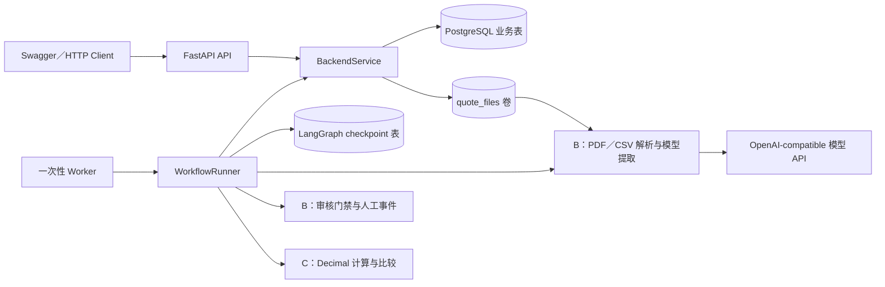

# 成员 D 交接：后端编排、版本与恢复

本文说明成员 D 在 Week1 新增的后端代码、各模块作用、数据与版本关系，以及如何迁移数据库、启动 FastAPI、执行一次性 worker，并复现 MCU-DEMO-001 的两次 LangGraph 中断。代码入口是 `supplier_comparison.backend.api:app`、`supplier_comparison.worker` 和 `supplier_comparison.checkpoints`。本轮实现基线已通过本地真实模型端到端验收；AWS Lightsail／主办方 Claude API 仍需单独验收。

## 1. 已实现范围

- FastAPI、同步 SQLAlchemy／psycopg、PostgreSQL 16 和 Alembic 业务表。
- 原始报价按 64 KiB 分块计算大小与 SHA-256，并写入不可覆盖的 ID 路径；保存文件版本、媒体类型和原始文件名元数据。
- LangGraph 使用 `graph_run_id` 作为 `thread_id`；checkpoint 只保存业务 ID、artifact ID 和冻结时间，不保存 requirement 正文、报价内容或磁盘路径。checkpoint 表由独立命令初始化。
- `ParsedInput`、`ExtractionBatch`、`ReviewEnvelope`、人工事件、输入快照和比较结果以不可变 JSON artifact 保存。
- 每份文档独立持久化最多 8 次模型调用预算；中断恢复复用已完成提取。
- 问题回答和字段纠正检查 `task_revision`；主动纠正创建新图运行。上传新报价会推进 revision，并使旧图、未决 issue、待执行 job 和旧当前结果指针失效；迟到 worker 不能改回当前状态。
- 本地身份固定来自后端配置 `TEST_USER_ID`，请求体中的同名字段不会覆盖操作者。

本轮不包括 React、正式登录／审批、RAG 运行、常驻 worker、任意崩溃窗口自动恢复和报告。OCR 代码保持兼容，但 `SUPPLIER_PDF_OCR_ENABLED=false` 是正式默认值。

## 2. 本轮新增代码与作用

### 2.1 运行结构



FastAPI 负责 HTTP 校验和错误映射，`BackendService` 负责事务、版本、幂等和持久化，`WorkflowRunner` 负责编排。模型解析、审核和成本计算仍由 B、C 的公共接口完成，D 层没有复制这些业务规则。

API 只创建持久化 job，不在 HTTP 请求中等待模型。worker 按 `job_id` 领取一个 job，执行至成功、失败或 `interrupt()` 后退出。这让 API 与耗时模型调用分开，也让中断后的恢复可以由另一个进程完成。

### 2.2 文件与模块清单

| 文件 | 新增内容 | 作用 |
| --- | --- | --- |
| `src/supplier_comparison/backend/settings.py` | `BackendSettings` | 从环境读取数据库、文件目录、本地测试身份和模型运行元数据；不保存 API Key 值。 |
| `src/supplier_comparison/backend/database.py` | engine、session factory、readiness probe | 为 API 和 worker 提供相同的同步 SQLAlchemy／psycopg 会话；`pool_pre_ping` 检查失效连接。 |
| `src/supplier_comparison/backend/models.py` | 11 张业务表的 ORM 模型 | 保存任务、修订、文件、不可变 artifact、图运行、问题、job、模型预算和幂等结果。 |
| `src/supplier_comparison/backend/service.py` | `BackendService` | application service；集中实现事务、行锁、revision、幂等、文件写入、issue、纠正、artifact 和结果发布。路由和图节点不直接写业务表。 |
| `src/supplier_comparison/backend/api.py` | FastAPI 应用与 10 个业务接口 | 校验 Pydantic 请求、注入服务端身份、调用 application service，并返回统一错误格式。 |
| `src/supplier_comparison/backend/workflow.py` | `DefaultQuoteProcessor`、`WorkflowRunner` | 调用 B 的 PDF／CSV 与审核接口、调用 C 的比较接口，并实现九个 LangGraph 节点及两次中断。 |
| `src/supplier_comparison/backend/checkpoints.py` | checkpoint URL 转换和初始化函数 | 将 SQLAlchemy PostgreSQL URL 转为 `PostgresSaver` URL，并调用 `setup()` 建表。 |
| `src/supplier_comparison/checkpoints.py` | checkpoint CLI | 提供 `python -m supplier_comparison.checkpoints setup`。 |
| `src/supplier_comparison/worker.py` | 一次性 worker CLI | 创建 service、字典、真实模型 processor 和 `PostgresSaver`，然后执行指定 job；异常时只输出安全的通用错误。 |
| `migrations/versions/ad0606803e8d_create_backend_workflow_schema.py` | 首个 Alembic migration | 创建全部业务表、索引、外键和唯一约束；支持 upgrade 和 downgrade。 |
| `migrations/env.py`、`alembic.ini` | Alembic 运行配置 | 从应用配置读取数据库 URL，并加载业务 metadata。 |
| `src/supplier_comparison/backend/migration_filter.py` | Alembic include filter | 排除 LangGraph checkpoint 表，避免 Alembic 误删或接管它们。 |
| `Dockerfile`、`.dockerignore` | 后端镜像 | API 和 worker 复用同一镜像，以不同命令启动。构建上下文排除 `.env`、本地结果和开发缓存。 |
| `compose.yaml` | `postgres`、`api`、`worker` 服务 | API 和 worker 共享 `quote_files`；PostgreSQL 使用独立 `database_data`；worker 通过 profile 按需启动。 |
| `tests/backend/` | API、service、workflow、migration、checkpoint 和 PostgreSQL 测试 | 覆盖两次中断、跨进程恢复、幂等、并发 revision、迟到发布、预算和卷持久化相关逻辑。 |
| `scripts/run_*evaluation.py`、`scripts/evaluate_*results.py` | 版本评测修复 | 统一 Windows 路径，为每份文档分配独立模型预算，并支持 V7 development 子集评分。 |

### 2.3 与 A／B／C 的集成边界

| 模块 | D 调用的内容 | D 不重新实现的内容 |
| --- | --- | --- |
| A：契约与数据 | `ProcurementRequirement`、字段字典版本／哈希、MCU-DEMO-001 文件和评测契约 | 字段含义、数据生成器、参考答案和数据许可管理 |
| B：解析与审核 | `PdfQuoteParser`、`RegisteredHybridCsvParser`、`extract_quote_candidates`、`review_extraction_batch`、`create_review_event`、`apply_candidate_correction` | PDF/CSV 解析算法、提示词字段抽取、证据门禁和人工事件纯函数 |
| C：规则与比较 | `compare_reviewed_extractions`、`ProcurementRequirement`、`RULE_VERSION` | 规格匹配、MOQ／步长、Decimal 成本、交期、可行性和排序公式 |
| D：持久化与编排 | API、文件、PostgreSQL、LangGraph、job、revision、snapshot、幂等与恢复 | 不新增第二套字段模型、解析器或成本公式 |

`DefaultQuoteProcessor` 对两类输入采用不同入口，但最终都返回 B 的 `ExtractionBatch`：

- PDF：`PdfQuoteParser` 先生成带页码和坐标的 `ParsedInput`，再由 `extract_quote_candidates` 调用模型完成字段理解。
- 注册 CSV：`RegisteredHybridCsvParser` 先做确定性字段映射；没有语义字段时使用 0 次模型调用，只有需要理解的字段才构造子字典并调用模型，最后通过 `merge_semantic_review` 合并。
- 其他媒体类型立即返回 `unsupported_media_type`，不会发送给模型。

### 2.4 PostgreSQL 业务表

| 表 | 保存内容 | 关键约束／用途 |
| --- | --- | --- |
| `tasks` | 当前 revision、任务状态、当前 graph／snapshot／result 指针 | 当前业务状态的入口；旧运行不能改写三个 current 指针。 |
| `task_revisions` | 每次外部决策输入变化 | `(task_id, revision)` 唯一；记录 change type、操作者和请求哈希。 |
| `requirements` | 每版采购需求 JSON | 保存版本、所属 task revision 和 content hash。 |
| `quotes` | 供应商报价身份和当前版本 | 与任务绑定；失效报价可以保留历史。 |
| `documents` | 文件版本、媒体类型、大小、SHA-256 和内部存储位置 | 存储位置唯一；原始文件名只作元数据。 |
| `workflow_artifacts` | 解析、提取、审核、人工事件、snapshot 和结果 JSON | 追加写入；保存 schema version、content hash 和 parent artifact。 |
| `graph_runs` | LangGraph 运行与模型元数据 | `thread_id=graph_run_id` 且唯一；保存 started／effective revision。 |
| `document_executions` | 每份文档在某次图运行中的进度 | `(graph_run_id, document_id)` 唯一；保存 artifact 引用和 8 次调用预算。 |
| `issues` | 固定问题、回答 schema、回答和操作者 | 同一图、问题类型、报价和字段组合唯一；状态为 OPEN／RESOLVED／SUPERSEDED。 |
| `jobs` | START／RESUME 一次性执行 | 保存 revision、状态、尝试次数和安全错误摘要。 |
| `idempotency_records` | 原请求哈希和原响应 | `(actor_id, operation, idempotency_key)` 唯一；相同请求重试返回原响应。 |

复杂 B/C 对象以 PostgreSQL JSONB 原样保存。这样不会因 D 层重新映射而丢失 schema 1.1 的证据、OCR 兼容字段或运行审计信息。

LangGraph 的 `checkpoints`、`checkpoint_blobs` 和 `checkpoint_writes` 等表由 `PostgresSaver.setup()` 管理。它们只负责恢复执行位置，不是任务、问题或结果的权威业务记录。

### 2.5 ID、revision 与不可变历史

| 标识 | 含义 |
| --- | --- |
| `task_id` | 一个采购比较任务。 |
| `task_revision` | 当前外部决策输入版本；创建任务为 1，每次上传、回答或主动纠正都会推进。 |
| `quote_id`／`quote_version` | 一家供应商报价及其业务版本。 |
| `document_id`／`document_version` | 一份上传文件及其不可变版本。 |
| `graph_run_id` | 一次编排运行；同时作为 LangGraph `thread_id`。 |
| `job_id` | 一次 START 或 RESUME 执行，可由独立 worker 领取。 |
| `issue_id` | 一次需要用户确认的结构化问题。 |
| `artifact_id` | 不可变过程产物、snapshot 或 comparison result。 |

`tasks.current_*` 只指向当前有效运行。上传新文件或主动纠正会推进 revision，并把旧 graph、未决 issue 和未完成 job 标为 `SUPERSEDED`。旧 artifact 和结果仍可查询，但发布结果时会再次锁定 task 并校验 graph 和 revision；迟到 worker 因此不能覆盖新结果。

图运行第一次开始时冻结 `evaluated_at`。两个 interrupt 之后即使换进程或系统时间已经变化，草稿和最终比较仍使用同一时间基准。主动纠正创建新图时才冻结新的评估时间。

### 2.6 API、事务和文件写入

FastAPI 路由只做请求解析和响应转换。所有修改都进入 `BackendService` 的短事务；等待模型或用户时不保持 HTTP 请求、数据库事务或行锁。

关键写操作如下：

| 操作 | service 行为 |
| --- | --- |
| 创建任务 | 创建 `tasks`、revision 1 和 requirement version 1。 |
| 上传报价 | 锁定 task，校验 revision，流式写临时文件，计算 SHA-256，移动到不可覆盖的 ID 路径，创建 quote/document 并推进 revision。 |
| 启动运行 | 拒绝同任务已有 PENDING／RUNNING／INTERRUPTED 图的情况；创建 graph run 和 START job。 |
| 回答问题 | 锁定 task，校验当前 revision、issue 仍 OPEN、answer type 匹配且 graph 当前有效；解决 issue、推进 revision 并创建 RESUME job。 |
| 主动纠正 | 保存 CorrectionEvent 和新候选版本，重新审核，推进 revision，废止旧图并创建新 START job；已有 extraction artifact 可复用。 |
| 发布结果 | 再次检查 `current_graph_run_id` 和 effective revision，只有当前运行才能更新 `current_snapshot_id`／`current_result_id`。 |

上传仅接受 `application/pdf` 和 `text/csv`，默认最大 5 MiB。服务端以 64 KiB 分块读取，边读边计算 SHA-256；超过限制时删除 staging 文件。最终路径由 task／quote／document ID 组成，例如：

```text
<quote_storage>/<task_id>/<quote_id>/v1/<document_id>/source.pdf
```

客户端提供的文件名经过 `Path(...).name` 处理，只保存在元数据中，不能决定磁盘路径。API 上传响应会移除 `storage_path`。

### 2.7 LangGraph 节点

| 顺序 | 节点 | 作用 |
| ---: | --- | --- |
| 1 | `load_context` | 从 PostgreSQL 读取当前 requirement 和活动文档，确认输入存在，并冻结或恢复 `evaluated_at`。 |
| 2 | `extract_documents` | 为每份文档取得独立 `document_execution`；已有 batch artifact 时直接复用，否则调用 B 并保存 ParsedInput／ExtractionBatch。 |
| 3 | `review_quotes` | 调用 B 的审核门禁，保存 ReviewEnvelope，并将文档执行状态更新为 REVIEWED。 |
| 4 | `await_missing_confirmation` | 当且仅当一份报价因 `shipping_fee_status` 阻塞时创建 `CONFIRM_MISSING` issue，并调用 `interrupt()`。 |
| 5 | `apply_missing_confirmation` | 从数据库读取已解决 issue，调用 `create_review_event`，保存 ReviewEvent 并重新审核该报价。 |
| 6 | `freeze_draft_and_compare` | 冻结当前回答后的 InputSnapshot（MCU 演示为 revision 5），调用 C 生成 PENDING 草稿并保存历史结果。 |
| 7 | `await_shipping_amount` | 创建 `SHIPPING_AMOUNT` issue，再次 `interrupt()`。 |
| 8 | `apply_shipping_amount` | 从数据库读取 SGD 金额，分别纠正 `shipping_fee_status` 和 `shipping_fee_amount`，保存两个 CorrectionEvent 并重新审核。 |
| 9 | `freeze_final_and_compare` | 冻结最终 InputSnapshot，调用 C 重新计算，保存 ComparisonResult，并受控发布为当前结果。 |

如果初次审核的所有报价都可以进入下游，图会从 `review_quotes` 直接进入最终比较。如果除固定单一运费缺失之外还有其他报价未通过审核，图会以 `review_required` 失败，不会把不合格的 `ReviewEnvelope` 静默传给 C。

checkpoint 状态只保存 task、graph、revision 和 artifact ID 等小对象，不放 PDF、requirement 全文、完整模型输出或文件路径。恢复时 `Command(resume=...)` 只携带 `issue_id`；节点随后从 PostgreSQL 重新读取回答，并验证 issue 已解决且属于当前 graph。

### 2.8 模型预算、job 与恢复

- 每份文档对应一个 `document_execution`，默认 `max_calls=8`；A、B、C 互不共享预算。
- 每次模型调用后的累计数写回 PostgreSQL。写回要求数据库中的旧计数与 worker 开始时一致，防止并发覆盖。
- 恢复时如果 `batch_artifact_id` 已存在，`extract_documents` 直接复用，因此两次 interrupt 不会重新调用模型。
- 每个 job 最多尝试 3 次，领取时使用行锁并从 PENDING 改为 RUNNING；本周没有常驻轮询或自动重试调度。
- worker 执行到 interrupt 后将 job 置为 WAITING_INPUT、graph 置为 INTERRUPTED、task 置为 NEEDS_INPUT，然后正常退出。
- 回答 issue 后创建新的 RESUME job；旧 job 不会再次领取。

实际代码使用的主要状态如下：

| 对象 | 状态 |
| --- | --- |
| Task | DRAFT、QUEUED、RUNNING、NEEDS_INPUT、COMPLETED、FAILED |
| Graph run | PENDING、RUNNING、INTERRUPTED、SUCCEEDED、FAILED、SUPERSEDED |
| Job | PENDING、RUNNING、WAITING_INPUT、SUCCEEDED、FAILED、SUPERSEDED |
| Issue | OPEN、RESOLVED、SUPERSEDED |

### 2.9 幂等、身份与错误安全

所有修改接口要求 `Idempotency-Key`。服务端以操作者、操作名和 key 定位记录：相同 key 与相同规范化请求返回原响应；相同 key 配不同请求返回 409 `idempotency_key_reused`。revision 不一致、已解决 issue、失效 graph 和迟到发布也返回 409。

Week1 的操作者由服务端配置 `TEST_USER_ID` 提供。请求体即使包含 `actor_id` 也不会覆盖它。正式登录和角色授权留到 Week2。

统一错误结构为：

```json
{
  "error": {
    "code": "task_revision_conflict",
    "message": "Task revision has changed.",
    "details": {"expected": 4, "actual": 5},
    "request_id": "request_..."
  }
}
```

- 409：revision、幂等键、issue、graph 或 job 状态冲突。
- 404：当前服务端身份看不到对应任务或资源。
- 422：业务输入、媒体类型、文件大小或 Pydantic 请求校验失败。
- 503：数据库 readiness 失败。
- 500：未预期异常；只返回通用信息。

API、job 错误、worker CLI 和 interrupt payload 不返回 API Key、Authorization、provider 原始响应、完整报价或内部磁盘路径。

### 2.10 V1–V7 评测脚本修复

本轮同时修复了真实模型评测工具，避免本地测试结果因 runner 本身的问题失真：

| 文件 | 修改 | 解决的问题 |
| --- | --- | --- |
| `scripts/evaluate_development_extractions.py` | 将输入路径先解析为绝对路径，再安全转换为仓库相对显示路径 | 修复 Windows 下“相对结果路径不能 `relative_to` 绝对仓库路径”的异常。 |
| `scripts/evaluate_development_extractions.py` | 对期望为 MISSING 的字段要求 `origin=null` | 避免把正确缺失字段错误判为必须来自 DOCUMENT。 |
| `scripts/evaluate_versioned_results.py`、`scripts/evaluate_v7_model_results.py` | 将反斜杠统一为正斜杠后再匹配输入 | 修复 runner 写 Windows 路径、reference 使用 POSIX 路径时出现 0 文档匹配的问题。 |
| `scripts/run_real_extraction.py`、`scripts/run_versioned_evaluation.py`、`scripts/run_v7_model_evaluation.py` | 每份文档创建独立 `ModelCallBudget` 和 graph run ID，并在末尾汇总调用数 | 防止前一份文档的超时／重试消耗后续文档预算。 |
| `scripts/evaluate_v7_model_results.py` | 增加可重复的 `--case-id` | OCR 关闭时可以只评分 V7-DEV-01 至 03 原生文本 development 子集，不需要修改正式参考文件。 |

runner 的 `status=PASSED` 只表示该文档完成了解析、结构校验和证据门禁；evaluator 顶层 `status=PASSED` 只表示评分程序执行成功。版本是否通过仍要检查文档成功率、字段准确率、review 状态和 `critical_silent_error_count`。

### 2.11 本地数据与仓库隔离

- `.env`、`.local-memory/` 和 `evaluation/results/local/` 不进入 Git；真实 API Key、provider 诊断和端到端运行记录只保留本机。
- 测试不读取 `evaluation/results/local/`。自动化编排统一使用 `FixedOutputAdapter` 或测试 processor，保证无网络环境仍可复现。
- 曾提交的 V7.2 私有参考答案已停止 Git 跟踪并只在本机保留。该答案已经暴露，因此 V7.2 只能作为开发／回归数据，不能再次报告为盲测结果。
- 上传仓库前应检查暂存区，确认本地记忆、API Key、真实 provider 输出和私有答案没有被加入。

## 3. 初始化本地环境

在仓库根目录执行：

```powershell
python -m venv .venv
.\.venv\Scripts\python.exe -m pip install --upgrade pip
.\.venv\Scripts\python.exe -m pip install -e ".[dev]"
Copy-Item .env.example .env
```

`.env` 中的模型 Key 只能保存在本机，不要提交。`SUPPLIER_MODEL_API_KEY_ENV` 保存环境变量名，真正的 Key 放在该环境变量中。本地开发使用 OpenAI-compatible 接口；部署到主办方环境时只替换 provider、base URL、model ID 和对应凭据。

### 3.1 主要环境变量

| 变量 | 作用 |
| --- | --- |
| `DATABASE_URL` | 本机 API／worker 连接 PostgreSQL 的 SQLAlchemy URL；本机主机通常是 `localhost`。 |
| `POSTGRES_DB`、`POSTGRES_USER`、`POSTGRES_PASSWORD`、`POSTGRES_PORT` | Compose 创建和暴露 PostgreSQL 时使用。生产部署必须替换开发密码。 |
| `QUOTE_STORAGE_PATH` | 本机报价文件根目录；Compose 内覆盖为共享 `quote_files` 卷路径。 |
| `TEST_USER_ID` | Week1 服务端固定操作者；不接受请求体覆盖。 |
| `SUPPLIER_MODEL_PROVIDER`、`SUPPLIER_MODEL_MODEL_ID` | 写入 graph run 的模型身份，也供模型适配层读取。 |
| `SUPPLIER_MODEL_BASE_URL` | 本地 OpenAI-compatible 服务地址。 |
| `SUPPLIER_MODEL_API_KEY_ENV` | 指向真正保存凭据的环境变量名。 |
| 被上一项引用的 Key 变量 | 保存真实 API Key，只能存在于本地 `.env`／部署 secret 中。 |
| `SUPPLIER_MODEL_TIMEOUT_SECONDS`、`SUPPLIER_MODEL_MAX_ATTEMPTS` | B 模型适配器的单次超时和有限重试配置。 |
| `SUPPLIER_MODEL_MAX_TOKENS`、`SUPPLIER_MODEL_ENABLE_THINKING` | 模型输出上限和 provider 可选能力。 |
| `SUPPLIER_PDF_OCR_ENABLED` | OCR 发布开关；Week1 正式值保持 `false`。 |

Compose 会把数据库主机覆盖为服务名 `postgres`，并只给 worker 注入模型调用需要的 base URL 和凭据。不要把 Compose 内部数据库 URL 复制回本机 `.env`。

启动数据库并初始化两类表：

```powershell
docker compose up -d --wait postgres
.\.venv\Scripts\python.exe -m alembic upgrade head
.\.venv\Scripts\python.exe -m supplier_comparison.checkpoints setup
```

Alembic 只管理业务表。LangGraph checkpoint 表由第二条 Python 命令管理；不要把 checkpoint 表加入 Alembic migration。

## 4. 启动方式

直接在本机运行 API：

```powershell
.\.venv\Scripts\python.exe -m uvicorn supplier_comparison.backend.api:app --host 127.0.0.1 --port 8000
```

也可以完全使用 Compose：

```powershell
docker compose build api worker
docker compose run --rm api python -m alembic upgrade head
docker compose run --rm api python -m supplier_comparison.checkpoints setup
docker compose up -d --wait api
```

检查地址：

- Swagger：`http://127.0.0.1:8000/docs`
- 存活：`GET http://127.0.0.1:8000/health/live`
- 数据库就绪：`GET http://127.0.0.1:8000/health/ready`

## 5. MCU-DEMO-001 输入

创建任务时在 Swagger 调用 `POST /api/v1/tasks`，请求头加入唯一的 `Idempotency-Key`，例如 `demo-create-001`，请求体如下：

```json
{
  "scenario_id": "MCU-DEMO-001",
  "requirement": {
    "manufacturer": "QQ Demo Components",
    "manufacturer_part_number": "QW-MCU9-DEMO",
    "package": "QFN-32",
    "revision": "R1",
    "condition": "NEW",
    "allow_substitutes": false,
    "base_unit": "piece",
    "required_quantity": 1000,
    "quantity_unit": "piece",
    "budget_amount": "8000.00",
    "currency": "SGD",
    "includes_shipping": true,
    "tax_mode": "NOT_APPLICABLE",
    "other_fees_required": true,
    "planned_order_date": "2026-09-14",
    "delivery_deadline": "2026-09-19",
    "delivery_location": "SG-DEMO-01",
    "ranking_preference": "LOWEST_CONFIRMED_TOTAL_COST",
    "secondary_preference": null
  }
}
```

记下返回的 `task_id` 和 `task_revision`。随后依次调用 `POST /api/v1/tasks/{task_id}/quotes` 上传三份 PDF。每次上传使用最新返回的 revision 和新的幂等键。

| supplier_id | 文件 |
| --- | --- |
| `SUP-022` | `data/generated/inputs/development/quote_V1/supplier_a_quote_v1.pdf` |
| `SUP-023` | `data/generated/inputs/development/quote_V1/supplier_b_quote_v1.pdf` |
| `SUP-024` | `data/generated/inputs/development/quote_V1/supplier_c_quote_v1.pdf` |

表单字段为 `expected_task_revision`、`supplier_id`、`is_synthetic=true` 和 `file`。原始文件名只作为元数据；服务端文件名由 ID 构成。

## 6. 两次 interrupt 与恢复

1. 调用 `POST /api/v1/tasks/{task_id}/runs`，提交当前 `expected_task_revision` 和新幂等键，记下 `job_id`。
2. 在新的终端执行一次 worker：

真实模型配置保存在 `.env` 时，本机 worker 使用 `python-dotenv` 把配置注入当前子进程：

```powershell
.\.venv\Scripts\python.exe -m dotenv -f .env run -- `
  .\.venv\Scripts\python.exe -m supplier_comparison.worker run-job --job-id <job_id>
```

Compose 方式为：

```powershell
docker compose --profile worker run --rm worker python -m supplier_comparison.worker run-job --job-id <job_id>
```

3. worker 返回 `WAITING_INPUT` 和 `CONFIRM_MISSING` issue 后退出。调用 `POST /api/v1/tasks/{task_id}/issues/{issue_id}/answers`：

```json
{
  "expected_task_revision": 4,
  "answer": {"answer_type": "CONFIRM_MISSING"}
}
```

这里的 revision 以实际任务返回值为准。回答接口返回一个 `RESUME` job；再次用上面的 worker 命令执行它。
4. 第二次 worker 保存比较草稿后，在 `SHIPPING_AMOUNT` issue 处再次返回 `WAITING_INPUT`。此时结果应为：A 不可行、已知总成本 S$12,800；B 待确认、已知小计 S$6,800；C 可行、总成本 S$7,100；由于 B 仍为 pending，`final_recommendation_allowed=false`。
5. 回答第二个 issue：

```json
{
  "expected_task_revision": 5,
  "answer": {
    "answer_type": "SHIPPING_AMOUNT",
    "amount": "200.00",
    "currency": "SGD"
  }
}
```

6. 执行返回的第二个 `RESUME` job。最终 B 总成本为 S$7,000，并成为唯一推荐。草稿和最终结果均可通过 `GET /api/v1/tasks/{task_id}/results` 查询。

每个回答都必须使用新的 `Idempotency-Key`。使用相同 key 和相同请求会返回原响应；相同 key 配不同请求、旧 revision 或已解决 issue 返回 409。

MCU-DEMO-001 的 revision 推进如下：

| 操作 | 操作后 revision | 图运行 |
| --- | ---: | --- |
| 创建任务 | 1 | 无 |
| 上传 A | 2 | 无 |
| 上传 B | 3 | 无 |
| 上传 C | 4 | 无 |
| 创建 START job | 4 | 创建 graph run，不推进 revision |
| 回答 `CONFIRM_MISSING` | 5 | 恢复原 graph run |
| 回答 `SHIPPING_AMOUNT` | 6 | 再次恢复原 graph run，并发布最终结果 |

## 7. 人工纠正与历史结果

通过 `POST /api/v1/tasks/{task_id}/quotes/{quote_id}/fields/{field_name}/corrections` 提交：

```json
{
  "expected_task_revision": 6,
  "raw_value": "S$0.00",
  "normalized_value": "0.00",
  "unit": "SGD",
  "reason": "Correct a confirmed extraction error."
}
```

纠正会创建 `CorrectionEvent`、新 task revision、新 graph run 和 START job。新运行复用三份已提取文档，不再次调用模型。旧结果仍可按 result ID 查询，但迟到旧运行不能写入 `current_result_id`。

## 8. API 清单

| 方法 | 路径 | 关键输入／返回 | 作用 |
| --- | --- | --- | --- |
| POST | `/api/v1/tasks` | requirement、scenario；201 | 创建 task、revision 1 和 requirement version 1。 |
| GET | `/api/v1/tasks/{task_id}` | 200 | 返回当前状态、revision、issue/job 摘要、snapshot/result ID 和需求。 |
| POST | `/api/v1/tasks/{task_id}/quotes` | multipart、expected revision；201 | 上传 PDF／注册 CSV，返回 quote/document ID 与新 revision。 |
| POST | `/api/v1/tasks/{task_id}/runs` | expected revision；202 | 创建 graph run 和一次性 START job。 |
| GET | `/api/v1/tasks/{task_id}/quotes/{quote_id}/fields` | 200 | 返回最新候选字段、审核状态和可展示证据，不返回存储路径。 |
| GET | `/api/v1/tasks/{task_id}/issues` | 200 | 返回当前及历史问题、回答、操作者和解决 revision。 |
| POST | `/api/v1/tasks/{task_id}/issues/{issue_id}/answers` | expected revision、判别联合 answer；202 | 解决当前问题、推进 revision 并返回 RESUME job。 |
| POST | `/api/v1/tasks/{task_id}/quotes/{quote_id}/fields/{field_name}/corrections` | expected revision、值、单位、理由；202 | 保存人工纠正、推进 revision，并创建复用既有提取的新图运行。 |
| GET | `/api/v1/tasks/{task_id}/results` | 200 | 返回当前和历史 ComparisonResult，明确 `is_current`。 |
| GET | `/api/v1/tasks/{task_id}/results/{result_id}` | 200 | 按 result ID 读取指定历史结果。 |
| GET | `/health/live` | 200 | 只证明 API 进程存活。 |
| GET | `/health/ready` | 200 或 503 | 执行 `SELECT 1`，证明数据库连接可用。 |

错误统一为 `{error: {code, message, details, request_id}}`。API 和中断内容不会返回磁盘路径、完整报价、provider body、Authorization 或 API Key。

## 9. 自动化验收

无模型 Key 时先运行确定性验收；它通过 `FixedOutputAdapter`／固定解析边界验证业务编排，不访问网络：

```powershell
.\.venv\Scripts\python.exe -m pytest -q
$env:RUN_POSTGRES_TESTS = "1"
.\.venv\Scripts\python.exe -m pytest tests\backend\test_postgres_recovery.py -q
Remove-Item Env:RUN_POSTGRES_TESTS
```

该 PostgreSQL 测试文件会用四个独立 processor／checkpointer 实例执行两次中断、恢复、最终发布和主动纠正，验证三份文档只提取一次；同时验证两个同 revision 上传并发时只有一个成功，另一个得到版本冲突。

模型 Key 配置完成后，再用第 5–6 节的 V1 PDF 走一次真实模型 smoke test。固定输出测试只验证编排和规则，不能替代真实模型提取验收。

2026-09-12 已使用本地真实模型完成一次第 5–6 节的完整端到端验收：三份 PDF 各调用模型一次，两次 interrupt 后分别重启 API 并由新 worker 恢复，最终 Supplier B 为 S$7,000 且唯一推荐；Compose 下线并保留卷后重建，任务、结果、checkpoint 和三份报价文件仍可验证。相同运费回答的幂等重试返回原 job，没有增加 revision 或作业。该记录只代表本地环境，不代表 Lightsail／主办方 Claude API 已验收。

V1–V7 各数据版本的真实模型 runner、离线评分命令和 holdout 隔离规则见 `docs/guide/guide_V1_V7_TESTING.md`。

注册 CSV 要求文件内 authority ID 与任务、quote 和 document 上下文完全一致。API 会为上传对象生成这些 ID，因此当前主演示使用 PDF；CSV 路径由 B 的模块测试和 D 的固定集成测试覆盖。若第二周需要从 API 上传标准 CSV，应先加入服务端 CSV 模板导出或 ID 预留协议。

### 9.1 测试文件与覆盖范围

| 测试文件 | 主要覆盖内容 |
| --- | --- |
| `test_api.py` | 路由、上传、统一错误、服务端身份和健康检查。 |
| `test_task_service.py` | task、文件、artifact、revision、主动纠正和历史读取。 |
| `test_run_service.py` | START／RESUME job、issue 回答、幂等和冲突。 |
| `test_workflow.py` | 两次 interrupt、草稿／最终结果、事件链、快照时间和迟到发布。 |
| `test_document_budget.py` | 每文档模型调用预算及超限。 |
| `test_postgres_recovery.py` | 新 checkpointer／processor 跨连接恢复和同 revision 并发写。 |
| `test_migrations.py`、`test_migration_filter.py` | upgrade／downgrade／upgrade 及 checkpoint 表隔离。 |
| `test_checkpoints.py`、`test_worker_cli.py` | checkpoint URL／初始化和 worker 安全错误。 |

截至 2026-09-12，默认测试为 `379 passed, 2 skipped`；设置 `RUN_POSTGRES_TESTS=1` 后为 `381 passed`。V1–V7 的真实模型测试结果和判定规则见 `docs/guide/guide_V1_V7_TESTING.md`。

## 10. 持久化检查

先完成一次中断，然后执行：

```powershell
docker compose down
docker compose up -d --wait api
```

不要加 `-v`。重启后查询原任务、问题和结果，并用原 `job_id` 对应的恢复作业继续执行。`database_data` 保存业务和 checkpoint，`quote_files` 保存上传文件。

## 11. 常见问题

- `database_unavailable`：检查 `docker compose ps` 和 `.env` 的 `DATABASE_URL`；本机使用 `localhost`，Compose 内部固定使用 `postgres`。
- `relation ... does not exist`：重新执行 Alembic upgrade；checkpoint 表缺失则执行 checkpoint setup。
- `idempotency_key_reused` 或 `task_revision_conflict`：读取最新任务状态，换新 key，并使用当前 revision；不要用换 key 绕过一次有效操作。
- `pdf_page_requires_ocr`：输入是扫描页且 OCR 默认关闭。换用原生文本 PDF；不要把它当成全字段缺失。
- 模型配置错误：确认 `SUPPLIER_MODEL_*` 和 `SUPPLIER_MODEL_API_KEY_ENV`，但不要把 Key、provider 原响应或诊断文件放进日志、文档或 Git。
- worker 失败：查询 job 和 issue 状态；Week1 只保证成功写入 interrupt 后可跨进程恢复，不保证任意节点崩溃自动续跑。
- 未预期的 worker 异常只保存并输出通用错误说明；provider 原始异常、Authorization 和凭据不会写入 job 错误正文或 CLI traceback。
