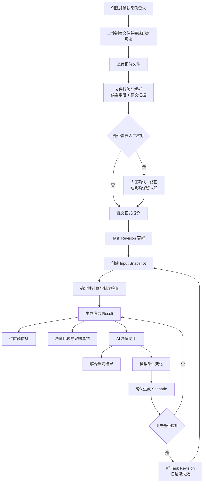
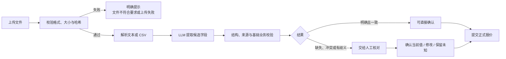
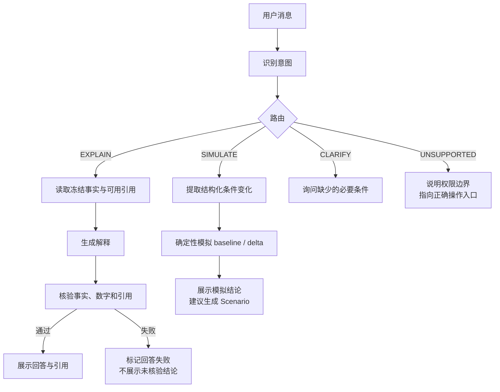
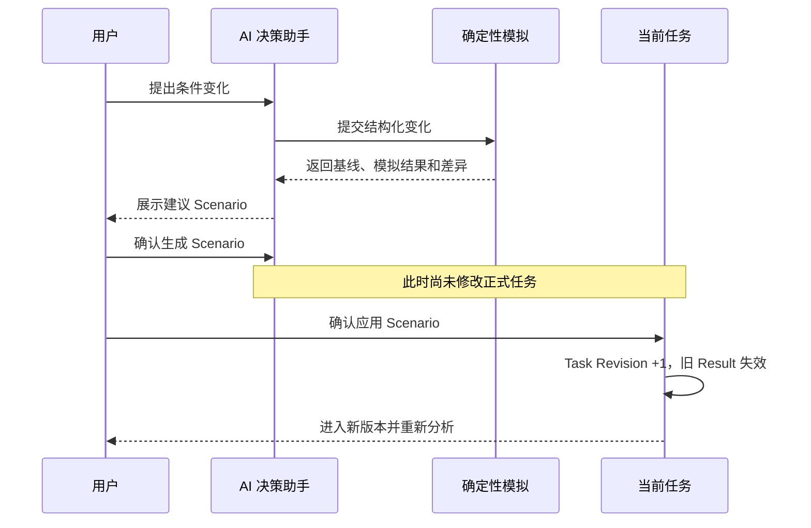
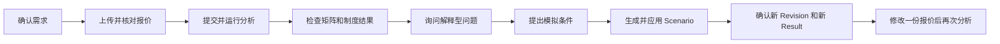

# QuoteWise 全流程与 AI 决策助手

本文说明系统当前的主流程、版本变化和 AI 决策助手在不同情况下的反应。它面向产品演示、人工测试和问题定位，不展开字段级实现细节。

> 演示中的器件、供应商和报价均为合成数据。AI 决策助手只提供解释与模拟，不具有审批、下单或付款权限。

## 1. 先理解五个对象

| 对象 | 含义 |
| --- | --- |
| Task Revision | 当前采购任务版本。需求、正式报价或已应用的 Scenario 变化时推进 |
| Quote Version | 某家供应商的一版报价；新文件或正式修改形成新版本 |
| Input Snapshot | 一次分析实际使用的冻结输入，不随后续编辑变化 |
| Result | 基于 Snapshot 产生的成本、可行性、排序和制度检查结果 |
| Conversation / Scenario | 基于某个 Result 的对话，以及从模拟结果生成的待应用方案 |

页面上的数据可能属于三种时间状态：

- **当前任务**：最新保存的需求、报价和偏好。
- **当前冻结结果**：最近一次成功分析使用的 Snapshot 和 Result。
- **历史结果**：已被新 Revision 替代，只能查看，不能继续修改或追加对话。

因此，修改报价或需求后，旧结果不会被偷偷改写；系统必须重新分析才能得到新的当前结果。

## 2. 端到端主流程



| 阶段 | 用户操作 | 系统的关键动作 | 可能停下的原因 |
| --- | --- | --- | --- |
| 需求 | 确认采购对象、数量、截止日期和排序偏好 | 保存当前需求版本 | 必填信息不足或格式不合法 |
| 报价 | 上传 PDF 或固定模板 CSV | 保存原件、计算哈希、解析字段并绑定证据 | 文件不符合要求、解析失败 |
| 核对 | 确认候选值、修正歧义或保留未知 | 保存人工决定和原始提取值 | 仍有影响决策的字段未处理 |
| 提交 | 将核对后的报价转为正式报价 | 推进 Task Revision，使旧分析失效 | 字段版本冲突或报价未达到提交条件 |
| 分析 | 点击运行或重新分析 | 冻结 Snapshot，重新计算全部结果 | 必要输入仍为未知或任务已变化 |
| 决策 | 查看比较矩阵、制度证据和总结 | 只展示该 Result 的冻结事实 | 当前页面是历史版本 |
| 对话 | 提问、模拟并按需应用 Scenario | 解释冻结结果或计算模拟差异 | 无当前结果、对话过期或模型调用失败 |

## 3. 报价解析与人工核对



处理原则：

- LLM 负责理解原文并提出候选值，不负责决定成本、可行性或排名。
- 确定性代码负责格式、单位、来源引用和跨字段一致性检查。
- 人工负责歧义、缺失信息和例外处理。人工确认的合法值是后续计算的权威输入。
- `UNKNOWN` 表示确实尚未确认，不等于 `0`，也不应被系统擅自改成不合格。
- 文件不合规、解析失败和字段待核对是三类不同情况，前端应给出不同提示和下一步。

报价状态可简化理解为：

```text
上传 → 处理中 → 待核对 → 可提交 → 已提交
          └──────────────→ 失败
```

更细的字段、证据和提交规则见 [报价解析、审阅与提交全流程](./guide_QUOTE_REVIEW_FLOW.md)。

## 4. 分析、结果与版本变化

一次分析只能读取当次冻结的 Snapshot。它按以下顺序执行：

```text
输入完整性检查
    ↓
商品、数量、交付和制度硬约束
    ↓
Decimal 成本计算与供应商可行性
    ↓
主指标、次指标和成本容差排序
    ↓
生成不可变 Result
```

供应商状态只有三种：

| 状态 | 含义 |
| --- | --- |
| `FEASIBLE` | 已确认满足当前采购要求，可以参与排序 |
| `INFEASIBLE` | 已确认违反硬约束，保留在结果中但不参与排序 |
| `PENDING` | 仍缺少会影响判断的信息，不能当作可行或不合格 |

以下操作会推进 Task Revision，并使当前 Result 变为历史结果：

- 修改已确认需求；
- 提交新报价版本；
- 停用或重新启用正式报价；
- 应用 Scenario。

旧 Snapshot、Result、引用和对话都会保留用于追溯，但不能覆盖新版本。

## 5. AI 决策助手全流程

AI 决策助手始终从某个冻结 Result 出发。用户消息先被识别为四类意图，再进入对应路径。



### 5.1 常见问题与系统反应

| 用户表达 | 路由 | 系统反应 | 是否改变正式数据 |
| --- | --- | --- | --- |
| “为什么推荐 A？” | `EXPLAIN` | 基于当前冻结结果解释，并为事实附引用 | 否 |
| “如果改成最快到货呢？” | `SIMULATE` | 提取新排序条件并运行确定性模拟 | 否 |
| “总价最多高 100，新范围内选最快的” | `SIMULATE` | 模拟成本容差和次级排序，展示与基线的差异 | 否 |
| “就按刚才的改” | `SIMULATE` | 仅在上文条件明确时复用；仍需确认生成并应用 Scenario | 否 |
| “尽量快，但别太贵” | `CLARIFY` | 询问明确的成本上限或容差 | 否 |
| “必须 10 月 18 日当天到” | `CLARIFY` | 确认是最晚截止日期，还是必须当天到达 | 否 |
| “排除那家不好的供应商” | `CLARIFY` | 要求明确供应商 | 否 |
| “把这家报价改成 6500” | `UNSUPPORTED` | 引导到报价修改和人工核对流程 | 否 |
| “批准并下单” | `UNSUPPORTED` | 说明助手没有审批、下单或付款权限 | 否 |

模拟目前可表达的核心变化包括预算、交付截止日期、主次排序指标、成本容差和排除供应商。模拟结果只是提案，不会直接修改需求或报价。

### 5.2 回答为什么必须带引用

解释型回答中的供应商、金额、日期、数量、状态和推荐结论都必须来自当前冻结结果允许使用的证据。系统会检查：

- 行内引用是否存在，并属于当前 Result；
- 引用内容是否真的支持对应事实；
- 金额、日期、数量和供应商归属是否一致；
- 正文引用与底部引用列表是否一致。

校验失败时，本轮回答标记为失败，不修改任何正式数据。用户输入本身不能被当成事实证据。

## 6. Scenario：从模拟到正式应用



如果需求、报价或当前 Result 已在 Scenario 生成后发生变化，该 Scenario 会被判定为过期，必须基于当前版本重新模拟。

应用 Scenario 后：

- 原 Result 和原对话保留为历史记录；
- 已审核且仍适用的报价字段可以复用；
- 成本、可行性、排序和制度检查必须重新计算；
- 新回复只能写入当前 Result 对应的 `ACTIVE` 对话。

## 7. Chatbot 在异常状态下如何反应

| 情况 | 用户看到的反应 | 系统处理与下一步 |
| --- | --- | --- |
| 没有成功的当前 Result | 助手不可用或提示先完成分析 | 完成报价核对并运行分析 |
| Worker 未运行 | 消息长时间处于处理中，并出现等待提示 | 启动 Worker；原 Job 可继续被领取 |
| 模型超时或服务失败 | 本轮消息显示失败 | 不改变任务；检查模型服务后重试 |
| 输出格式或引用校验失败 | 提示回答未通过事实与引用校验 | 丢弃不可靠回答；重试或缩小问题范围 |
| 模拟涉及未安全核对的报价 | 提示先处理相关字段 | 前往“待处理事项”完成核对 |
| Scenario 基线过期 | 提示当前结果已经变化 | 按当前版本重新模拟 |
| 提交时 Revision 冲突 | 提示字段或任务版本已变化 | 刷新页面后重新核对 |
| 查看历史 Conversation | 历史消息可查看，但输入区只读 | 新建或切换到当前 Result 的对话 |
| 当前任务已废弃 | 所有修改和应用入口禁用 | 仅保留历史审计信息 |

界面上的处理中状态不等于模型已经给出答案。只有回答完成结构校验、事实校验并成功保存后，才会显示为成功。

## 8. 权力边界

| 参与者 | 可以做什么 | 不可以做什么 |
| --- | --- | --- |
| LLM | 理解文档、提取候选字段、识别对话意图、组织解释 | 决定成本公式、伪造缺失事实、直接修改正式数据 |
| 确定性代码 | 单位换算、成本、硬约束、状态、排序和版本控制 | 在没有依据时替人工猜测业务事实 |
| 人工 | 确认字段、处理歧义和例外、决定是否应用变更 | 用未经确认的未知值冒充已验证事实 |
| AI 决策助手 | 解释当前结果、模拟支持的条件变化 | 联系供应商、审批、下单、付款或改写报价事实 |

核心原则是：**模型给候选，代码做确定性计算，人工确认关键事实；任何模拟都必须经过明确确认才能进入正式任务。**

## 9. 最小人工贯通测试



测试时至少确认：

1. 解析失败、字段待核对和硬约束不符合有不同提示。
2. 人工核对完成后能够提交，并且修正值进入新分析。
3. Chatbot 的事实回答带有可定位引用，失败回答不会改变任务。
4. 模拟不会直接改变正式结果，只有应用 Scenario 才推进 Revision。
5. 应用 Scenario、修改报价或修改需求后，旧结果和旧对话变为历史只读，新结果重新计算。

更完整的当前版本测试步骤见 [LC 当前版本测试指南](./guide_LC_CURRENT_TESTING.md)。
